# CFM-Based Runtime Architecture
 The CFM-based runtime architecture relies on fragments and the Code Fragment Manager (CFM) for its operation. This architecture has been implemented as the default architecture for PowerPC-based Mac OS computers and an optional one, CFM-68K, for 68K-based machines. The key concepts are identical for both implementations, so you should read this chapter if you plan to write either PowerPC or CFM-68K code. 
 In addition, you should read Chapter 2, "Indirect Addressing in the CFM-Based Architecture," which contains more information related to the CFM-based architecture. Chapter 3, "Programming for the CFM-Based Runtime Architecture," contains additional practical information that you may find useful when writing CFM-based programs. 
 For specific information about the implementation of the CFM-based architecture on the PowerPC and 68K microprocessors, you should read the following chapters:  Chapter 4, "PowerPC Runtime Conventions," for PowerPC information
Chapter 9, "CFM-68K Application and Shared Library Structure," and Chapter 5, "CFM-68K Runtime Conventions," for CFM-68K information   Chapter Contents   Overview  Closures   Code and Data Sections  Reference Counts  Using Code Fragment Manager Options   Preparing a Closure   Searching for Import Libraries  Checking for Compatible Import Libraries    The Structure of Fragments   Fragment Storage  The Code Fragment Resource   Extensions to Code Fragment Resource Entries  Sample Code Fragment Resource Entry Definitions  A PowerPC Application 'cfrg' 0 Resource Definition  A CFM-68K Application 'cfrg' 0 Resource Definition  A Shared Library 'cfrg' 0 Resource Definition   Special Symbols    The Main Symbol  The Initialization Function  The Termination Routine                
# Overview
   In the CFM-based architecture, a fragment is the basic unit of executable code and its associated data. All fragments share fundamental properties such as basic structure and method of addressing code and data. The major advantage of a fragment-based architecture is that a fragment can easily access code or data contained in another fragment. For example, a fragment can import routines or data items from another fragment or export them for another fragment's use. In addition, fragments that export items may be shared among multiple clients.
Note   The term fragment is not intended to suggest that the block of code and data is in any way either small, detached, or incomplete. Fragments can be of virtually any size, and they are complete, executable entities. The term fragment was chosen to avoid confusion with the terms already used in Inside Macintosh volumes to describe executable code (such as component and module).      The Code Fragment Manager handles fragment preparation ,  which involves bringing a fragment into memory and making it ready for execution. Fragments can be grouped by use into applications and shared libraries, but fundamentally the Code Fragment Manager treats them alike.
Fragment-based applications are launched from the Finder. Typically they have a user interface and use event-driven programming to control their execution.
A  shared library,  however, is a fragment that exports code and data for use by other fragments. Unlike a traditional static library, which the linker includes in the application during the build process, a shared library remains a separate entity. For a shared library, the linker inserts a reference to an imported function or data item into the client fragment. When the fragment is prepared, the Code Fragment Manager creates incarnations of the shared libraries required by the fragment and binds all references to imported code and data to addresses in the appropriate libraries. A shared library is stored independently of the fragment that uses it and can therefore be shared among multiple clients.
Note   Shared libraries are sometimes referred to as dynamically linked libraries (DLLs), since the application and the externally referenced code or data are linked together dynamically when the application launches.       Using a shared library offers many benefits based on the fact that its code is not directly linked into one or more fragments but exists as a separate entity that multiple fragments can address at runtime. If you are developing several CFM-based applications that have parts of their source code in common, you should consider packaging all the common code into a shared library.
Here are some ways to take advantage of shared libraries:
- An application framework can be packaged as a shared library. This potentially saves a good deal of disk space because that library resides only once on disk--where it can be addressed by multiple applications--rather than being linked physically into numerous applications.  System functions and tools, such as OpenDoc, can be packaged as shared libraries.  Updates and bug fixes for a single library can be released without the need to recompile and send copies of all the applications that use the library.
  Shared libraries come in two basic forms:
- Import libraries.  These contain code and data that your application requires to run. The Code Fragment Manager automatically prepares these libraries at runtime. Import libraries do not occupy application memory but are stored separately.  Plug-ins.  These are libraries that provide optional services, such as a spelling checker for a word processor. The application must make explicit calls to the Code Fragment Manager to prepare these libraries and must then find the symbols associated with the libraries. Plug-ins are sometimes referred to as drop-in additions or extensions.
     Note   Although the terms are similar, shared library and import library are not interchangeable. An import library is a shared library, but a shared library is not necessarily an import library.      In the CFM-based runtime architecture, the Code Fragment Manager handles the manipulation of fragments. Some of its functions include
- mapping fragments into memory and releasing them when no longer needed  resolving references to symbols imported from other fragments  providing support for special initialization and termination routines
  Fragments can be shared within a process or between two or more processes. A  process defines the scope of an independently-running program. Typically each process contains a separate application and any related plug-ins.
The physical incarnation of a fragment within a process is called a connection .  A fragment may have several unique connections, each local to a particular process. Each connection is assigned a  connection ID. For more information on how the Code Fragment Manager groups connections into functional programs, see  "Closures" (page 1-6) .
Fragments are physically stored in containers ,  which can be any kind of storage area accessible by the Code Fragment Manager. For example, in System 7 the system software import library  `InterfaceLib`  is stored in the ROM of a PowerPC-based Macintosh computer. Other import libraries are typically stored in files of type  `'shlb'` . Fragments containing executable code are usually stored in the data fork of a file, although it is possible to store a fragment as a resource in the resource fork. For more information about container storage, see  "Fragment Storage" (page 1-24) , and  Chapter 8, "PEF Structure."
---


Main Body
 Chapter 1 - CFM-Based Runtime Architecture
---

# Closures
   The Code Fragment Manager uses the concept of a  closure when handling fragments. A closure is essentially a set of connection IDs that are grouped according to the order they are prepared. The connections represented by a closure are the  root fragment ,  which is the initial fragment the Code Fragment Manager is called to prepare, and any import libraries the root fragment requires to resolve its symbol references.
During the fragment preparation process, the Code Fragment Manager automatically prepares all the connections required to make up a closure. This process occurs whether the Code Fragment Manager is called by the system (application launch) or programmatically from your code (for example, when preparing a plug-in).
Figure 1-1  shows a set of connections that make up a closure.
Figure 1-1  A closure
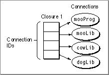

Each closure is assigned a  closure ID.
A fragment may be used in more than one process, but a separate connection is created for each process. For example, if two applications require the standard C library, a separate connection is created for each one.
Connections may be shared among closures within a process if your application calls the Code Fragment Manager to prepare a plug-in.  Figure 1-2  shows the closure of an application and a closure of a plug-in sharing a fragment within a process.
Figure 1-2  Multiple closures in a process
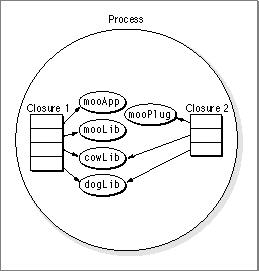

The Code Fragment Manager does not create new connections when sharing a fragment within a process but uses the ones that are currently available. Therefore it is possible for separate closures in the same process to refer to a fragment by the same connection ID. Connections are not shared across processes, however, so new connections (and connection IDs) are created when a fragment appears in another process.
---
   SubtopicsTOC      Code and Data Sections     Reference Counts     Using Code Fragment Manager Options

---


Main Body
 Chapter 1 - CFM-Based Runtime Architecture  /  Closures
---

## Code and Data Sections
   Each connection has sections associated with it that contain either code or data as shown in  Figure 1-3 .
Figure 1-3  Sections associated with a connection
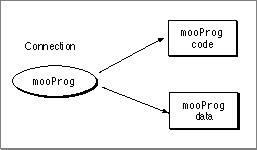

Within a process, a connection is generally shared between multiple closures, and therefore both code and data sections are shared. Fragments that are used in multiple processes share their code, but they have the following choices for sharing their data:
- Systemwide (or global) instantiation. The Code Fragment Manager allocates a single copy of the library's global data, and all connections for a particular fragment share that data.  Per-process instantiation. The Code Fragment Manager allocates one copy of the library's global data for each process. Each connection can access only its own copy of the data.
  In  Figure 1-4 , fragment  `cowLib`  is globally shared while fragment  `dogLib`  is shared per-process.
Figure 1-4  Fragments shared between processes
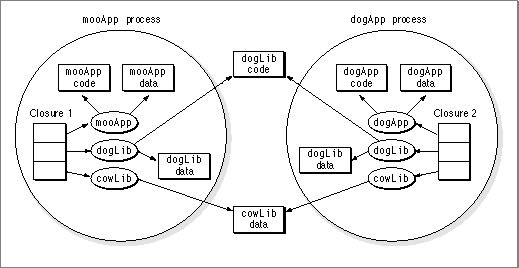

In most cases, per-process sharing is preferred over systemwide sharing. For more information about systemwide sharing, see  "Systemwide Sharing and Data-Only Fragments," beginning on page 3-24 .
Each library determines how its global data is to be shared, and this information is stored in the library at link time. The library developer can indicate either systemwide or per-process data instantiation for each separate data section in a library.

---


Main Body
 Chapter 1 - CFM-Based Runtime Architecture  /  Closures
---

## Reference Counts
   The Code Fragment Manager keeps a  reference count  for every connection currently in a process. This value indicates the number of closures that reference the connection. For example, in  Figure 1-2 , the shared fragments  `dogLib`  and  `cowLib`  each have a reference count of 2. If the plug-in is released, the reference count for each would be decremented. When the reference count of a connection drops to zero, the connection is not part of any closure and the Code Fragment Manager is free to release it if necessary.
The Code Fragment Manager also keeps similar count values for each section of a shared fragment that indicates the number of connections associated with it. For example, in  Figure 1-4 , the code section for  `dogLib`  has a reference count of 2, and the two data sections for  `dogLib`  each have a reference count of 1. If the process containing  `dogApp`  terminates, the reference count for the  `dogLib`  data section in that process drops to zero, so the Code Fragment Manager can release the section. The reference count for the code section only drops to 1, however, so it remains in memory.
Finally, the Code Fragment Manager also keeps track of the number of connections associated with a given fragment container. If a fragment container has no connections associated with it, the Code Fragment Manager can release the container from memory.

---


Main Body
 Chapter 1 - CFM-Based Runtime Architecture  /  Closures
---

## Using Code Fragment Manager Options
   If you prepare and release fragments explicitly from your code, you should be aware of the different options available. These options are available (as the  `CFragLoadOptions`  parameter) for the following Code Fragment Manager routines:
- `GetSharedLibrary`   `GetDiskFragment`   `GetMemFragment`
  If you are calling one of these Code Fragment Manager routines to prepare a plug-in, you should generally specify the  `kReferenceCFrag`  option when invoking it. The Code Fragment Manager then prepares the fragment (and any required import libraries) if a connection is not already present, adds a new closure, and increments the reference count of any import libraries that the new closure shares with others already in memory. The Code Fragment Manager then returns a closure ID which you can use to access the symbols in the closure.
IMPORTANT   Code Fragment Manager routines that do not create a new closure return a connection ID rather than a closure ID. The Code Fragment Manager increments reference counts on existing connections only when a new closure is created.      You can also use the  `kReferenceCFrag`  option to gain access to symbols in an already instantiated connection. For example, say you have an application  `mooApp`  as shown in  Figure 1-5  A. The application  `mooApp`  prepares the plug-in  `mooPlug`  as shown in B, and  `mooPlug`  sometime later programmatically prepares the shared library  `dogLib`  (shown in C). If you wanted to access the symbols in  `dogLib`  from  `mooApp` , you could do so by calling the Code Fragment Manager to prepare  `dogLib`  using the  `kReferenceCFrag`  option. The Code Fragment Manager adds a new closure and increases reference counts to reflect the presence of the new closure.  Figure 1-5  D shows the effect of using  `kReferenceCFrag`  to prepare the shared library  `dogLib` , which requires the library  `cowLib` .
Note   `kReferenceCFrag`  was previously called  `kLoadCFrag` .       Figure 1-5  Using  `kReferenceCFrag`
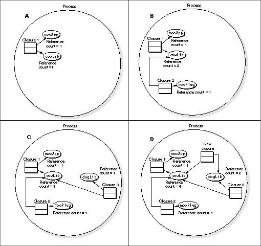

In some cases you may only want to determine if a connection associated with a fragment exists. In such cases, you can use the  `kFindCFrag`  option to return a connection ID of an existing connection. However, using the  `kFindCFrag`  option does not add a closure or increase the connection's reference count. You can theoretically access the symbols it contains, but if the reference count drops to 0, the Code Fragment Manager might release the connection while your program is still using it. For example, in  Figure 1-6 , say that  `mooApp`  prepares the plug-in  `mooPlug` , and  `mooPlug`  programmatically prepares the shared library  `dogLib` . Later,  `mooApp`  uses  `kFindCFrag`  to access symbols in  `dogLib` . If  `mooPlug`  releases  `dogLib` , then any references to symbols in  `dogLib`  are left dangling.
Figure 1-6  Using  `kFindCFrag`
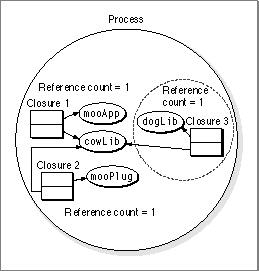

Another useful option is  `kPrivateCFragCopy` . Using the  `kPrivateCFragCopy`  option when calling a Code Fragment Manager routine, you can create a new connection for each request to prepare the fragment, even if the same application makes multiple preparation requests. That is, you can have multiple connections (each with its own private data section) from the same shared library that all serve the same client fragment.  Such a connection is called a private connection. A fragment prepared in this manner, however, is not visible as an import library (that is, the Code Fragment Manager does not recognize its name as an import library and you cannot find it using the  `GetSharedLibrary`  routine or the  `kFindCFrag`  option.)
Note   A private connection is also known as a per-load instantiation.      For example, the application  `mooApp`  in  Figure 1-7  has created two "copies" of the plug-in  `mooPlug` . Each instance of  `mooPlug`  has its own data, but they all share the same code. Note that  `cowLib`  is not duplicated for each instance of  `mooPlug` ; any import libraries that are part of a private connection's closure are treated normally.
Figure 1-7  Using private connections
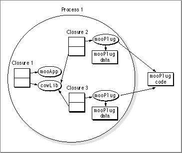

You can specify a private connection, for example, if you have a communications application that uses a shared library to implement a tool for connecting to a serial port. By requesting private connections, you can ensure that your tool can connect to two or more serial ports simultaneously by maintaining separate copies of the tool's data. The tool itself can then be ignorant of how many ports it is handling.

---


Main Body
 Chapter 1 - CFM-Based Runtime Architecture
---

# Preparing a Closure
   When the Code Fragment Manager is called to prepare a fragment, it prepares the closure associated with the fragment to ensure that the fragment can access all its imported symbols during execution. This preparation process involves the following steps:
1. Determine the closure associated with the root fragment (an application or a plug-in, for example). The Code Fragment Manager does the following to determine the closure:
- Finds compatible versions of all the import libraries the root fragment requires. Note that some import libraries may themselves depend on other import libraries.  Brings into memory any fragments that do not currently have connections to them.  Assigns connection IDs to any new connections and assigns a closure ID to the new closure.
See  "Searching for Import Libraries," beginning on page 1-16 , for information about the library search procedure and  "Checking for Compatible Import Libraries," beginning on page 1-19 , for information about how the Code Fragment Manager checks version compatibility.
   Instantiate (or locate, if already present) code and data sections for each connection in the closure. This procedure assigns actual addresses to the sections and, consequently, assigns addresses to all exported symbols.  Resolve all imported symbols. For every imported symbol required by the new connections in the closure, the Code Fragment Manager finds the corresponding exported symbol address and stores it in an internal lookup table.  Do relocations. Using the lookup table compiled in step 3 and the section addresses determined in step 2, the Code Fragment Manager replaces all references to imported symbols (and any other pointer-based symbol references) in the closure with actual addresses. See  Chapter 2, "Indirect Addressing in the CFM-Based Architecture,"  and the section  "Relocations," beginning on page 8-21 , for more details.  Execute initialization functions (if any exist).  Return the closure ID and main symbol to the caller.
     IMPORTANT   These steps apply for any fragment the Code Fragment Manager is called to prepare (including plug-ins ).       In general, if the Code Fragment Manager cannot complete any step, then the preparation fails and an error is returned. The only special case is when certain libraries or symbols have been declared weak. A weak library or symbol is one that is marked as being optional; the preparation process can continue even if the library or symbol is not available. However, once a weak library or symbol is determined to be present, it is handled normally for the rest of the preparation process. For example, if a weak library is available but cannot be prepared properly for some reason, the whole closure preparation fails. See  "Weak Libraries and Symbols," beginning on page 3-11 , for more information.
Note   A weak library is determined to be present or not present in step 1 of the preparation process. Weak symbols are determined in step 3.
---
   SubtopicsTOC      Searching for Import Libraries     Checking for Compatible Import Libraries

---


Main Body
 Chapter 1 - CFM-Based Runtime Architecture  /  Preparing a Closure
---

## Searching for Import Libraries
   When the Code Fragment Manager is called to prepare a fragment, if the fragment requires other import libraries to complete the closure, the Code Fragment Manager goes through an ordered search process to find physical copies of those libraries. For example, the Code Fragment Manager can search folders containing the application or the root fragment as well as a common folder specially designated to hold shared libraries.
Currently the Code Fragment Manager looks for files that contain a resource of type  `'cfrg'` . The  `'cfrg'0`  resource identifies the fragment name of the import library. There can be more than one fragment name listed in a single  `'cfrg'0`  resource. This might happen if there are multiple import libraries contained in a single file or if a single import library or application is to be identified by more than one name. Fragments are typically stored in the data fork, although it is possible to store a fragment in a resource. In either case, the  `'cfrg'0`  resource points to the location of the fragment within the file. For more information about the  `'cfrg'0`  resource, see  "The Code Fragment Resource," beginning on page 1-25 .
Once the Code Fragment Manager finds a library that is compatible with the fragment it's preparing, it stops searching and resolves imports in the fragment to code or data in that library. If it reaches the end of its search without finding a compatible library, the fragment preparation fails.
Note   Because the Code Fragment Manager is searching for the import library by name, the file containing the library must have a  `'cfrg'0`  resource. However, you can prepare fragments that do not contain a  `'cfrg'0`  resource by calling Code Fragment Manager routines from your program. See  "Calling the Code Fragment Manager," beginning on page 3-3 , for more information.      In System 7 through 7.5, the search process for import libraries is as follows:
1. Check connections in the same process to see if a connection for the import library already exists.
If the connection is already in use in another closure, then the Code Fragment Manager can simply increment its reference count and use it.
If the existing connection is associated with an incompatible version of the import library, the preparation fails. In all the steps that follow, however, finding an incompatible import library version merely causes the Code Fragment Manager to move to the next step in the search procedure. See  "Checking for Compatible Import Libraries" (page 1-19)  for more information about how the Code Fragment Manager checks for compatible libraries.  Check the folder containing the root fragment.
If the root fragment folder is not the same as the application folder, the Code Fragment Manager searches here first. The Code Fragment Manager looks only in the top level of the folder, not in any subfolders contained within it.  Check the file containing the application.
Since a file can contain multiple fragments, the file containing the application fragment may also contain import library fragments.  Check the application subfolder.
When you build your application, you can designate a library folder for the Code Fragment Manager to search for import libraries. For more information, see  "The Code Fragment Resource," beginning on page 1-25 .  Check the folder containing the application.
The Code Fragment Manager looks only in the top level of the application folder, not in any subfolders contained within it.  Check the Extensions folder.
The Extensions folder usually contains import libraries used by multiple applications (libraries for QuickTime, for example). The Code Fragment Manager searches the Extensions folder and one level of folders inside the Extensions folder.  Check the ROM registry.
The ROM registry keeps track of all import libraries that are stored in the ROM of a Mac OS-based computer. The Mac OS registers all ROM-based import libraries in this registry at system startup time.  Check the file registry.
The final stage of the search path is a file and directory registry that the Code Fragment Manager maintains internally. This registry, which is currently reserved for system use, is a list of files and directories that, for various reasons, cannot be put into the normal search path followed by the Code Fragment Manager or would not be recognized as import libraries even if they were in that path.
  In System 7.6, the Code Fragment Manager combines steps 6, 7, and 8, searching all three locations and choosing the import library that best fits the compatibility requirements.
The Code Fragment Manager searches a folder by looking for files of type  `'shlb'`  that contain a resource of type  `'cfrg'` . Within a folder, the Code Fragment Manager also looks for alias files of type  `'shlb'`  and resolves them to their targets.
At any stage, the Code Fragment Manager selects the one import library of all those available to it that best satisfies its compatibility version checking. If an import library meets the relevant criteria, the library search stops. Otherwise, the search continues to the next stage. If the final stage (the file and directory registry) is reached and no suitable library can be found, the Code Fragment Manager gives up and does not prepare the original fragment.

---


Main Body
 Chapter 1 - CFM-Based Runtime Architecture  /  Preparing a Closure
---

## Checking for Compatible Import Libraries
   Checking compatibility between a client fragment and an import library essentially means checking for an intersection between the version range required by the client fragment and the range supported by the import library.
When building a fragment that requires an import library, you must supply information in a definition stub library that defines the library's API. A  s tub library contains symbol definitions but does not contain actual code. The linker uses definition stub libraries to associate imported symbols with particular import libraries.  Figure 1-8  shows an application linking to a definition stub library to produce the completed application. A reference such as  `cowLib:setWindow`  means that the symbol  `setWindow`  can be found in the import library  `cowLib` .
Figure 1-8  Linking to a definition stub library
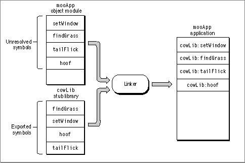

An import library that provides implementation code is dynamically linked to the client fragment by the Code Fragment Manager during the preparation process. This library (sometimes called the implementation library) must be fully functional.
Note   Since an implementation library contains symbol definitions, the implementation library can act as a definition stub library at link time.       Figure 1-9  shows an implementation library bound to the application at runtime.
Figure 1-9  Using the implementation version of a library at runtime
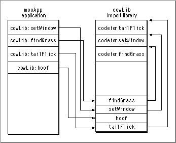

The definition stub library may not be the same version as the implementation library (one may be an earlier version, for example), so the Code Fragment Manager must check to make sure that they are compatible. Generally the libraries are compatible if the library used at runtime can satisfy the programming interface defined for it during the build process.
When building an import library, you determine compatibility by defining version numbers. You should set three version numbers (usually by specifying linker options) for use in version checking:
- the current version number of the library you are creating  the old implementation version number, which is the oldest version of this library available at runtime that supports the client's needs  the old definition version number, which is the oldest version of the library defined for the client fragment that is supported by the library you are creating
  When building a client fragment, the linker stores the current version and old implementation version numbers of the import library in the client. Later, when the Code Fragment Manager prepares the client fragment, it uses this information to check for a compatible import library.
Table 1-1  shows two different versions of an import library  `cowLib`  and their version numbers.
| Name | Currentversion number | Old definition version number | Old implementation version number |
| --- | --- | --- | --- |
| cowLib 13 | 13 | 9 | 10 |
| cowLib 16 | 16 | 12 | 14 |

IMPORTANT   The current version number must always be greater than or equal to both the old definition version number and the old implementation version number.      If you build an application  `mooApp`  with  `cowLib 13`  and attempt to run with  `cowLib 16` , the compatibility ranges are as follows:
- `cowLib 13`  is not compatible with implementations of  `cowLib`  earlier than version 10 (its old implementation number is set to 10).  `cowLib 16`  (present in the Extensions folder, for example) is not compatible with definitions of  `cowLib`  earlier than version 12 (its old definition version number is set to 12).
   Figure 1-10  shows the compatibility ranges graphically.
Figure 1-10  Library versions compatible with each other
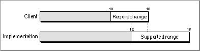

The presence of an overlap between the two areas of compatibility indicates that the two import libraries are compatible in this case.
However, reversing the roles of the two libraries (building with  `cowLib 16` , executing with  `cowLib 13` ) results in a different set of compatibility ranges as follows:
- `cowLib 16`  is not compatible with implementations of  `cowLib`  earlier than version 14 (the old implementation version number is 14).  `cowLib 13`  is not compatible with definitions of  `cowLib`  earlier than version 9 (the old definition version number is 9).
  In this case the two libraries are incompatible, as shown in  Figure 1-11 .
Figure 1-11  Library versions incompatible with each other
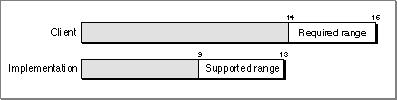

The library  `cowLib 16`  may (for example) include additional routines that are not supported by versions older than 14.
The Code Fragment Manager uses the algorithm shown in  Listing 1-1  for checking import library compatibility. It uses this algorithm to check the compatibility of the fragment being prepared with all the import libraries from which it imports code and data.
Listing 1-1  Pseudocode for the CFM version-checking algorithm
```
if (Definition.Current == Implementation.Current)
   return(kLibAndAppAreCompatible);
else if (Definition.Current > Implementation.Current)
   /*definition version is newer than implementation version*/
   if (Definition.OldestImp <= Implementation.Current)
      return(kImplAndDefAreCompatible);
   else
      return(kImplIsTooOld);
else
   /*definition version is older than implementation version*/
   if (Implementation.OldestDef <= Definition.Current)
      return(kImplAndDefAreCompatible);
   else
      return(kDefIsTooOld);
```
  The fact that only one instance of an import library can appear in a given process may cause versioning conflicts. For example say an application  `mooApp`  uses the import library  `mooLib` . If  `mooApp`  loads a plug-in  `mooPlug`  that also requires  `mooLib` , then the Code Fragment Manager uses the available connection for  `mooLib` . If this version is not compatible with the version required by the plug-in, then the preparation of the plug-in fails. (This failure occurs even if you designated  `mooLib`  to be weak.)

---


Main Body
 Chapter 1 - CFM-Based Runtime Architecture
---

# The Structure of Fragments
   Every fragment can contain separate code and data sections. A code or data section can be up to 4 GB in size. Code and data sections do not have to be contiguous in memory.
Note   Since all fragments can contain both code and data sections, any fragment can contain global variables.       A code section contains position-independent executable code (that is, code that is independent of its own memory location and the location of its associated data). Code sections are read-only, so fragments can be stored in ROM or file-mapped and paged in from disk as necessary.
A data section is typically allocated in the application heap. Each data section may be instantiated multiple times, creating a separate copy for each connection associated with the fragment. See  "Closures," beginning on page 1-6 , for more details. An import library's data section may also be placed into the system heap or temporary memory (when systemwide instantiation is selected).
Although a fragment's code and data sections can be located anywhere in memory, those sections cannot be moved within memory once they are prepared. The Code Fragment Manager must resolve any dependencies a fragment might have on other fragments, and this preparation involves placing pointers to imported code and data into the fragment's data section. To avoid having to prepare fragments in this way more than once, the Mac OS requires that a prepared fragment remain stationary as long as it stays in memory.
Note   Accelerated resources, which model the behavior of classic 68K resources, do not have to be fixed in memory between calls.
---
   SubtopicsTOC      Fragment Storage     The Code Fragment Resource     Special Symbols

---


Main Body
 Chapter 1 - CFM-Based Runtime Architecture  /  The Structure of Fragments
---

## Fragment Storage
   The physical storage unit for a fragment is called its container. A container can be any logically contiguous piece of storage, such as the data fork of a file (or some portion thereof), the Macintosh ROM, or a resource. The System 7 version of the Code Fragment Manager recognizes two container formats, the Preferred Executable Format (PEF) and the Extended Common Object File Format (XCOFF). Note that compatibility with these formats is not a requirement of the CFM-based architecture, and it may change in the future.
- The Preferred Executable Format (PEF) ,  as defined by Apple Computer, is the current standard executable file format for CFM-based architectures. PEF provides full support of a fragment's attributes. See  Chapter 8, "PEF Structure,"  for more details of this format.  The Extended Common Object File Format (XCOFF) is a refinement of the Common Object File Format (COFF), the standard executable file format on many UNIX®-based computers. XCOFF containers tend to be larger than their PEF counterparts and often take longer to load into memory. XCOFF containers do not support initialization or termination routines, and they do not store version information for import library compatibility checks. XCOFF is supported on Mac OS-based computers primarily because early development tools produced executable code in the XCOFF format.
     Note   Not all object code in the XCOFF format can execute on Mac OS-based computers. Any XCOFF code that uses UNIX-style memory services or that otherwise depends on UNIX features does not execute correctly on Mac OS-based computers. XCOFF output from a compiler also does not execute.

---


Main Body
 Chapter 1 - CFM-Based Runtime Architecture  /  The Structure of Fragments
---

## The Code Fragment Resource
   If the Code Fragment Manager is to search for a fragment by name, the file containing the fragment must contain a code fragment resource in the resource fork. A code fragment resource is a resource of type  `'cfrg'`  with ID 0 ( `'cfrg'0`  resource).
The code fragment resource has the form shown in  Listing 1-2 .
Listing 1-2  The code fragment resource
```c
struct CFragResource {
      UInt32            reservedA;/* must be zero! */
      UInt32            reservedB;/* must be zero! */
      UInt16            reservedC;/* must be zero! */
      UInt16            version;
      UInt32            reservedD;/* must be zero! */
      UInt32            reservedE;/* must be zero! */
      UInt32            reservedF;/* must be zero! */
      UInt32            reservedG;/* must be zero! */
      UInt16            reservedH;/* must be zero! */
      UInt16            memberCount;
      CFragResourceMemberfirstMember;
   };
```

- The  `version`  field indicates the version of the code fragment resource. The current version is  `1` .  The  `memberCount`  field indicates how many fragment entries ( `'cfrg'0`  entries) are described by this resource.  Each entry of type  `CFragResourceMember`  describes a fragment entry, listing the type of fragment, its name, location, and so on.
   Since the  `'cfrg'0`  resource is an array, it is possible to store information for several fragments in one file. The fragments remain separate and the Code Fragment Manager can prepare them independently, but they can be shipped and marketed as a single file. In addition, the code fragment resource can point to fragments of multiple architectures, allowing you to create fat applications and shared libraries that can execute on multiple platforms. See  Chapter 7, "Fat Binary Programs,"  for more information.
Note   Typically you can use a development tool (such as MergeFragment in MPW) to place multiple fragments in a file.      The structure of the code fragment resource is identical for all fragment types, although some of the field values may differ. Field values in the code fragment resource are determined and set at link time, but some may be changed later using a resource editor (such as ResEdit). Field values are defined in  `CodeFragments.h` .
A code fragment resource entry has the form shown in  Listing 1-3 .
Listing 1-3  A code fragment resource entry
```c
struct CFragResourceMember {
      CFragArchitecturearchitecture;
      UInt16         reservedA;  /* zero */
      UInt8          reservedB;  /* zero */
      UInt8          updateLevel;
      CFragVersionNumbercurrentVersion;
      CFragVersionNumberoldDefVersion;
      CFragUsage1UnionuUsage1;
      CFragUsage2UnionuUsage2;
      CFragUsage     usage;
      CFragLocatorKindwhere;
      UInt32         offset;
      UInt32         length;
      UInt32         reservedC;  /* zero */
      UInt32         reservedD;  /* zero */
      UInt16         extensionCount;/* number of extensions */
      UInt16         memberSize; /* total size in bytes */
      unsigned char  name [kDefaultCFragNameLen];
   };
```

- The  `architecture`  field indicates the runtime environment of the fragment. Current values for this field are as follows:
- `kPowerPCCFragArch`  for the PowerPC runtime environment  `kMotorola68KCFragArch`  for the CFM-68K runtime environment  `kCompiledCFragArch` , which is conditionally set at compile time. For example, if you are compiling for the PowerPC runtime environment, this value is set to  `kPowerPCCFragArch` . You can specify this value in source code that is used for both PowerPC and CFM-68K builds.
   The  `updateLevel`  field indicates whether this fragment is a base fragment or one created to update another fragment. This field typically has the value  `kIsCompleteCFrag`  to indicate a base fragment.  The next two fields,  `currentVersion`  and  `oldDefVersion` , store the current and oldest definition version numbers that the Code Fragment Manager relies on for checking compatibility with client fragments. If a fragment does not export any symbols, it does not need to check compatibility, and these values can be ignored.  The  `uUsage1`  field contains a union defined as
```c
union CFragUsage1Union {  UInt32  appStackSize; };
```

If the fragment is an application, appStackSize indicates the application stack size. Typically  `appStackSize`  has the value  `kDefaultStackSize` .  The  `uUsage2`  field contains a union defined as
```
union CFragUsage2Union {   SInt16  appSubdirID; };
```

If the fragment is an application,  `appSubdirID`  indicates the library directory. By default, the Code Fragment Manager searches the folder containing the application and the Extensions folder when looking for import libraries, but you can specify a library directory in addition to the default search directories (see  "Searching for Import Libraries," beginning on page 1-16 , for more information). If you do not specify a library directory, this field has the value kNoAppSubFolder. In System 7, if you want to add another library directory, you must change this field to the resource ID of an alias resource (a resource of type  `'alis'` ) in the application's resource fork. This resource should describe the application's library directory. For more information about alias resources, see the chapter "Alias Manager" in Inside Macintosh: Files.  The  `usage`  field indicates the type of fragment. Possible values are as follows:
- `kApplicationCFrag`  for an application  `kImportLibraryCFrag`  for an import library  `kDropInAdditionCFrag`  for a plug-in
   The  `where`  field indicates where the fragment is located. Possible values are as follows:
- `kDataForkCFragLocator`  if the fragment is in the data fork  `kMemoryCFragLocator`  if the fragment is stored in ROM  `kResourceCFragLocator`  if the fragment is stored in a resource
   The next two fields,  `offset`  and  `length` , indicate the starting and ending offsets of the fragment container. For example, the values  `kZeroOffset`  and  `kCFragGoesToEOF`  indicate that the container for the fragment starts at the beginning of the data fork and ends at the end of the data fork.
If the fragment is stored in a resource, the  `offset`  field describes the type of resource, and the  `length`  field contains the resource ID number.  The field  `extensionCount`  indicates the number of extensions. See  "Extensions to Code Fragment Resource Entries" (page 1-29)  for more information.  The field  `memberSize`  contains the total size, in bytes, of the code fragment resource entry. This size includes any extensions.  The  `name`  field contains the name of the fragment.

### Extensions to Code Fragment Resource Entries
   The basic code fragment resource entry structure shown in  Listing 1-3  is used for most applications and shared libraries. However, a code fragment resource entry can also contain one or more extensions, which appear directly after the fragment name. Such an extended code fragment resource entry stores additional information about the fragment that may be used by third-party software. For example, while the regular entry might simply indicate that a fragment  `mooLib`  is an import library, an extension could also indicate that it is a SOM class library that inherits from the class  `cow` .
Note   A code fragment resource can contain any combination of extended and regular entries.      Padding is added after the  `name`  field to begin the extensions on a 4-byte boundary (the length byte of the  `name`  string does not include this padding). All extensions must be aligned on 4-byte boundaries, with padding added after each if necessary. The  `memberSize`  field includes any padding added after the last extension.
An extension to the code fragment resource has the form shown in  Listing 1-4 .
Listing 1-4  Structure of a sample code fragment resource extension
```c
struct CFragResourceSearchExtension {
      CFragResourceExtensionHeaderextensionHeader;
      ExtensionData           data [1];
   };
```
  The extensionHeader field contains a data structure defined as shown in  Listing 1-5 .
Listing 1-5  The code fragment resource extension header
```c
struct CFragResourceExtensionHeader {
    UInt16 extensionKind;
    UInt16 extensionSize;
};
```

- The  `extensionKind`  field defines the type of extension. Each type defines the format of the information contained in the extension. Currently only one is defined ( `extensionKind`  =  `30EE` ).  The  `extensionSize`  field specifies the total size, in bytes, of this extension, including any padding necessary to round the extension to a 4-byte boundary. This size added to the offset of the extension gives the offset of the next extension (if any).
  The information that follows the  `extensionHeader`  field depends on the value of  `extensionKind` . As an example,  Listing 1-6  shows the format of the code fragment resource extension of type  `30EE` .
Listing 1-6  A code fragment resource extension of type  `30EE`
```c
struct CFragResourceSearchExtension {
      CFragResourceExtensionHeaderextensionHeader;
      OSType                  libKind;
      unsigned char           qualifiers [1];
   };
```

- The  `libKind`  field indicates the type of fragment. Currently defined values are as follows:
- `kFragDocumentPartHandler`  for a part handler  `kFragSOMClassLibrary`  for a SOM class library  `kFragInterfaceDefinition`  for an interface definition library  `kFragComponentMgrComponent`  for a component used by the Component Manager
   After the  `libKind`  field, you can define up to four Pascal-style strings in the  `qualifiers`  field. The values of these strings depend on the  `libKind`  field. The currently defined values are as follows:
- For type  `kFragDocumentPartHandler` , the first qualifier indicates the handler type. The second qualifier indicates the handler subtype (if any).  For type  `kFragSOMClassLibrary` , the first qualifier indicates the base class.  For type  `kFragInterfaceDefinition` , the first qualifier indicates the interface definition name.  For type  `kFragComponentMgrComponent` , the first qualifier indicates the component type. The second qualifier indicates the component subtype.
For any extension, the fourth qualifier can hold the name of the fragment. Unlike the string in the  `name`  field, this string is visible to the client fragment.

### Sample Code Fragment Resource Entry Definitions
  This section contains examples of the most common types of code fragment resource entries.
#### A PowerPC Application 'cfrg' 0 Resource Definition
   Listing 1-7  shows an example of a  `'cfrg'0`  resource definition for a PowerPC application.
Listing 1-7  A sample  `'cfrg'0`  resource for a PowerPC runtime application
```
#include "CodeFragmentTypes.r"
resource 'cfrg' (0) {
   {
      kPowerPCCFragArch,/* runtime environment */
      kIsCompleteCFrag, /* base-level library */
      kNoVersionNum,    /* current version number*/
      kNoVersionNum,    /* oldest definition version number */
      kDefaultStackSize,/* use default stack size */
      kNoAppSubFolder,  /* no library directory */
      kApplicationCFrag,/* fragment is an application */
      kDataForkCFragLocator,/* fragment is in the data fork */
      kZeroOffset,      /* beginning offset of fragment */
      kCFragGoesToEOF,  /* ending offset of fragment */
      "mooApp"          /* name of the fragment*/
   }
```

- The value kPowerPCCFragArch indicates that this fragment was created for use with the PowerPC runtime environment.  The value kIsCompleteCFrag indicates that the fragment is complete by itself.  The constant kNoVersionNum in the next two fields has the value 0, a valid version number.  The constant  `kDefaultStackSize`  in the next field indicates that the stack should be given the default size for the current software and hardware configuration. In System 7, you can use stack-adjusting techniques that call  `GetApplLimit`  and  `SetApplLimit`  if you determine at runtime that your application needs a larger or smaller stack.  The constant kNoAppSubFolder indicates that there is no library search folder.  The value  `kApplicationCFrag ` indicates that this is an application.  The value  `kDataForkCFragLocator`  indicates that the fragment is stored in the data fork of the file.  The values  `kZeroOffset`  and  `kCFragGoesToEOF`  in the next two fields indicate that the container for the fragment starts at the beginning of the data fork and ends at the end of the data fork.  The default fragment name is usually the name of the output file from the linker, but you can assign a specific name if you wish.

#### A CFM-68K Application 'cfrg' 0 Resource Definition
   Listing 1-8  shows a sample  `'cfrg'0`  resource definition for a CFM-68K runtime application. The fields that have values different from those in a PowerPC application  `'cfrg'0`  resource entry are underlined.
Listing 1-8 A sample  `'cfrg'0`  resource for a CFM-68K runtime application
```
#include "CodeFragmentTypes.r"
resource 'cfrg' (0) {
   {
      kMotorola68KCFragArch,   /* runtime environment */
      kIsCompleteCFrag,        /* base-level library */
      kNoVersionNum,           /* no current version number*/
      kNoVersionNum,           /* no oldest definition version number */
      kDefaultStackSize,       /* use default stack size */
      kNoAppSubFolder,         /* no library directory */
      kApplicationCFrag,       /* fragment is an application */
      kResourceCFragLocator,   /* fragment is in a resource */
      kRSEG,                   /* resource type = 'rseg' */
      kSegIDZero,              /* resource ID = 0 */
      "mooApp"       /* name of the application fragment*/
   }
```

- The constant  `kMotorola68KCFragArch`  in the first field indicates that this fragment was created for use with the CFM-68K runtime environment.  The next underlined value,  `kResourceCFragLocator` , indicates that this is a segmented application stored in resources.  The next two underlined fields,  `kRSEG`  and  kSegIDZero , tell the Code Fragment Manager that the initial container to load is contained in a resource of type  `'rseg'`  with a resource ID 0.
  For more information about the structure of CFM-68K applications, see  "CFM-68K Application Structure," beginning on page 9-3 .
#### A Shared Library 'cfrg' 0 Resource Definition
   Shared libraries have essentially the same  `'cfrg'0`  resource entry for both PowerPC and CFM-68K implementations (only the field indicating the runtime environment differs).
Listing 1-9  shows the  `'cfrg'0`  resource for an import library (plug-ins are identical except the fragment type is set to  `kDropInAdditionCFrag` ). Values that differ from an application's  `'cfrg'0`  resource are underlined.
Listing 1-9  A sample  `'cfrg'0`  resource for an import library
```
#include "CodeFragmentTypes.r"
resource 'cfrg' (0) {
   {
      kPowerPCCFragArch,          /* runtime environment */
      kIsCompleteCFrag,           /* base-level library */
      6,                          /* current version number*/
      4,                          /* oldest definition version number */
      kDefaultStackSize,          /* use default stack size */
      kNoAppSubFolder,            /* no library directory */
      kImportLibraryCFrag,        /* fragment is a library */
      kDataForkCFragLocator,      /* fragment is in the data fork */
      kZeroOffset,                /* fragment starts at offset 0 */
      kCFragGoesToEOF,            /* fragment occupies entire fork */
      "mooLib"                    /* name of the library fragment */
   }
```

- The first two underlined fields store the current and definition version numbers that the Code Fragment Manager relies on for checking compatibility with client fragments. If you do not specify version numbers when you link, the version numbers are set to 0. See  "Checking for Compatible Import Libraries," beginning on page 1-19 , for more details.  The application stack size field is ignored for shared libraries.  The library directory field is ignored for shared libraries.  The value  `kImportLibraryCFrag`  specifies that this is an import library. A plug-in would have the value  `kDropInAdditionCFrag` .  As you do with an application, you may supply a specific library name. However, for an import library you must do so before linking to a client because the fragment name is bound to the client at link ti me.

---


Main Body
 Chapter 1 - CFM-Based Runtime Architecture  /  The Structure of Fragments
---

## Special Symbols
   A fragment can define three special symbols that are separate from the list of symbols exported by the fragment:
- a main symbol  an initialization function  a termination routine

### The Main Symbol
   The Code Fragment Manager returns the main symbol of a root fragment when preparing a closure; main symbols of any import libraries are ignored. The use of a fragment's main symbol depends upon the type of fragment containing it. For applications, the main symbol refers to the main routine, which is simply the usual entry point. The main routine typically performs any necessary application initialization not already performed by the initialization function and then jumps into the application's main event loop.
Applications must define a main symbol that is the application's entry point. Import libraries and plug-ins are not required to have a main symbol. However, plug-ins having a single entry point can use a main symbol instead of an exported symbol to avoid having to standardize on a particular name.
Note   In fact, the main symbol exported by a fragment does not have to refer to a routine at all; it can refer instead to a block of data. See  "Using the Main Symbol as a Data Structure" (page 3-24)  for more information.
### The Initialization Function
   A fragment's initialization function is called as part of the Code Fragment Manager's fragment preparation process. You can use the initialization function to perform any actions that should be performed before any of the fragment's other code or static data is accessed. For example, in System 7, you often have to initialize various system services before you can use them ( `InitWindows`  for example). To make sure that all the required services are initialized before they are needed, you can put the calls to these services in an initialization function.
When a fragment's initialization function is executed, it is passed a pointer to a fragment initialization block, a data structure that contains information about the fragment. In particular, the initialization block contains information about the location of the fragment's container. For example, if an import library's code fragment is contained in some file's data fork, you can use that information to find the file's resource fork.
IMPORTANT   The initialization function must return a value. If an initialization function returns a nonzero value, preparation of the associated closure also fails.      It's important to know when the initialization function for a fragment is executed. A good rule of thumb to remember is that a fragment's initialization function is executed whenever a new data section is instantiated for that fragment.
If the preparation of a fragment causes a (currently unprepared) import library to be prepared in order to resolve imports in the first fragment, the initialization function of the import library is executed before that of the first fragment. This makes sense because the initialization routine of the first fragment might need to use code or data in the import library. For example,  Figure 1-12  shows three fragments and their initialization functions.
Figure 1-12  Three fragments with initialization functions
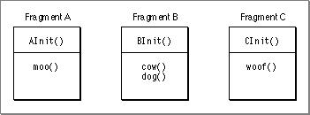

If fragment A imports symbols from fragment B, and fragment B imports symbols from fragment C, then C's initialization function must be run first, followed by B's, and then A's.
If you have two import libraries that depend upon each other, you may specify during the build process which should be initialized first.
Note you can run into problems if the initialization function of the import library requires routines that must be imported from another fragment. For example, in  Figure 1-12 , if the initialization function  `AInit`  imports  `cow`  from library B, and library B's routine  `dog`  imports  `woof`  from library C, you cannot guarantee that library C is initialized before it is needed. In general, your initialization function should be kept simple by avoiding accessing imported symbols.
### The Termination Routine
   A fragment's termination routine is executed only when a fragment's data instantiation is released. For example, if a fragment's data is globally shared between two applications, the fragment's termination routine would not be executed until both applications have quit. Note there is no guarantee that the termination routine will be run if your application crashes or otherwise terminates unnaturally.
You can use the termination routine to undo the actions of the initialization function or perform simple cleanup operations to preserve data (such as flushing file buffers). To avoid problems with circular dependencies, your termination routine should not reference symbols from other fragments.
When a process quits, the closures associated with the process are released in a first-in/first-out manner. That is, the first closure prepared is the first released. This generally ensures that the Code Fragment Manager does not release a connection that another closure may depend upon. For example, if a process contains an application that prepared a plug-in, when the application quits, the application's closure is released first.
In general, your termination routine should be as simple as possible. For example, you may have your termination routine flush internal I/O buffers to any open files, but you don't need to actually close the files since the process termination sequence takes care of this action.

---