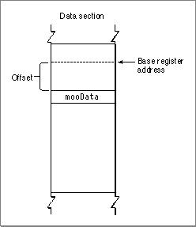
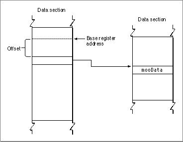
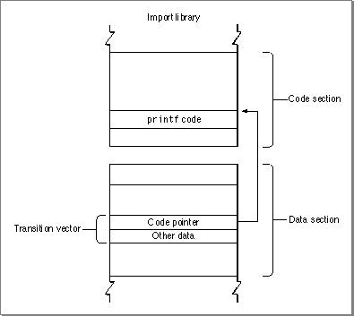
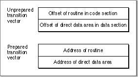

# Indirect Addressing in the CFM-Based Architecture
 This chapter discusses the indirect addressing model used in the CFM-based runtime architecture. This material is presented separately as it does not relate directly to the Code Fragment Manager. 
 The overview section describes the fundamental concepts underlying the indirect addressing model. Everyone who is writing programs for the CFM-based architecture should read this section. In addition, this chapter provides details of how the indirect addressing model is implemented for the PowerPC and 68K Mac OS platforms. If you are writing a program that requires such low-level details (a compiler, for example) you should read these sections after the overview. 
 This chapter assumes knowledge of terms and concepts introduced in Chapter 1, "CFM-Based Runtime Architecture." In addition, read Chapter 3, "Programming for the CFM-Based Runtime Architecture," if you are planning to write CFM architecture-based programs.   Chapter Contents   Overview  PowerPC Implementation   Glue Code for Named Indirect Calls  Glue Code for Pointer-Based Calls   CFM-68K Implementation   Direct and Indirect Calls  The Direct Data Area Switching Method              
# Overview
   Two methods exist for addressing data: direct addressing and indirect addressing. The choice of addressing method for any particular data item is determined by the compiler. Direct addressing is accomplished by using a base registe r  to access an area of memory called the  direct data area. Direct data items can be referenced as an offset from the address stored in the base register.  Figure 2-1  shows an example of direct addressing.
Note   The term direct addressing as used in this chapter actually assumes one level of indirection (using the base register) and is therefore not the same as absolute addressing in assembly-language terminology. Similarly, indirect addressing actually possesses two traditional levels of indirection.       Figure 2-1  Direct addressing of data


Direct addressing is simple and efficient, but since the offset bits in a given instruction can address only a certain amount of memory (typically �32 KB), space limitations can occur if you have large data items or many data items.
If you are writing a compiler, you should store as many items as possible in the direct data area because this reduces access time. Small data items (that is, equal to or smaller than pointers) should always be placed in the direct data area.
The alternative is indirect addressing, where the item in the direct data area is not the data itself, but a pointer to that data. Since you are no longer restricted by addressing limitations, you can access large data structures.  Figure 2-2  shows an example of indirect addressing.
Figure 2-2  Indirect addressing of data


The additional advantage of accessing symbols indirectly through pointers is that the symbols being referenced do not need to be present at build time. The components that make up a functional program can be stored separately if you can fix up the pointers to point to the correct symbols at runtime. In the CFM-based architecture, indirect addressing makes the use of imported and exported symbols possible.
Before preparation by the Code Fragment Manager, a fragment contains only a reference for each imported symbol. During the fragment preparation process, the Code Fragment Manager resolves all these references by searching for the code and data they refer to and replacing the references with relevant addresses.
Indirect addressing also provides the following benefits:
- Symbols external to a fragment can be specified by name, not by address. This allows the symbols to be grouped into import libraries.  Data can be specified by name, not by address.  Callback routines can be specified by name, not by address.  Using the base register allows multiple connections with independent data sections in the same address space. For example, in System 7, all applications share the same address space, so allowing a fragment to have multiple connections in that space makes it possible to have shared libraries.  An import library can have multiple connections associated with it, each linked to a different application.
   Indirect addressing of data items is simple. Knowing the address stored in the base register and the offset into the direct data area, you can access the pointer to the data and consequently the data itself. For example, to find the proper address of an imported data item, a fragment adds the offset of the pointer to the import within the direct data area (determined at compile time) to the value stored in the base register. The result is the address of a pointer to the data item.
Note   The same indirect method is used to access global variables; the pointer merely points to the current fragment rather than a different one.       Indirect addressing of routines is a little more complicated, but it is essentially similar. Indirect calls to routines must pass through the routine's transition vector. A  transition vector is a data structure in the called fragment's data section whose first element is the address of the routine to be called. Any pointer to a routine (such as those used by C++ virtual method calls) actually points to the routine's transition vector, whether or not the routine is in the same fragment.
Indirect calls branch to the routine address (the first element of the transition vector) and store the address of the transition vector in a specific register (the details vary depending on the platform). This allows the called routine to access other elements in the transition vector (if any). The generated code usually also varies slightly for named calls (such as calls to imported routines) versus pointer-based calls (C function pointers or C++ virtual functions, for example).
The basic structure of a transition vector is shown in  Figure 2-3 .
Figure 2-3  A transition vector


A routine's transition vector is accessed through the base register, just like any other piece of data. As with other data, it is generally more efficient to place the transition vector in the direct data area. Control can then pass from the transition vector to the called routine.
The transition vector can contain any number of elements in addition to the routine address. These other elements may be used by the called routine in any way useful. For example, the PowerPC and CFM-68K implementations typically store a pointer to the called fragment's direct data area in a routine's transition vector; this method of storing the pointer allows the called routine to access its own da ta.
---


Main Body
 Chapter 2 - Indirect Addressing in the CFM-Based Architecture
---

# PowerPC Implementation
   The PowerPC implementation of the indirect addressing model is fairly straightforward. The PowerPC runtime environment uses general-purpose register GPR2 as the base register. Note that the use of this register to access the direct data area is a convention, not a requirement. Debuggers and other analytical applications should not assume that GPR2 is the base register.
Note   Historically (from IBM documentation) the set of pointers to a fragment's indirectly accessed data was referred to as the Table of Contents and its base register was called the Table of Contents Register (RTOC).       To access imported data or indirect global data, the build-time offset of the global data item is added to the value in GPR2. The result is the address of a pointer that points to the desired data.
To access imported routines, the offset of the routine is added to the value in GPR2, as in the data version, but the result points not directly to the routine, but to a transition vector.
The PowerPC transition vector typically contains two elements. The first must be the address of the routine being called. By convention the second element contains the address of the called fragment's direct data area.
Prior to preparation, the transition vector contains
- the offset of the routine being called from the beginning of the code section  the offset of the direct data area from the beginning of its data section
  During preparation, the Code Fragment Manager adds the code and data section start addresses to the offset values, generating absolute addresses for the routine and the location of the direct data area.  Figure 2-4  shows the unprepared and prepared versions of the transition vector.
Figure 2-4  Unprepared and prepared PowerPC transition vectors


Note   The transition vector may contain any number of 4-byte fields. Currently only the first two are used. During an indirect call, GPR12 is assumed to point to the transition vector itself; this convention allows the called routine to access any additional fields in the transition vector beyond the first two.      In order for indirect calls to work properly, certain requirements must be met on the part of the calling routine and the called routine. These requirements are as follows:
- For each routine call, the compiler generates a PC-relative branch followed by an instruction to restore GPR2.  When entering the called routine, GPR12 points to the transition vector and GPR2 contains the second word of the transition vector.  When returning to the calling routine, the old GPR2 value resides on the stack at  `20(SP)`  (in the linkage area).
  How these requirements are implemented is determined by convention. For example, in the PowerPC runtime environment, glue code in the calling routine handles loading the proper values into GPR2 and GPR12. Any other actions are also determined by convention.
---
   SubtopicsTOC      Glue Code for Named Indirect Calls     Glue Code for Pointer-Based Calls

---


Main Body
 Chapter 2 - Indirect Addressing in the CFM-Based Architecture  /  PowerPC Implementation
---

## Glue Code for Named Indirect Calls
  If the routine call is referenced indirectly by name, the linker generates glue code in the calling fragment and directs the compiler-generated branch to this code. If the linker finds that a call is local (that is, not cross-fragment), it replaces the GPR2 restore instruction with a NOP instruction.
The glue co de takes the following steps to switch the direct data areas and execute the actual called routine:
1. Loads the pointer for the transition vector into GPR12.  Saves the current value of GPR2.  Loads the next 4 bytes of the transition vector into GPR2 (effectively switching the direct data area).  Jumps to the start of the actual routine.
  Upon return, control passes directly to the caller (not the glue code) which restores the saved value of GPR2.
Listing 2-1  shows some sample glue code.
Listing 2-1  Glue code for a cross-fragment call
```
bl moo_glue             ; call the cross-fragment glue
   lwz   R2, R2_save_offs(SP); restore the caller's base pointer

   ...

moo_glue:
   lwz   R12, tvect_of_moo(R2); get pointer to moo's transition
                           ;  vector
   stw   R2, R2_save_offs(SP); save the caller's base pointer
   lwz   R0, 0(R12)        ; get moo's entry point
   lwz   R2, 4(R12)        ; load moo's base pointer
   mtctr R0                ; move entry point to Count Register
   bctr                    ; and jump to moo
```
     Note   The linker generates custom glue for each routine since the glue code contains the direct data area offset of the routine's transition vector.

---


Main Body
 Chapter 2 - Indirect Addressing in the CFM-Based Architecture  /  PowerPC Implementation
---

## Glue Code for Pointer-Based Calls
  Pointer-based function calls must make use of the transition vector since the eventual call may be cross-fragment. (A routine pointer does not point to the code, but to the transition vector of the called routine.)
The glue code for a pointer-based call, as shown in  Listing 2-2 , is very similar to that for the named indirect call.
Listing 2-2  Glue code for a pointer-based call
```
lwzR12, address_of_TVector
   bl    ptr_glue
   lwz   R2, R2_save_offs(SP); restore the caller's base pointer

   ...

ptr_glue:
   lwz   R0, 0(R12)        ; get the entry point
   stw   R2, R2_save_offs(SP); save the caller's base pointer
   mtctr R0                ; move entry point to Count Register
   lwz   R2, 4(R12)        ; load the new base pointer
   bctr                    ; jump through the Count Register
```

---


Main Body
 Chapter 2 - Indirect Addressing in the CFM-Based Architecture
---

# CFM-68K Implementation
   In the CFM-68K runtime environment, the A5 register acts as  the base register.
To access global, static, or imported data, the build-time offset of the direct data item is added to the value in A5. The result is the address of a pointer that points to the desired data.
To access imported routines, the offset of the routine is added to the value in A5, as in the data version, but the address at that location points not directly to the routine, but to a transition vector.
Note   CFM-68K transition vectors reside above the jump table in the direct data area of the called routine. This positioning is dictated by segmentation requirements.       A CFM-68K import library's transition vector is typically similar to that of a PowerPC import library, containing two 4-byte elements: the address of the routine being called and the address of the called fragment's direct data area (A5 world).
Note   Transition vectors in CFM-68K application fragments include a third field of segment information to allow them to properly address routines in a segmented application. For more information about the structure of CFM-68K applications and the application launch process, see  "CFM-68K Application Structure," beginning on page 9-3 .
---
   SubtopicsTOC      Direct and Indirect Calls     The Direct Data Area Switching Method

---


Main Body
 Chapter 2 - Indirect Addressing in the CFM-Based Architecture  /  CFM-68K Implementation
---

## Direct and Indirect Calls
   A direct call does not require switching of the direct data area since it makes use of the calling party's direct data area by default. A direct assembly-language call to the function  `mooFunc`  would simply be
```
BSR.L          _$mooFunc
```
  where ` _$mooFunc`  signifies the internal entry point of  `mooFunc` .
IMPORTANT   When discussing routine calls and the direct data area switching method, the  external entry point  refers to the entry point of the routine when called indirectly through a transition vector. A direct (in-fragment) call enters a routine through the  internal entry point.      To allow the switching of the direct data area, the CFM-68K runtime architecture specifies that a procedure pointer points to a transition vector.
All indirect or cross-fragment calls go through a transition vector. The fragment uses the code and data world pair to set up a direct data area associated with the called routine. An indirect call to the function  `mooFunc`  would be as follows:
```
MOVE.L         _@mooFunc,A1; load transition vector into A1
MOVE.L         (A1)+, A0   ; get code address
JSR            (A0)        ; make the call
MOVE.L         "lcl", A5   ; restore A5 from "cl" 
                           ; after the call.
```
  The term " `lcl` ", which can be either a memory-based load variable or a register variable, is the location where the procedure saved its own A5 value prior to the call.
Note   Unlike the PowerPC case, glue code in the called routine is responsible for switching the direct data area in CFM-68K. However, the other actions of the caller's code (loading the transition vector into a register, calling the routine, and restoring the base register after the call) are identical.

---


Main Body
 Chapter 2 - Indirect Addressing in the CFM-Based Architecture  /  CFM-68K Implementation
---

## The Direct Data Area Switching Method
  In the CFM-68K runtime environment, the standard direct data area switching procedure takes the following steps.
1. The program uses the transition vector to jump to the external entry point of the procedure. At this point, the A1 register points to the second word of the transition vector, which contains the address of the direct data area.  The external entry point loads the A5 register with the new direct data area address (using the register A1) and then enters the internal entry point.  The function's prolog code is executed, part of which saves a copy of A5 in case the function must in turn make other indirect or cross-fragment calls.  The program executes the function. If the routine makes any indirect or cross-fragment calls, it restores the saved value of A5 after each such call.  After executing the function, the program then runs the epilog and throws away its local variables (including the saved copy of A5).  After running the epilog, the program returns to the calling fragment.
  Direct callers and indirect callers can enter the procedure at different locations, so you can set up slightly different prolog sequences depending on the type of call.
Listing 2-3  illustrates glue code surrounding a simple function call.
Listing 2-3  Glue code for a simple function
```
MOVE.L         (A1), A5          ; set up A5 from A1
LINK           A6, #LOCALS       ; (this is the internal entry point)
MOVEM.L        <REGSET/A5>,-(A7) ; save new A5

<body of function  here>

MOVEM.L        (A7)+, <REGSET>   ; note A5 not restored here
UNLK           A6
RTD            #PARAM_CT
```
  If the function itself makes indirect or cross-fragment calls, you must save the A5 value before the call and restore it after each return.  Listing 2-4  shows how to handle an indirect call within an indirectly called function:
Listing 2-4  Making an indirect call from within an indirectly called function
```
MOVE.L         (A1), A5          ; set up A5 from A1
LINK           A6, #LOCALS       ; the reserved space
MOVEM.L        D7/D6/A5, -(A7)   ; save new A5 at -12(A6)

...

                                 ; now making cross-fragment call to
                                 ; the imported function mooCall
MOVE.L         _@mooCall(A5), A1 ; load transition vector into A1 via
                                 ;  the pointer to the transition vector
MOVE.L         (A1)+,A0          ; get code address
JSR            (A0)              ; call function
MOVE.L         -12(A6), A5       ; restore A5 from saved location

...

                                 ; no A5 restore here (but pop saved
MOVEM.L        (A7)+, D7/D6      ; data registers)
UNLK           A6                ; UNLK compensates for unbalanced stack
RTD            #PARAM_CT
```
     Note   You do not have to save your A5 value on the stack. In some cases (such as when you know the called procedure will make a lot of indirect calls) it may be advantageous to save your A5 value in a data register, or even another address register.      In certain cases, you may omit some of the switching steps to optimize your code. Three different optimization possibilities exist:
- You can choose to not save A5 in the prolog. This choice is useful only when you are certain that the routine you are calling will never make any indirect or cross-fragment calls and thus will never need to restore A5. Routines using this optimization may still use A5, however.  You can remove the external entry point and transition vector. This choice removes the initial  `MOVE.L (A1), A5`  instruction and is equivalent to tagging the routine as  `internal`  during a compile. You should use this optimization only if you are sure that the routine will never be called indirectly or from another fragment.  You can remove the  `MOVE.L (A1), A5`  instruction but keep the transition vector. This optimization works only for calling routines that never use the A5 register during execution (for example, a leaf routine that doesn't access global variables). Note that all the following actions do use A5 and disqualify routines from using this option:
- Direct (in-fragment) calls, because the called procedure may use A5, or the call may have to go through the jump table (which uses A5). Note that segmented shared libraries use the jump table if calling direct between two code segments.  Any cross-fragment call or access to an imported data item, because the CFM-68K code uses the A5 register to access such data items indirect ly.

---