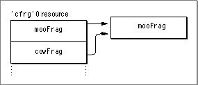
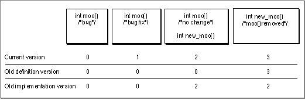
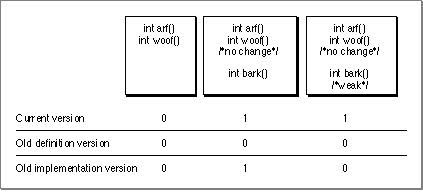
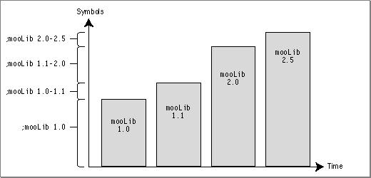
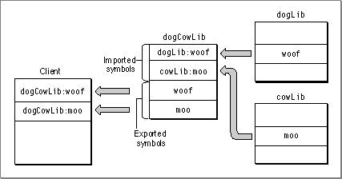
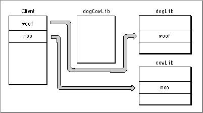
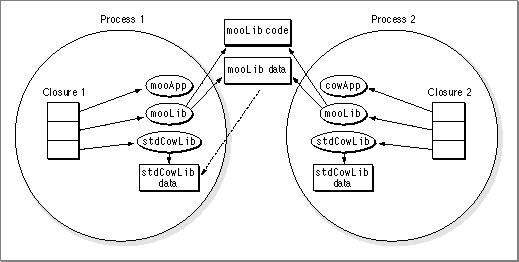
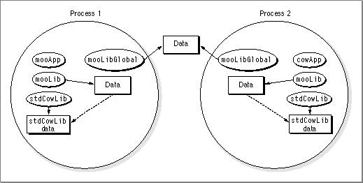
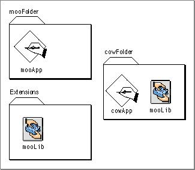

# Programming for the CFM-Based Runtime Architecture 
 This chapter contains practical information about programming for the CFM-based runtime architecture, including guidelines for building shared libraries. Note that the topics in this chapter are independent of one another and do not need to be read in any particular order. 
 This chapter assumes familarity with the terms and concepts presented in Chapter 1, "CFM-Based Runtime Architecture," and Chapter 2, "Indirect Addressing in the CFM-Based Architecture."   Chapter Contents   Calling the Code Fragment Manager   Preparing Code Fragments  Releasing Fragments  Getting Information About Exported Symbols  Using Shadow Libraries    Requirements for Executing CFM-68K Runtime Programs  Using Stub Libraries at Build Time  Weak Libraries and Symbols  Multiple Names for the Same Fragment  Import Library Techniques   Use No Version Numbers and No Weak Symbols   Declare Weak Symbols in Client  Use PEF Version Numbering  Change Names for Newer Import Libraries  Create an Alias Library Name Using Multiple 'cfrg' 0 Entries  Put New Symbols in New Logical Libraries  Use Reexport Libraries   Using the Main Symbol as a Data Structure  Systemwide Sharing and Data-Only Fragments  Multiple Fragments With the Same Name              
# Calling the Code Fragment Manager
   If your application uses plug-ins, you must prepare them explicitly by calling the Code Fragment Manager from your code. This section describes some of the routines you can use to prepare fragments and find symbols exported from other fragments.
IMPORTANT   In general, the Code Fragment Manager automatically loads all import libraries required by your application at the time your application is launched. You need to use the routines described in this section only if your application supports dynamically loaded plug-ins.
---
   SubtopicsTOC      Preparing Code Fragments     Releasing Fragments     Getting Information About Exported Symbols     Using Shadow Libraries

---


Main Body
 Chapter 3 - Programming for the CFM-Based Runtime Architecture  /  Calling the Code Fragment Manager
---

## Preparing Code Fragments
   If the fragment is an import library that contains a  `'cfrg'0`  resource, you can use the Code Fragment Manager's  `GetSharedLibrary`  function to prepare the fragment. If the fragment is stored in a disk file, you call the  `GetDiskFragment`  function. If the fragment is stored in a resource, you need to place the resource into memory (using normal Resource Manager and Memory Manager routines) and then call the  `GetMemFragment`  function. In general, however, you should avoid storing fragments in resources. Resource-based fragments do not gain the benefits of file-based fragments (such as file mapping directly from the file's data fork), so you should use them only when you have no other choice.
For complete information about the Code Fragment Manager routines, see  Inside Macintosh: PowerPC System Software . The APIs defined in that book apply for both the PowerPC and CFM-68K implementations.
In general, the overhead involved in preparing the code fragment and later releasing it is not trivial, so you should avoid closing the connection to a prepared fragment (that is, calling  `CloseConnection` ) until you are finished using it.
IMPORTANT   When called to prepare a plug-in, the Code Fragment Manager automatically prepares all the fragments that make up the plug-in's closure. That is, if the plug-in imports symbols from an import library, that library is also prepared; you do not have to explicitly prepare the library.       Listing 3-1  shows how to prepare a fragment using  `GetSharedLibrary` .
Listing 3-1  Preparing a fragment using  `GetSharedLibrary`
```
myErr = GetSharedLibrary(myLibName, KPowerPCCFragArch, kPrivateCFragCopy,
                   &myConnID, (Ptr*)&myMainAddr, myErrName);
if (myErr) {
   AlertUser(myErr);
}
```
  The fragment name is held in  `myLibName`  and it is specified to be a PowerPC fragment. The Code Fragment Manager follows its standard search path to find the library. See  "Searching for Import Libraries," beginning on page 1-12 , for more information on the search procedure.
Note that the preparation fails if the preparation of any of the fragments that make up the closure fails. The error term  `myErrName`  then contains the name of the fragment that caused the failure.
Listing 3-2  show how to prepare a disk-based fragment.
Listing 3-2  Preparing a disk-based fragment
```
myErr = GetDiskFragment(&myFSSpec, 0, kCFragGoesToEOF, myToolName, 
               kPrivateCFragCopy, &myConnID, (Ptr*)&myMainAddr, 
               myErrName);
if (myErr) {
   AlertUser(myErr);
}
```
   Listing 3-3  shows how to prepare a resource-based fragment.
Listing 3-3  Preparing a resource-based fragment
```
Handle         myHandle;
OSErr          myErr;
ConnectionID   myConnID;
Ptr            myMainAddr;
Str255         myErrName;

myHandle = GetResource('tool', 128);
HLock(myHandle);
myErr = GetMemFragment(*myHandle, GetHandleSize(myHandle), 
               myToolName, kPrivateCFragCopy, &myConnID, 
               (Ptr*)&myMainAddr, myErrName);
if (myErr) {
   AlertUser(myErr);
}
```
  The code in  Listing 3-3  places the resource into memory by calling the Resource Manager function  `GetResource`  and locks it by calling the Memory Manager procedure  `HLock` . Then it calls  `GetMemFragment`  to prepare the fragment. The first parameter passed to  `GetMemFragment`  specifies the memory address of the fragment. Because  `GetResource`  returns a handle to the resource data,  Listing 3-3  dereferences the handle to obtain a pointer to the resource data. To avoid dangling pointers, you need to lock the block of memory before calling  `GetMemFragment` . The constant  `kPrivateCFragCopy`  passed as the fourth parameter requests that the Code Fragment Manager allocate a new copy of the fragment's global data section.
Like other fragments a resource-based fragment must remain locked in memory and has separate code and data sections. You have access to the connection ID of the resource-based fragment, so you can call Code Fragment Manager routines like  `CloseConnection`  and  `FindSymbol` .
Note   Some PowerPC executable resources are specially written to model a classic 68K stand-alone code resource. These accelerated resources do not have all the freedom of a true fragment. See  "Accelerated and Fat Resources," beginning on page 7-4 , for information about how to write and call an accelerated resource.

---


Main Body
 Chapter 3 - Programming for the CFM-Based Runtime Architecture  /  Calling the Code Fragment Manager
---

## Releasing Fragments
  To programmatically release fragments from memory, you use the  `CloseConnection`  routine. A call to  `CloseConnection`  is simply
```
myErr = CloseConnection(&myID);
```
  where  `myID`  is the ID value received when you called the Code Fragment Manager to prepare the fragment. Note that you cannot call  `CloseConnection`  using the ID value received when using the  `FindCFrag`  option or the ID passed by a fragment's initialization block (when executing an initialization function).
The  `CloseConnection`  routine actually releases the closure associated with the ID and decrements the associated reference counts. If any reference counts drop to 0, the Code Fragment Manager releases the associated section, connection, or fragment container.
Note that all import libraries and other fragments that are prepared on behalf of your application (either as part of its normal startup or programmatically by your application) are released by the Code Fragment Manager at application termination; therefore, a library can be prepared and does not have to be released by the application before it terminates.

---


Main Body
 Chapter 3 - Programming for the CFM-Based Runtime Architecture  /  Calling the Code Fragment Manager
---

## Getting Information About Exported Symbols
   In cases in which you prepare a fragment programmatically (that is, by calling Code Fragment Manager routines), you can get information about the symbols exported by that fragment by calling the  `FindSymbol` ,  `CountSymbols` , and  `GetIndSymbol`  functions.
The  `CountSymbols`  function returns the total number of symbols exported by a fragment.  `CountSymbols`  takes as one of its parameters a connection ID; accordingly, you must already have established a connection to a fragment before you can determine how many symbols it exports.
Given an index ranging from 0 to one less than the total number of exported symbols in a fragment, the  `GetIndSymbol`  function returns the name, address, and class of a symbol in that fragment. You can use  `CountSymbols`  in combination with  `GetIndSymbol`  to get information about all the exported symbols in a fragment. For example, the code in  Listing 3-4  prints the names of all the exported symbols in a particular fragment.
Listing 3-4  Finding symbol names
```c
void MyGetSymbolNames (ConnectionID myConnID);
{
   long           myIndex;
   long           myCount;       /*number of exported */
                                 /*symbols in fragment*/
   OSErr          myErr;
   Str255         myName;        /*symbol name*/
   Ptr            myAddr;        /*symbol address*/
   SymClass       myClass;       /*symbol class*/

   myErr = CountSymbols(myConnID, &myCount);
   if (!myErr)
      for (myIndex = 0; myIndex < myCount; myIndex++)
         {
            myErr = GetIndSymbol(myConnID, myIndex, myName, 
                                    &myAddr, &myClass);
            if (!myErr)
               printf("%P", myName);
         }
}
```
  If you already know the name of a particular symbol whose address and class you want to determine, you can use the  `FindSymbol`  function. See  Inside Macintosh: PowerPC System Software  for details.

---


Main Body
 Chapter 3 - Programming for the CFM-Based Runtime Architecture  /  Calling the Code Fragment Manager
---

## Using Shadow Libraries
   In some cases you might want to prepare import libraries on an "on-call" basis the same way you would with plug-ins. For example, if you only occasionally use routines from  `mooLib`  in your application, you may not want to take up excess memory when  `mooLib`  is not required. In such cases, you should create a shadow library. A shadow library is essentially a small library whose only purpose is to prepare an import library when a symbol from that library is required.
For example, suppose you have a simple header file with this function:
`StatusType FunctionOne (ParamOneAType param1A, ParamOneBType param1B);`
Listing 3-5  shows how to access these functions through a simple shadow library.
Listing 3-5  Sample code found in a shadow library
```c
/* Function pointers used internally by the shadows. */
typedef StatusType (* FunctionOnePtr) (PramOneAType param1A, ParamOneBType param1B);

/* The initial version of the function pointers. */
static StatusType PrepareAndCallF1 (ParamOneAType param1A, ParamOneBType param1B);
static FunctionOnePtr gFunctionOne = PrepareAndCallF1;

/* The initial version of the function pointer, which does setup first, and then */
/* calls through to the actual function. */

static StatusType PrepareAndCallF1 (ParamOneAType param1A, ParamOneBType param1B)
{
   OSErr err = Setup ();
   if (err == noErr) 
      err = (*gFunctionOne) (param1A, param1B);
   return err;
}

/* The shadow implememtation of FunctionOne, which calls through the */
/* function pointer, which itself could point to the setup version */
/* (first time) or to the actual routine (second time or later). */

StatusType FunctionOne (ParamOneAType param1A, ParamOneBType param1B)
   {
   return (*gFunctionOne) (param1A, param1B);
   }

static OSErr Setup (void)
   {
   CFragConnectionID connID;
   OSErr err = GetSharedLibrary ("\pRealImplementation", 
                                   kCompiledCFragArch, kReferenceCFrag,
                                   &connID, NULL, NULL);

   if (err == noErr) 
      {
      FunctionOnePtr p1;
      err = FindSymbol (connID, "\pFunctionOne", (Ptr *) & p1, NULL);
      if (err == noErr)
         gFunctionOne = p1;
      }
   return err;
   }
```
  This example just uses local pointers to go to the "right" function. The first time through, these pointers take you to routines that call the Code Fragment Manager to prepare the real library. Subsequent times they take you to the real routines. This implementation requires no changes to clients (for example, you can change the import library without recompiling or relinking the clients).
Note that this example works only if all functions in the library return some sort of success/failure indication. This could be through an explicit status value, a null/nonnull pointer, and so on. Also, this example is not preemptive thread safe, and it does not have sophisticated error checking. If you are writing code to prepare a shadow library, you should anticipate errors such as the following:
- The initialization function in the library fails.  The Code Fragment Manager cannot find a compatible library.  The Code Fragment Manager cannot find the required symbols in the library.
  Also, if your shadow library may be released at some point, you should include code in the library's termination routine to release any libraries it has prepared and to perform any other necessary cleanup.

---


Main Body
 Chapter 3 - Programming for the CFM-Based Runtime Architecture
---

# Requirements for Executing CFM-68K Runtime Programs
  To run CFM-68K runtime programs, target computers must have the following configuration:
- System software version 7.1 or later.  A 68020 or later microprocessor.  The CFM-68K runtime library, which contains the Code Fragment Manager and shared library routines that the CFM-68K program accesses during execution. This library may be available as part of the system software or as a system extension called the CFM-68K Runtime Enabler.
  If the Code Fragment Manager is not present when an attempt to launch a CFM-68K application is made, a message indicates that the CFM-68K Runtime Enabler is needed.
If you want to check on the availability of the Code Fragment Manager from classic 68K code, you can call the  `Gestalt`  function with the selector  `gestaltCFMAttr`  in a routine similar to the following:
```
Boolean HaveCFM()
{
   long response;
   return ( (Gestalt(gestaltCFMAttr, &response) == noErr) &&
            (((response >> gestaltCFMPresent) & 1) != 0));
}
```
  For more information about  `Gestalt`  and the Gestalt Manager, see Inside Macintosh: Operating System Utilities.
CFM-68K programs run transparently side by side with classic 68K applications. The Process Manager reads the  `'cfrg'0`  resource at application launch time. The  `'cfrg'0`  resource tells the Process Manager whether the application contains CFM-68K runtime code and, if so, where that code is located. If the Process Manager cannot find a  `'cfrg'0`  resource, it assumes that the application is a classic 68K application, where the executable code is contained within  `'CODE'`  resources in the application's resource fork. For more details of the CFM-68K application launch process, see  Chapter 9, "CFM-68K Application and Shared Library Structure."
If the target 68K computer does not support file-mapping, it must have enough RAM installed to load all the shared libraries required by the CFM-68K program. At least 8 MB of RAM is suggested for target computers.
---


Main Body
 Chapter 3 - Programming for the CFM-Based Runtime Architecture
---

# Using Stub Libraries at Build Time
   Stub libraries are import libraries that export symbols but do not contain any code. Instead of linking against fully functional import libraries, you can link against a stub library, since all you need at build time is the definition of the library's API.
Stub libraries are also useful when you have a circular dependency between import libraries. For example, if the library  `mooLib`  imports symbols from  `cowLib`  and  `cowLib`  imports symbols from  `mooLib` , then a problem arises: you cannot build  `mooLib`  without linking with  `cowLib`  and you cannot build  `cowLib`  without linking to  `mooLib` . The solution is to begin by linking against a stub version of one library. You can build  `mooLib`  by linking to a stub of  `cowLib`  (which allows you to resolve imports from  `cowLib` ), and then you can build the real  `cowLib`  by linking it to  `mooLib.`
---


Main Body
 Chapter 3 - Programming for the CFM-Based Runtime Architecture
---

# Weak Libraries and Symbols
   During the build process, you can designate certain symbols or import libraries to be weak (usually with linker options), which indicates to the Code Fragment Manager that the symbol or library is not required for execution. For example, an application  `mooProg`  may designate the QuickTime shared library as a weak library . Then, while it can make use of QuickTime features if the library exists, it can still launch and execute normally without it. Similarly, a  weak symbol  is an imported symbol that does not have to be present at launch time. Weak symbols are sometimes called soft imports.
IMPORTANT   Although the Code Fragment Manager allows weak imports to remain unresolved at runtime, the application is still responsible for checking to see if the symbol or library was found and taking appropriate action. For example, if a library was not found, the application might display a message and set a flag to avoid accessing routines or data imported from that library.      If the Code Fragment Manager cannot find imported symbols designated as weak, all references to these imports are replaced with the value  `kUnresolvedSymbolAddress` .  Listing 3-6  shows how you can check for weak imports using this value.
Listing 3-6  Testing for weak imports
```
extern int dogCow (char *, ...);
...
if (dogCow == kUnresolvedSymbolAddress)
   DebugStr("\dogCow is not available.");
else
   printf("Hi Clarus\n");
```
  The Code Fragment Manager checks for weak libraries before doing any preparation (resolving symbols and so on), and if the library exists, it is subsequently handled as a normal import library. For example, if an error occurs during preparation of the library, the Code Fragment Manager may abort the launch procedure, even though the library was designated as weak.
WARNING   You should not use the  `Gestalt`  function to check for weak imports or weak libraries.      If the Code Fragment Manager cannot find a weak library, you cannot subsequently resolve symbols imported from that library by calling Code Fragment Manager routines ( `GetSharedLibrary` , for example).
---


Main Body
 Chapter 3 - Programming for the CFM-Based Runtime Architecture
---

# Multiple Names for the Same Fragment
   The CFM-based architecture allows you to assign multiple names to a single fragment. For example, if you have a fragment that implements multiple SOM classes, you can assign a separate name for each class, all of which point to the same fragment.
You store multiple names as multiple  `'cfrg'0 ` entries. As mentioned earlier, the  `'cfrg'0`  resource is actually an array, so you can store as many fragment descriptions as you like.
For example, the  `'cfrg'0`  resource in  Figure 3-1  contains two fragment entries,  `mooFrag`  and  `cowFrag` , which both point to the same fragment (that is, their  `'cfrg'0`  resource entries map to the same location). If the Code Fragment Manager is called to prepare  `mooFrag`  and then called sometime later to prepare  `cowFrag` , it knows that they are the same fragment and treats them as such. For example, if the preparation request for  `cowFrag`  came from the same process, it increments the reference count for  `mooFrag`  and creates a closure using the existing connection. In this manner it is possible to create "aliases" for fragment names.
Figure 3-1  Two names for a single fragment


You can use aliasing to update older libraries without having to change the client fragments that import from them. For example, say you build a library  `cowFrag`  and create several applications that use it. Sometime later you build another library  `mooFrag`  that contains all the functionality of  `cowFrag`  as well as some new features. If the  `'cfrg'0`  entry for  `mooFrag`  contains an entry for both  `mooFrag`  and  `cowFrag` , then the following are possible:
- Applications built with  `mooFrag`  can run with  `mooFrag`  and use all of the available features.  Applications built with  `cowFrag`  can run with  `mooFrag`  and use the features previously available in  `cowFrag` .

---


Main Body
 Chapter 3 - Programming for the CFM-Based Runtime Architecture
---

# Import Library Techniques
   Sometimes when you modify an import library, the new version may not remain fully compatible with older versions. As a rule of thumb, the developer should think about compatibility issues for versions of your import libraries in the following cases:
- the API for the library changes  the input or output behavior of any library routine changes
  There are a number of ways to check or maintain compatibility between successive versions of an import library.  Table 3-1  shows some methods for checking or maintaining compatibility. Each method has advantages and disadvantages, and some of them may be used in conjunction with each other.
These methods are described more completely in the sections that follow.
---
   SubtopicsTOC      Use No Version Numbers and No Weak Symbols     Declare Weak Symbols in Client     Use PEF Version Numbering     Change Names for Newer Import Libraries     Create an Alias Library Name Using Multiple 'cfrg' 0 Entries     Put New Symbols in New Logical Libraries     Use Reexport Libraries

---


Main Body
 Chapter 3 - Programming for the CFM-Based Runtime Architecture  /  Import Library Techniques
---

## Use No Version Numbers and No Weak Symbols
  Choosing not to use any version numbers or weak symbols when developing import libraries provides rudimentary compatibility checking with no effort on the developer's part. That is, if a required symbol is not found, then the program preparation fails.
Note   Choosing no version numbers means that all three version numbers are set to zero.

---


Main Body
 Chapter 3 - Programming for the CFM-Based Runtime Architecture  /  Import Library Techniques
---

## Declare Weak Symbols in Client
   If symbols are added to a newer version of an import library, the developer can make sure that the newer clients can still link to the older library by declaring the new symbols to be weak. This method, however, has two drawbacks: the client application must check for all weak imports, and the developer must keep track of all weak exports.
For example, say you have a library  `mooLib 1.0` , which contains the symbols  `dog`  and  `cow` . Later you update  `mooLib`  to 2.0 by adding the symbols  `woof`  and  `moof` . If  `woof`  and  `moof`  are declared weak by a client built with  `mooLib 2.0` , the client can still run with  `mooLib 1.0` ; it just cannot use the symbols  `woof`  and  `moof` .
The developer's code must check for the presence of all weak symbols before attempting to use them and perhaps inform the end user of any limited functionality if some symbols are not present. In addition, each time a new version of the library is created, the developer must create a new weak export list. For example, building clients with  `mooLib 2.0`  requires a weak export list of all symbols added after version 1.0. Building with version 3.0 would require a list of weak symbols added between 1.0 and 2.0 and a list of symbols added between 2.0 and 3.0. When building libraries for other developers, the developer would have to supply an updated export list for every version released.

---


Main Body
 Chapter 3 - Programming for the CFM-Based Runtime Architecture  /  Import Library Techniques
---

## Use PEF Version Numbering
   The Code Fragment Manager relies on version numbers stored in the import library PEF containers to determine whether an implementation library is compatible with the definition stub library. The developer can assign version numbers as a redundancy check for possible library mismatches during a library's development. As shown in the example that follows, there are some cases that this method does not solve. This section gives several examples of when and how to change these version numbers when developing import libraries.
When using PEF versioning, the developer should use the following rules:
- The first library should have all three version numbers set to zero.  The current version number can be incremented each time the developer releases a change to the library.  The old definition version number should be incremented only if the developer changes the library's API in a manner that makes the library incompatible with older clients (for example, removing a routine that older clients expect to see).  The old implementation number should be incremented only if the developer makes additions to the API that new clients must depend on (for example, adding a routine that all new clients will require).
     IMPORTANT   The version numbers encoded in an import library are for developer use only. The library compatibility version numbers do not need to correspond to the version numbers visible to the end user.       Figure 3-2  shows the version numbers required for each update of a library  `mooLib`  that contains the function  `moo` .
Figure 3-2  Changes to import library version numbers


When you first build the library, you do not have to worry about compatibility, so all the version numbers are set to 0.
Now, suppose you find a minor bug in the function  `moo`  in your first version. After fixing the bug, you create version 1. Fragments built with version 0 can run on machines that contain version 1 without having to be updated, because the two versions of  `moo`  are compatible. Similarly, fragments built with version 1 can still run on machines that contain version 0 (even though it contains a bug). Therefore, the old implementation and old definition numbers remain at 0 while the current version number is raised to 1.
Now, suppose you update the library again to add a different implementation of function  `moo` , called  `new_moo` . The definition and implementation for function  `moo`  remain the same. This version becomes version 2 of the import library. Fragments built with either of the older versions still run on machines that have version 2 because they won't look for the function  `new_moo` . However, fragments built with version 2 cannot run on machines containing older versions of the library because they cannot find an implementation for function  `new_moo` . Therefore, version 2 of  `mooLib`  has an old definition version of 0 and an old implementation version of 2.
Finally, you remove function  `moo` , so that only  `new_moo`  is supported, and build version 3 of the import library. Fragments built with older versions of the import library won't run with version 3 because they expect  `moo`  to be present. However, fragments built with version 3 run on machines that contain any version that has an implementation for  `new_moo`  (in this case, version 2 or version 3). Therefore, version 3 of  `mooLib`  should have a old definition version of 3 and an old implementation version of 2.
A drawback of simple PEF versioning is that if a compatible implementation library is not found, the program fails. Although this result is the same as using no versioning at all, PEF versioning can also prevent incompatible usage in cases where the symbols have not changed. In addition, PEF versioning acts as a redundancy check for possible library mismatches during development. Note that even when a compatible library is found, the client fragment cannot determine which version of the library was actually used.
In addition, each version number can represent only a single compatibility range. Depending on how the developer changes the library, it is possible to have pockets of compatibility appear in older versions that cannot be represented by the version numbers. As a trivial example, say you create a version 4 of  `mooLib`  that restores the function  `moo` . Fragments built with version 4 cannot run with version 3 because version 3 does not contain  `moo` ; the old definition version number must be 4. However, this choice also disqualifies version 2, which does contain  `moo`  and would be a compatible library.
In some cases, the developer can increase the compatibility ranges by designating weak symbols in addition to PEF versioning. For example, say you have a library  `dogLib`  with the functions  `woof ` and  `arf` . Normally, if you add a new function  `bark`  to  `dogLib` , you must increase the current and old implementation version numbers as in the previous example. However, if the fragment that imports from  `dogLib`  declares  `bark`  to be weak, you have a little more flexibility. For example, if version 0 is the original  `dogLib`  and version 1 contains the  `bark`  function, the following are true:
- A client fragment built with version 0 of  `dogLib`  can run with either version 0 or version 1, since it neither knows about nor uses  `bark` .  A client fragment built with version 1 of  `dogLib`  can run with either version 0 or version 1 if the client declares  `bark`  to be weak. (Note that the client fragment must check for the presence of  `bark`  and use it only if it is available.)
  Therefore, if  `bark`  is weak, version 1 of  `dogLib`  can have both its old definition and old implementation version numbers set to 0.  Figure 3-3  shows the version numbers for both variations of  `bark` .
Figure 3-3  Version numbering with weak imports


---


Main Body
 Chapter 3 - Programming for the CFM-Based Runtime Architecture  /  Import Library Techniques
---

## Change Names for Newer Import Libraries
   If the new version of the import library cannot support older clients, it is essentially a new library, so the developer could give the new library a different name to eliminate the need for version or symbol checking. For example, you could call a revision to  `mooLib`  that is not compatible with older clients  `mooLib_2.0` . However, since the Code Fragment Manager considers libraries with different names to be totally separate libraries, it is possible to have several instantiations of a library present in memory at the same time.
WARNING   By simply renaming an import library, it is possible for one program to end up trying to use two different versions of an import library. For example, say an application uses  `mooLib`  and uses a third-party library that also requires  `mooLib` . If the third-party developer decides to upgrade to  `mooLib_2.0` , the application may end up trying to use both  `mooLib`  and  `mooLib_2.0` . Because of this danger, the developer should avoid simply renaming newer versions of import libraries. For a safer method, see  "Put New Symbols in New Logical Libraries" (page 3-21) .

---


Main Body
 Chapter 3 - Programming for the CFM-Based Runtime Architecture  /  Import Library Techniques
---

## Create an Alias Library Name Using Multiple 'cfrg' 0 Entries
   A developer can create aliases for library names by including additional  `'cfrg'0`  entries that point to the same fragment (see  "Multiple Names for the Same Fragment" (page 3-13)  for more information). This aliasing can be useful when combining several libraries into one fragment. For example, say you have libraries  `cowLib`  and  `dogLib`  that have been linked to a number of clients. You then decide to merge  `cowLib`  and  `dogLib`  into a new library  `dogCowLib` . To ensure that clients originally built with  `cowLib`  or  `dogLib`  can still access those routines in  `dogCowLib` , you must create separate  `'cfrg'0`  entries for  `cowLib`  and  `dogLib` . These entries list the old fragment names but point to the container for  `dogCowLib` .

---


Main Body
 Chapter 3 - Programming for the CFM-Based Runtime Architecture  /  Import Library Techniques
---

## Put New Symbols in New Logical Libraries
   A developer can give logical names to different portions of a library and then have multiple  `'cfrg'0`  entries to point to a single implementation. For example, consider the breakdown of  `mooLib`  in  Figure 3-4 .
Figure 3-4  Multiple logical names for a single library


The updated portion of each new version has its own logical name. For example, if your program called a routine introduced between versions 1.1 and 2.0 of  `mooLib` , it would look for the symbol in the library  `;mooLib_1.1-2.0` . The advantage here is that the name of the library explicitly indicates the version of  `mooLib`  that introduced any particular export. A disadvantage is that since a new library name is added with each revision, the number of names may become unwieldy over time .

---


Main Body
 Chapter 3 - Programming for the CFM-Based Runtime Architecture  /  Import Library Techniques
---

## Use Reexport Libraries
   A developer can split the functionality of a library into several libraries (for example, to reduce size or to isolate certain services). By using reexport libraries, older clients can use multiple newer libraries in place of an older one.
For example, say you have a library  `dogCowLib`  which has been split into two libraries  `dogLib`  and  `cowLib` . Older clients still expect to import symbols from  `dogCowLib` , so you must provide one. The new version of  `dogCowLib ` contains no code, however, but merely imports symbols from  `dogLib`  and  `cowLib`  and reexports them as its own.  Figure 3-5  shows the use of a reexport library.
Figure 3-5  Using a reexport library


When the Code Fragment Manager performs relocations,  `dogCowLib`  is optimized out, with the result that symbol pointers point directly to  `dogLib`  or  `cowLib` .  Figure 3-6  shows the old client linked to the new libraries at runtime.
Figure 3-6  The reexport library removed at runtime


More generally, a developer can use reexport libraries to link against a collection of libraries that do not exist as real implementations. For example, you can group symbols in arbitrary libraries according to functionality during the build process and then use a reexport library at runtime to assign these symbols to the actual implementation libraries.
A drawback to using reexport libraries is that the client application receives all the connections associated with a reexport library even if they are not needed. In  Figure 3-5 , for example, even if the client application does not need any symbols in  `dogLib` , the Code Fragment Manager prepares it anyway, since  `dogCowLib`  requires  it.

---


Main Body
 Chapter 3 - Programming for the CFM-Based Runtime Architecture
---

# Using the Main Symbol as a Data Structure
   As mentioned before, the main symbol does not have to point to a routine, but can point to a block of data instead. You can use this fact to good effect with plug-ins, where the block of data referenced by the main symbol can contain essential information about the plug-in. Using the main symbol in this fashion has several advantages:
- The Code Fragment Manager returns the address of the main symbol when you programmatically prepare a fragment, so you do not need to call  `FindSymbol` .  You do not have to reserve and document the specific name of an export for your plug-in.
  However, not having a specific symbol name means that the plug-in's purpose is not quite as obvious.
A plug-in can store its name, icon, or information about its symbols in the main symbol data structure. Storing symbolic information in this fashion eliminates the need for multiple  `FindSymbol`  calls.
---


Main Body
 Chapter 3 - Programming for the CFM-Based Runtime Architecture
---

# Systemwide Sharing and Data-Only Fragments
   As discussed in Chapter  1 , a fragment can select either per-process or systemwide (global) sharing for its data sections. If you specify systemwide sharing, however, you should do so only with fragments that contain no code. The danger in having code in a fragment whose data is shared globally is that a globally shared routine may end up making a call into a process. Such a call goes through the fragment's direct data area, which holds a pointer to the called routine's transition vector. If two or more processes are sharing the fragment, the target of the pointer can be unclear (each process could contain an eligible called routine).  Figure 3-7  illustrates the problem.
Figure 3-7  Systemwide sharing in a fragment containing code and data


A solution is to isolate the data that must be globally shared in a data-only fragment. Function calls are stored in per-process data so there is no confusion as to which process the calls refer.  Figure 3-8  shows the fragment  `mooLib`  separated into  `mooLib`  and  `mooLibGlobal` .
Figure 3-8  Systemwide sharing using a data-only fragment


---


Main Body
 Chapter 3 - Programming for the CFM-Based Runtime Architecture
---

# Multiple Fragments With the Same Name
   The Code Fragment Manager associates fragments with physical entities (on disk, in memory, and so on) rather than names, even within the same closure. This referencing method means that it is possible to have the Code Fragment Manager prepare two fragments with the same name (which may or may not be identical). For example, consider  Figure 3-9 , which shows a hard disk that contains two separate copies of the import library  `mooLib` .
Figure 3-9  Identical but independent fragments


When the application  `mooApp`  launches, the Code Fragment Manager determines that  `mooApp`  requires the import library  `mooLib`  and, following its search path, eventually finds a copy in the default system libraries folder (the Extensions folder, for example). This copy of  `mooLib`  is then bound to  `mooApp` .
Later, you decide to launch the application  `cowApp` , which also depends on the import library  `mooLib` . However, in searching for  `mooLib` , the Code Fragment Manager finds a copy of the library in the folder containing  `cowApp` . Since this location takes precedence over the Extensions folder, the Code Fragment Manager binds this copy of  `mooLib`  to  `mooApp` .
The result is that two separate copies of  `mooLib`  exist at the same time. Even though they share the same name (and may in fact be completely identical), they do not share data or code; as far as the Code Fragment Manager is concerned, they are two separate fragments. This can lead to subtle problems when the libraries have specified systemwide sharing of data. For example, even if both copies of  `mooLib`  specified systemwide data sharing, they would not share global data with each other. On the other hand, allowing multiple copies of a library to exist can be useful for test or debugging purposes. For example,  `cowApp`  could use a test copy of  `mooLib`  without disturbing the copy used by  `mooApp` .
---