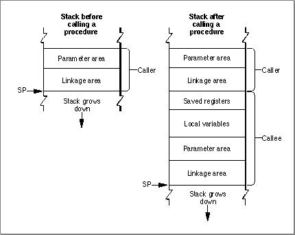
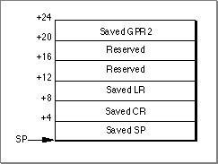
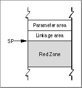
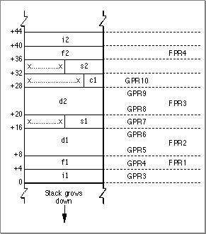
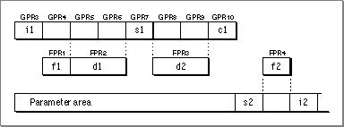
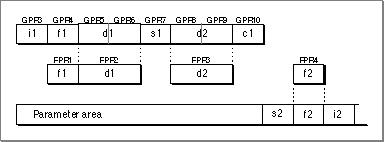

# PowerPC Runtime Conventions This chapter covers specific low-level details of the PowerPC runtime environment, including the following:  data storage types 
stack structure
routine calling conventions 
 These conventions may be useful for low-level programming (if you are writing in assembly language, for example) or for optimizing higher-level code.   Chapter Contents   Data Types  Data Alignment  PowerPC Stack Structure   Prologs and Epilogs  The Red Zone   Routine Calling Conventions   Function Return  Register Preservation               
# Data Types
   Table 4-1  lists the binary data types and their sizes in the PowerPC runtime environment.
All numeric and pointer data types are stored in big-endian format (that is, high bytes first, then low bytes). Signed integers use two's-complement representation.
---


Main Body
 Chapter 4 - PowerPC Runtime Conventions
---

# Data Alignment
  The PowerPC runtime environment supports multiple data alignment modes. These alignments fall into two categories:
- the natural alignment, which is the alignment of a data type when allocated in memory or assigned a memory address  the embedding alignment, which is the alignment of a data type within a composite data item
  For example, the alignment of a  `UInt16`  variable may differ from that of a  `UInt16`  data item embedded in a data structure.
Note   Data items passed as parameters in a routine call have their own special alignment rules. See  "Routine Calling Conventions," beginning on page 4-11 , for more information.       Table 4-1 (page 4-3)  shows the natural alignment of each data type, which is simply the size of the data type. This alignment is fixed.
In data structures, you can specify an embedding alignment that varies depending on the alignment mode selected. Typically you can select the alignment mode using compiler options or pragmas.  Table 4-2  shows the possible alignment modes.
| Data type | PowerPC | 68K | Packed | Natural |
| --- | --- | --- | --- | --- |
| SInt8UInt8Boolean | 1 | 1 | 1 | 1 |
| SInt16UInt16 | 2 | 2 | 1 | 2 |
| SInt32UInt32 | 4 | 2 | 1 | 4 |
| float | 4 | 2 | 1 | 4 |
| double | 4 or 8 | 2 | 1 | 8 |
| Pointer | 4 | 2 | 1 | 4 |
| Composite | 4 or 8 | 2 | 1 | 16 |

In all but the 68K alignment mode, the embedding alignment of a composite (for example, a data structure or an array) is determined by the largest embedding alignment of its members. The total size of a composite is rounded up to be a multiple of its embedded alignment.
In 68K alignment mode, the embedded alignment of a composite is always 2 bytes. The total size of the composite is rounded up to a multiple of two.
In PowerPC alignment mode, if the first embedded element in a data structure is type  `double` , then the embedding alignment of all type  `double`  members in the structure is 8. In such cases, the embedding alignment for the entire structure is also 8 bytes.
Note that you may need to adjust embedded alignments if you are converting code from the classic 68K environment to the PowerPC (or CFM-68K) runtime environments. If you wish to enforce classic 68K alignment on your PowerPC code, you can often specify compiler pragmas or options to do so. Note, however, that the PowerPC processor is less efficient when accessing data that is not placed according to its natural alignment.
---


Main Body
 Chapter 4 - PowerPC Runtime Conventions
---

# PowerPC Stack Structure
   The PowerPC runtime environment uses a grow-down stack that contains linkage information, local variables, and a routine's parameter information as shown in  Figure 4-1 .
Figure 4-1  The PowerPC stack


The typical PowerPC stack conventions use only a stack pointer (held in register GPR1) and no frame pointer. This configuration assumes a fixed stack frame size, which is known at compile time. Parameters are not passed by pushing them onto the stack.
The calling routine's stack frame includes a parameter area and some linkage information. The parameter area has space for the parameters of any routines the caller calls (not the parameters of the caller itself). Since the calling routine might call several different routines, the parameter area must be large enough to accomodate the largest parameter list of all the routines the caller calls. It is the calling routine's responsibility for setting up the parameter area before each call to some other routine, and the called routine's responsibility for accessing the parameters placed within it. See  "Routine Calling Conventions," beginning on page 4-11 , for more information about the calling conventions.
The calling routine's linkage area holds a number of values, some of which are saved by the calling routine and some by the called routine.  Figure 4-2  shows the structure of the linkage area.
Figure 4-2  A stack frame's linkage area


The elements within the linkage area are as follows:
- The base register (GPR2) value is saved at  `20(SP)`  by the calling routine prior to the call if
- the call is to an imported routine  the call is a pointer-based call (which may or may not be cross-fragment)
This action ensures that the calling routine can still access its own direct data area upon return. See  "PowerPC Implementation," beginning on page 2-6 , for more information. Local calls do not need to save this value.
   The Link Register (LR) value is saved at  `8(SP)`  by the called routine if it chooses to do so.  The Condition Register (CR) value may be saved at  `4(SP)`  by the called routine. As with the Link Register value, the called routine is not required to save this value.  The stack pointer is always saved by the calling routine as part of its stack frame.
  Note that the linkage area is at the top of the stack, adjacent to the stack pointer. This positioning is necessary so the calling routine can find and restore the values stored there and also to enable the called routine to find the caller's parameter area. This placement means that a routine cannot push and pop parameters from the stack once the stack frame is set up.
The stack frame also includes space for the called routine's local variables. In general, the general-purpose registers GPR13 through GPR31 and the floating-point registers FPR14 through FPR31 are reserved for the routine's local variables. However, if the routine contains more local variables than would fit in the registers, it uses additional space on the stack. The size of the local variable area is determined at compile time; once a stack frame is allocated, the size of the local variable area cannot change.
---
   SubtopicsTOC      Prologs and Epilogs     The Red Zone

---


Main Body
 Chapter 4 - PowerPC Runtime Conventions  /  PowerPC Stack Structure
---

## Prologs and Epilogs
   T he called routine is responsible for allocating its own stack frame, making sure to preserve 16-byte alignment on the stack. This action is accomplished by the prolog before entering the actual routine. The compiler-generated prolog code does the following:
- Decrements the stack pointer to account for the new stack frame.  Writes the previous value of the stack pointer to its own linkage area. This procedure ensures that the stack can be restored to its original state after returning from the call.  Saves all nonvolatile general-purpose and floating-point registers into the saved-registers area. Note that if the called routine does not change a particular nonvolatile register, it does not save it.  Saves the Link Register and Condition Register values in the caller's linkage area, if needed.
     Note   The order in which the prolog executes these actions is determined by convention, not by any requirements of the PowerPC runtime architecture.       Listing 4-1  shows some sample prolog code. Note that the order of these actions differs from the order previously described.
Listing 4-1  Sample prolog code
```
linkageArea: set 24     ; size in PowerPC environment
params: set 32          ; callee parameter area
localVars: set 0        ; callee local variables
numGPRs: set 0          ; volatile GPRs used by callee
numFPRs: set 0          ; volatile FPRs used by callee)

spaceToSave: set linkageArea + params + localVars
spaceToSave: set spaceToSave + 4*numGPRs + 8*numFPRs

.moo:                   ; PROLOG
   mflr  r0,            ; extract return address 
   stw   r0,8(SP)       ; save the return address
   stwu  SP, -spaceToSave(SP); skip over caller save area
```
   After the called routine exits, the epilog code executes, which does the following:
- Restores the nonvolatile general-purpose and floating-point registers that were saved in the stack frame.  Restores the Condition Register and Link Register values that were stored in the linkage area.  Restores the stack pointer to its previous value.  Returns to the calling routine using the address stored in the Link Register.
   Listing 4-2  shows some sample epilog code.
Listing 4-2  Sample epilog code
```
; EPILOG
   lwz   r0,spaceToSave(SP)+8; get the return address
   mtlr  R0                ; reset Link Register
   addic SP,SP,spaceToSave ; restore stack pointer
   blr                     ; return
```
  The calling routine is responsible for restoring its GPR2 value immediately after returning from the called routine.

---


Main Body
 Chapter 4 - PowerPC Runtime Conventions  /  PowerPC Stack Structure
---

## The Red Zone
  The space beneath the stack pointer, where a new stack frame would normally be allocated, is called the  Red Zone. This area, as shown in  Figure 4-3 , may be used for any purpose as long as a new stack frame does not need to be added to the stack.
Figure 4-3  The Red Zone


For example, the Red Zone may be used by a  leaf procedure. A leaf procedure is a routine that does not call any other routines. Since it does not call any other routines, it does not need to allocate a parameter area on the stack. Furthermore, if it does not need to use the stack to store local variables, it need save and restore only the nonvolatile registers that it uses for local variables. Since by definition no more than one leaf procedure is active at any time, there is no possibility of multiple leaf procedures competing for the same Red Zone space.
A leaf procedure does not allocate a stack frame nor does it decrement the stack pointer. Instead it stores the Link Register and Condition Register values in the linkage area of the routine that calls it (if necessary) and stores the values of any nonvolatile registers it uses in the Red Zone. This streamlining means that a leaf procedure's prolog and epilog do only minimal work; they do not have to set up and take down a stack frame.
When an exception handler is called, the Exception Manager automatically decrements the stack pointer by 224 bytes (the largest possible area used to save registers), to skip over any possible Red Zone information, and then restores the stack pointer when the handler exits. The Exception Manager does this because an exception handler cannot know in advance if a leaf procedure is executing at the time the exception occurs. If you are writing code that modifies the stack at interrupt time, you must similarly decrement the stack pointer by 224 bytes to preserve any Red Zone information and restore it after the interrupt call.
Note   The value of 224 bytes is the space occupied by nineteen 32-bit general-purpose registers plus eighteen 64-bit floating-point registers, rounded up to the nearest 16-byte boundary. If a leaf procedure's Red Zone usage would exceed 224 bytes, then it must set up a stack frame just like routines that call other routines.

---


Main Body
 Chapter 4 - PowerPC Runtime Conventions
---

# Routine Calling Conventions
   This section details the process of passing parameters to a routine in the PowerPC runtime environment.
Note   These parameter passing conventions are part of Apple's standard for procedural interfaces. Object-oriented languages may use different rules for their own method calls. For example, the conventions for C++ virtual function calls may be different from those for C functions.       A routine can have a fixed or variable number of arguments. In an ANSI-style C syntax definition, a routine with a variable number of arguments typically appears with ellipsis points (...) at the end of its input parameter list.
A variable-argument routine may have several required (that is, fixed) parameters preceding the variable parameter portion. For example, the routine definition
```
mooColor(number,[color1. . .])
```
  gives no restriction on the number of color arguments, but you must always precede them with a number argument. Therefore, number is a fixed parameter.
Typ ically the calling routine passes parameters in registers. However, the compiler generates a parameter area in the caller's stack frame that is large enough to hold all parameters passed to the called routine, regardless of how many of the parameters are actually passed in registers. There are several reasons for this scheme:
- It provides the callee with space to store a register-based parameter if it wants to use one of the parameter registers for some other purpose (for instance, to pass parameters to a subroutine).  Routines with variable-length parameter lists must often access their parameters from RAM, not from registers. Such routines must reserve eight registers (32 bytes) in the parameter area to hold the parameter values.  To simplify debugging, some compilers may write parameters from the parameter registers into the parameter area in the stack frame; this allows you to see all the parameters by looking only at that parameter area.
   You can think of the parameter area as a data structure that has space to hold all the parameters in a given call. The parameters are placed in the structure from left to right according to the following rules:
- All parameters are aligned on 4-byte (word) boundaries.  Noncomposite parameters smaller than 4 bytes occupy the low order bytes of their word.  Composite parameters (such as data structures) are followed by padding to make a multiple of 4 bytes, with the padding bytes being undefined.
   For a routine with fixed parameters, the first 8 words (32 bytes) of the data structure, no matter the size of the individual parameters, are passed in registers according to the following rules:
- The first 8 words are placed in GPR3 through GPR10 unless a floating-point parameter is encountered.  Floating-point parameters are placed in the floating-point registers FPR1 through FPR13.  If a floating-point parameter appears before all the general-purpose registers are filled, the corresponding GPRs that match the size of the floating-point parameter are skipped. For example, a  `float`  item causes one (4-byte) GPR to be skipped, while an item of type  `double`  causes two GPRs to be skipped.  If the number of parameters exceeds the number of usable registers, the calling routine writes the excess parameters into the parameter area of its stack frame.
     Note   Currently the parameter area must be at least 8 words (32 bytes) in size.      For example, consider a routine  `mooFunc`  with this declaration:
```c
void mooFunc (SInt32 i1, float f1, double d1, SInt16 s1, double d2, 
            UInt8 c1, UInt16 s2, float f2, SInt32 i2);
```
  To see how the parameters of  `mooFunc`  are arranged in the parameter area on the stack, first convert the parameter list into a structure, as follows:
```c
struct params {
   SInt32            p_i1;
   float             p_f1;
   double            p_d1;
   SInt16            p_s1;
   double            p_d2;
   UInt8             p_c1;
   UInt16            p_s2;
   float             p_f2;
   SInt32            p_i2;
};
```
   This structure serves as a template for constructing the parameter area on the stack. (Remember that, in actual practice, many of these variables are passed in registers; nonetheless, the compiler still allocates space for all of them on the stack, for the reasons just mentioned.)
The "top" position on the stack is for the field  `pi_1`  (the structure field corresponding to parameter  `i1` ). The floating-point field  `p_f1`  is assigned to the next word in the parameter area. The 64-bit double field  `p_d1`  is assigned to the next two words in the parameter area. Next, the short integer field  `p_s1`  is placed into the following 32-bit word; the original value of  `p_s1`  is in the lower half of the word, and the padding is in the upper half. The remaining fields of the  `params`  structure are assigned space on the stack in exactly the same way, with unsigned values being extended to fill each field to make it a 32-bit word. The final arrangement of the stack is illustrated in  Figure 4-4 . (Because the stack grows down, it looks as though the fields of the  `params`  structure are upside down.)
Figure 4-4  The organization of the parameter area of the stack


To see which parameters are passed in registers and which are passed on the stack, you need to map the stack, as illustrated in  Figure 4-4 , to the available general-purpose and floating-point registers. Therefore, the parameter  `i1`  is passed in GPR3, the first available general-purpose register. The floating-point parameter  `f1`  is passed in FPR1, the first available floating-point register. This action causes GPR4 to be skipped.
The parameter  `d1`  is placed into FPR2 and the corresponding general-purpose registers GPR5 and GPR6 are unused. The parameter  `s1`  is placed into the next available general-purpose register, GPR7. Parameter  `d2`  is placed into FPR3, with GPR8 and GPR9 masked out. Parameter  `c1`  is placed into GPR10, which fills out the first 8 words of the data structure. Parameter  `s2`  is then passed in the parameter area of the stack. Parameter  `f2`  is passed in FPR4, since there are still floating-point registers available. Finally, parameter  `i2`  is passed on the stack.  Figure 4-5  shows the final layout of the parameters in the registers and the parameter area.
Figure 4-5  Parameter layout in registers and the parameter area


If you have a C routine with a variable number of parameters (that is, one that does not have a fixed prototype), the compiler cannot know whether to pass a parameter in the variable portion of the routine in the general-purpose (that is, fixed-point) registers or in the floating-point registers. Therefore, the compiler passes the parameter in both the floating-point and the general-purpose registers, as shown in  Figure 4-6 .
Figure 4-6  Passing a variable number of parameters


The called routine can access parameters in the fixed portion of the routine definition as usual. However, in the variable-argument portion of the routine, the called routine must copy the GPRs to the parameter area and access the values from there.  Listing 4-3  shows a routine that accesses values by walking through the stack.
Listing 4-3  A variable-argument routine
```
double dsum (int count, ...) 
{
   double sum = 0.0;
   double * arg = (double *) (&count + 1 /* pointer arithmetic */);
   while (count > 0 ) {
      sum += *arg;
      arg += 1;       /* pointer arithmetic */
      count -= 1;
   }
return sum;
}
```

---
   SubtopicsTOC      Function Return     Register Preservation

---


Main Body
 Chapter 4 - PowerPC Runtime Conventions  /  Routine Calling Conventions
---

## Function Return
   In the PowerPC runtime environment, floating-point function values are returned in register FPR1 (or FPR1 and FPR2 for long double values). Other values are returned in GPR3 as follows:
- Functions returning simple values smaller than 4 bytes (such as type  `SInt8` ,  `Boolean` , or  `SInt16` ) place the return value in the least significant byte or bytes of GPR3. The most significant bytes in GPR3 are undefined.  Functions returning 4-byte values (such as pointers, including array pointers, or types  `SInt32`  and  `UInt32` ) return them normally in GPR3.  If a function returns a composite value (for example, a  `struct`  or  `union`  data type) or a value larger than 4 bytes, a pointer must be passed as an implicit left-most parameter before passing all the user-visible arguments (that is, the address is passed in GPR3, and the actual parameters begin with GPR4). The address of the pointer must be a memory location large enough to hold the function return value. Since GPR3 is treated as a parameter in this case, its value is not guaranteed on re turn .

---


Main Body
 Chapter 4 - PowerPC Runtime Conventions  /  Routine Calling Conventions
---

## Register Preservation
   Table 4-3  lists registers used in the PowerPC runtime environment and their volatility in routine calls. Registers that retain their value after a routine call are called nonvolatile. All registers are 4 bytes long.
| Type | Register | Preserved by aroutine call? | Notes |
| --- | --- | --- | --- |
| General- purpose register | GPR0 | No |  |
|  | GPR1 | See next column | Used as the stack pointer to store parameters and other temporary data items. |
|  | General- purpose register | GPR2 | See next column |
| General- purpose register | GPR2 | See next column | Used as the base register to access the direct data area. GPR2 is preserved b... |
|  | GPR3 | See next column | Holds the return value or the address of the return value in function calls. ... |
|  | GPR4-GPR10 | No | Used to pass parameter values in routine calls. |
|  | GPR11-GPR12 | No |  |
|  | GPR13-GPR31 | Yes |  |
| Floating- point register | FPR0 | No |  |
|  | FPR1-FPR13 | No | Used to pass floating- point parameters in routine calls. |
|  | FPR14-FPR31 | Yes |  |
| Link Register | LR | No | Stores the return address of the calling routine during a routine call. |
| Count Register | CTR | No |  |
|  | Fixed-point exception register | XER | No |
| Fixed-point exception register | XER | No |  |
| Condition Registers | CR0-CR1 | No |  |
|  | CR2-CR4 | Yes |  |
|  | CR5-CR7 | No |  |

---