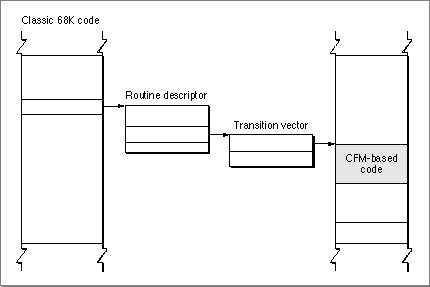
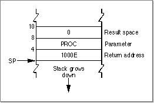
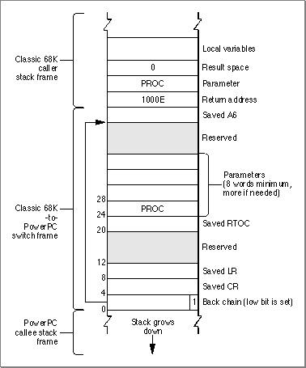
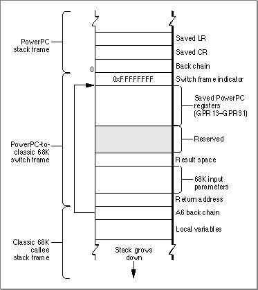
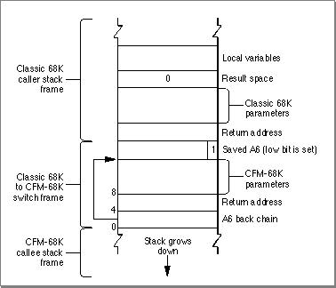
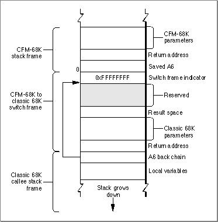

# The Mixed Mode Manager
 In certain cases, your CFM-based application or shared library may need to call routines written in classic 68K code or vice versa. For example, a PowerPC runtime program may need to call a system software routine that runs as emulated classic 68K code. The Mixed Mode Manager allows you to make such routine calls transparently.
 You should read this chapter if you have any of the following concerns:  You are writing CFM-based code, but want to make sure that it remains compatible with existing classic 68K software (third-party plug-ins, for example).
You need to maintain binary compatibility with old classic 68K routines or libraries whose source code is not available. You cannot recompile them for the CFM-based architecture, but you still want to be able to use the old routines. 
You are writing a low-level debugger or other tool that requires understanding of the Mixed Mode Manager.  
 This chapter assumes you have general programming knowledge of both the CFM-based runtime architecture and the classic 68K runtime architecture.   Chapter Contents   Overview  Universal Procedure Pointers and Routine Descriptors    CFM-Based Code Originates the Call  Classic 68K Code Originates the Call   Mixed Mode Manager Performance Issues   Mode Switching Implementations   Calling PowerPC Code From Classic 68K Code  Calling Classic 68K Code From PowerPC Code  Calling CFM-68K Code From Classic 68K Code  Calling Classic 68K Code From CFM-68K Code              
# Overview
   The Mixed Mode Manager is essentially a "black box" interface that allows routines with different calling conventions to exchange parameter information. The routines may reflect different architectures, different hardware, or both, but the basic treatment is the same.
In addition to routine parameter information, the Mixed Mode Manager requires the following information to make a mode switch:
- the calling conventions of the routine making the call  a translation key that tells the Mixed Mode Manager how to manipulate the parameters to meet the calling conventions of the routine being called
  Currently the Mixed Mode Manager handles calls between CFM-based architecture code and classic 68K architecture code.
The Mixed Mode Manager has two rules for the code that it handles:
1. The older classic 68K code does not need to be aware of the Mixed Mode Manager and no modification is required for mode switching.  The newer CFM-based code must be aware of the Mixed Mode Manager and take the steps necessary to invoke it if there is the possibility of a mode switch. Typically a mode switch can occur when a routine calls code not stored directly in the application or software (for example when loading and executing code stored in a resource).
  Given these assumptions, if there is the possibility of a mode switch, there are four different types of calls that can be made:
- A CFM-based routine calls a classic 68K routine.  A CFM-based routine calls a CFM-based routine.  A classic 68K routine calls a CFM-based routine.  A classic 68K routine calls a classic 68K routine.
  How the call is handled depends on the type of code that originates the call:
1. A CFM-based routine originates the call.
Rule 2 requires the calling CFM-based routine to invoke the Mixed Mode Manager if there is a possibility of a mode switch.
If the Mixed Mode Manager discovers that the called routine is classic 68K, a mode switch is required. The Mixed Mode Manager should make the switch and then execute the call. Any return values are passed back to the calling routine.
If the Mixed Mode Manager discovers that the called routine is CFM-based, no mode switch is necessary. The Mixed Mode Manager should allow the call to be made normally.
Note that you need to call the Mixed Mode Manager only if the calling conventions of the called routine are unknown. If you know that both the calling routine and the called routine are CFM-based (when making routine calls within an application, for example), you do not have to call the Mixed Mode Manager.  A classic 68K routine originates the call.
Rule 1 requires that a classic 68K routine need no knowledge of the Mixed Mode Manager.
If the called routine is CFM-based, the supplier of the CFM-based routine must make sure the Mixed Mode Manager is invoked. The Mixed Mode Manager can then make the mode switch, execute the call, and pass back any return values.
If the called routine is a classic 68K routine, neither the calling routine or the called routine invokes the Mixed Mode Manager. The call proceeds normally.
     IMPORTANT   The Mixed Mode Manager knows the size of the parameters it translates but not their type, so it cannot handle floating point parameters. If you need to pass floating-point values in a possible Mixed Mode call, you should pass pointers to the values instead.
---


Main Body
 Chapter 6 - The Mixed Mode Manager
---

# Universal Procedure Pointers and Routine Descriptors
  While the Mixed Mode Manager is the mechanism for switching between CFM-based code and classic 68K code, the actual interface between the two types of code is the  universal procedure pointer. A universal procedure pointer may be either of the following:
- A pointer to classic 68K code.  A pointer to  a routine descriptor, a data structure that describes the address of the called routine, its parameter signature, and its calling conventions. The Mixed Mode Manager uses the routine descriptor as a key to translate between the CFM-based and classic 68K calling conventions.
  Both the calling code and the supplier of the called routine must agree to pass universal procedure pointers to each other. In general, you do not have to worry about which flavor of universal procedure pointer you are passing; as long as you pass a pointer of type  `UniversalProcPtr` , the Mixed Mode Manager handles the rest and makes the mode switch when necessary. How you set up a universal procedure pointer varies depending on the type of code that initiates the call.
Note   Note that the choices for universal procedure pointers reflect the Mixed Mode Manager rules described earlier. Classic 68K code can pass universal procedure pointers without any code modification because all classic 68K procedure pointers are simply redefined to be universal procedure pointers.
---
   SubtopicsTOC      CFM-Based Code Originates the Call     Classic 68K Code Originates the Call

---


Main Body
 Chapter 6 - The Mixed Mode Manager  /  Universal Procedure Pointers and Routine Descriptors
---

## CFM-Based Code Originates the Call
  If CFM-based code makes a pointer-based call to a routine that might be in classic 68K code, you should call the routine  `CallUniversalProc`  to invoke a universal procedure pointer instead of a standard procedure pointer. For example, instead of simply calling an external routine using
```
(*moo)(cow);
```
  you must call
```
CallUniversalProc((UniversalProcPtr) moo, mooProcInfo, cow);
```
  where  `mooProcInfo`  describes the calling conventions of  `moo` . See Inside Macintosh: PowerPC System Software for more information on setting up the  `ProcInfo`  data structure.
IMPORTANT   In general you need to call  `CallUniversalProc`  only when calling external routines. Most CFM-based to CFM-based calls (including pointer-based calls) know that the called routine is CFM-based, so they do not need to call  `CallUniversalProc` .      Calling  `CallUniversalProc`  invokes the Mixed Mode Manager, which decides if a mode switch is necessary.
If the pointer it received ( `*moo`  in this case) turns out to point to a routine descriptor, the call requires a mode switch.The Mixed Mode Manager uses the routine descriptor to translate the parameter information into the form that the classic 68K routine expects to see and then calls the routine. After executing the routine, any return values are translated and passed back to the calling CFM-based routine.
If no mode switch is necessary the Mixed Mode Manager allows the call to be made normally. When the called routine returns, control passes back directly to the caller, not the Mixed Mode Manager.

---


Main Body
 Chapter 6 - The Mixed Mode Manager  /  Universal Procedure Pointers and Routine Descriptors
---

## Classic 68K Code Originates the Call
  If classic 68K code initiates the call, then the calling routine is not required to take any action; it is never even aware that a mode switch might be necessary.
The calling routine must always pass a universal procedure pointer. If the called routine is also classic 68K code, the universal procedure pointer is simply a classic 68K pointer (that is, a pointer to the called routine). The Mixed Mode Manager is never invoked, and the call proceeds normally.
If the called routine is CFM-based code, the universal procedure pointer cannot be a classic 68K pointer; it must therefore be a pointer to a routine descriptor. The classic 68K caller is not required to change, so the supplier of the CFM-based routine must provide the routine descriptor.
Note   The routine descriptor is not part of the called routine. Rather, it is a shell or wrapper through which all external calls to the routine must pass.      The first instruction in the routine descriptor is an A-line instruction that invokes the Mixed Mode Manager. The Mixed Mode Manager handles the mode switch using the information stored in the routine descriptor and then calls the transition vector of the CFM-based code.  Figure 6-1  shows the calling path from the classic 68K code to the CFM-based code.
Figure 6-1  Calling path from classic 68K code to a CFM-based routine


After the call any return values are passed back to the classic 68K caller.
In order to satisfy the agreement to always pass universal procedure pointers, you must create routine descriptors for any CFM-based routines that may be called by classic 68K code. For example, if you supply a callback routine, you must take additional steps to anticipate a possible mode switch when the callback occurs. A classic 68K runtime function call such as
```
AEInstallEventHandler (kCoreEventClass, kAEOpenApplication,
                     HandleOapp,0,false);
```
  must be changed to
```
UniversalProcPtr myHandleOappProc;
myHandleOappProc = NewAEEventHandlerProc (HandleOapp);
AEInstallEventHandler (kCoreEventClass,kAEOpenApplication,
                     myHandleOappProc,0,false)
```
  The  `NewAEEventHandlerProc`  macro (defined in  `AppleEvents.h` ) calls the Mixed Mode Manager's  `NewRoutineDescriptor`  function to create a routine descriptor for  `HandleOapp` .
Note   In certain cases where you cannot modify the CFM-based code (if it is a third-party library whose source code is unavailable, for example), it is possible to construct routine descriptors in your classic 68K code.

---


Main Body
 Chapter 6 - The Mixed Mode Manager
---

# Mixed Mode Manager Performance Issues
  The Mixed Mode Manager, while extremely useful for maintaining compatibility between CFM-based code and classic 68K code, takes a significant number of instruction cycles to perform a mode switch, so you should keep this in mind when determining when and how often to switch between architectures.
In general this is not a problem if the time spent switching architectures is a negligible percentage of the time spent in the called routines. For example, if your classic 68K application calls a PowerPC graphics filter plug-in, most of the execution time is spent crunching numbers in the plug-in, so performance is not affected.
However, consider a short PowerPC patch for an emulated classic 68K software program. Theoretically increasing the amount of native PowerPC code should improve performance. However, if the mode-switching time is a significant portion of the patch's execution time and the patch is in a location where it is called frequently, considerable "dead time" accumulates as the Mixed Mode Manager switches back and forth; in such cases performance can actually decrease. In extreme cases, the time spent mode switching is so great that a classic 68K version of the patch results in better performance than a PowerPC patch. To avoid such problems, you should create fat patches that contain both CFM-based and classic 68K code. See  "Mode Switching Implementations," beginning on page 6-10 , and  "Accelerated and Fat Resources," beginning on page 7-4 , for more information on creating fat programs.
---


Main Body
 Chapter 6 - The Mixed Mode Manager
---

# Mode Switching Implementations
   This section describes the implementations that the Mixed Mode Manager uses to switch modes between PowerPC and emulated classic 68K and in switching between CFM-68K and classic 68K.
Note that you need to read this section only if you need low-level details of how the Mixed Mode Manager implements stack switch frames during a mode switch (if you are writing a debugger, for example).
---
   SubtopicsTOC      Calling PowerPC Code From Classic 68K Code     Calling Classic 68K Code From PowerPC Code     Calling CFM-68K Code From Classic 68K Code     Calling Classic 68K Code From CFM-68K Code

---


Main Body
 Chapter 6 - The Mixed Mode Manager  /  Mode Switching Implementations
---

## Calling PowerPC Code From Classic 68K Code
   This section describes how the Mixed Mode Manager switches modes from the classic 68K emulated environment to the PowerPC native environment. This can happen when classic 68K code calls a system software routine or plug-in that is implemented in the PowerPC instruction set.
Suppose that a classic 68K application calls a PowerPC routine. The application is not aware that it is running under the 68LC040 Emulator, so it just pushes the routine's parameters onto the stack (or stores them into registers) and then jumps to the routine or calls a trap that internally jumps to the routine. If the routine exists as classic 68K code, no mode switch is required and the routine is called as usual. If, however, the routine exists as PowerPC code, the calling application must implicitly invoke the Mixed Mode Manager.
If the calling application merely jumps to the PowerPC code, the code must begin with a routine descriptor, as explained in  "Accelerated and Fat Resources," beginning on page 7-4 . If the calling application calls a trap, the trap dispatch table must contain--instead of the address of the routine's executable code--the address of a routine descriptor for that routine. This routine descriptor is created at system startup time.
For example, suppose that your application calls the  `CountResources`  function, as follows:
```
myResCount = CountResources('PROC');
```
  Suppose further that  `CountResources`  has been ported to the PowerPC instruction set. When your application calls  `CountResources` , the stack looks like the one shown in  Figure 6-2 .
Figure 6-2  The stack before a mode switch


The trap dispatcher executes the  `CountResources`  routine descriptor, which begins with an executable instruction that invokes the Mixed Mode Manager. The Mixed Mode Manager retrieves the transition vector and creates a switch frame on the stack. A switch frame is a stack frame that contains information about the routine to be executed, the state of various registers, and the address of the previous frame.  Figure 6-3  shows the structure of a classic 68K to PowerPC switch frame.
Note   In  Figure 6-3  the low bit in the back chain pointer to the saved A6 value is set. This bit signals to the Mixed Mode Manager that a switch frame is on the stack. The Mixed Mode Manager fails if the stack pointer has an odd value.       Figure 6-3  A classic 68K to PowerPC switch frame


In addition to creating a switch frame, the Mixed Mode Manager also sets up several CPU registers:
- The PowerPC base register (GPR2) must be set to the direct data area of the fragment containing the  `CountResources`  routine. This value is obtained from the transition vector whose address is extracted from the routine descriptor.  The Link Register (LR) must be set to point to code that cleans up the stack and restarts the emulator.
  At this point, it's safe to execute the native  `CountResources`  code. When  `CountResources`  completes, the Mixed Mode Manager pops the return address and parameters off the stack (since  `CountResources`  follows Pascal calling conventions). The GPR2, LR, and CR are restored to their saved values, and the switch frame is popped off the stack. The Mixed Mode Manager then jumps back into the 68LC040 Emulator, and the application continues execution.

---


Main Body
 Chapter 6 - The Mixed Mode Manager  /  Mode Switching Implementations
---

## Calling Classic 68K Code From PowerPC Code
   This section describes how the Mixed Mode Manager switches modes from the PowerPC native environment to the classic 68K emulated environment. When PowerPC code calls classic 68K code, the call must go through the routine  `CallUniversalProc` .
The call to  `CallUniversalProc`  invokes the Mixed Mode Manager, which verifies that a mode switch is necessary. At that point, the Mixed Mode Manager saves all nonvolatile registers and other necessary information on the stack in a switch frame.  Figure 6-4  shows the structure of a PowerPC to classic 68K switch frame.
Figure 6-4  A PowerPC to classic 68K switch frame


Once the switch frame is set up, the Mixed Mode Manager sets up the 68LC040 Emulator's context block and then jumps into the emulator. When the routine has finished executing, it attempts to jump to the return address pushed onto the stack. That return address points to a "return-to-native" signal (currently stored in the reserved area of the stack) that is used by the Mixed Mode Manager and the emulator to transfer back to PowerPC code. Once this is done, the Mixed Mode Manager restores native registers that were previously saved and deallocates the switch frame. Control then returns to the caller of  `CallUniversalProc` .
IMPORTANT   As currently implemented, the instruction that causes a return from the 68LC040 Emulator to the native PowerPC environment clears the low-order 5 bits of the Condition Code Register (CCR). This prevents 68K callback procedures from returning information in the CCR. If you want to port classic 68K code that calls an external routine that returns results in the CCR, you must instead call a classic 68K stub that saves that information in some other place.

---


Main Body
 Chapter 6 - The Mixed Mode Manager  /  Mode Switching Implementations
---

## Calling CFM-68K Code From Classic 68K Code
   Calling CFM-68K code from a classic 68K routine is very similar to calling PowerPC code from emulated classic 68K code. However, since no virtual machine switch is needed, the switch frame is simpler.
When the Mixed Mode Manager is invoked through the trap in the routine descriptor, it sets up a classic 68K to CFM-68K switch frame before calling the CFM-68K routine.  Figure 6-5  shows the switch frame.
Note   The low bit of the saved A6 register is set to indicate that a switch frame is on the stack. This is analogous to the set low bit of the back frame in the classic 68K to PowerPC switch frame.       Figure 6-5  A classic 68K to CFM-68K switch frame


After returning from the called routine, the Mixed Mode Manager copies the return value to its proper location (in a register or on the stack) and pops the stack frame and return address off the stack. If the calling routine uses Pascal calling conventions, the calling routine's parameters are also popped off the stack. Control then passes back to the classic 68K code.

---


Main Body
 Chapter 6 - The Mixed Mode Manager  /  Mode Switching Implementations
---

## Calling Classic 68K Code From CFM-68K Code
   Calling classic 68K code from CFM-68K code is analogous to calling classic 68K code from PowerPC code. The call to  `CallUniversalProc`  invokes the Mixed Mode Manager, which verifies that a mode switch is necessary. The Mixed Mode Manager sets up a CFM-68K to classic 68K switch frame before calling the classic 68K code.  Figure 6-6  shows the structure of the switch frame.
Figure 6-6  A CFM-68K to classic 68K switch frame


After returning from the call, the return value is copied to register D0, and the switch frame is popped off the stack. Control then passes back to the CFM-68K code.

---