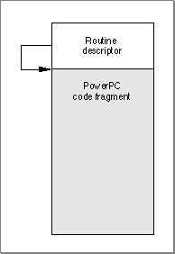
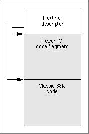

# Fat Binary Programs A fat binary program (often simply called a fat program) is an program that contains executable code for more than one runtime architecture. Typically you create fat programs when you want compatibility between hardware platforms. For example, a fat application with PowerPC code and CFM-68K code can be executed on both PowerPC-based and 68K-based Macintosh computers. A user can store a fat application on a portable hard drive and then move it between a 68K-based computer and a PowerPC- based computer. 
 In addition, fat programs designed to patch code or resources can improve performance by reducing the work of the Mixed Mode Manager. Since a fat program can contain both CFM-based code and classic 68K code, it can execute whichever code is necessary to avoid a mode switch.   Chapter Contents   Creating Fat Binary Programs  Accelerated and Fat Resources             
# Creating Fat Binary Programs
  There are two primary reasons for building fat programs:
- You would like to build an application that runs on both PowerPC-based and 68K-based machines. Fat programs of this type contain PowerPC code and either CFM-68K or classic 68K code.  You are building a shared library, and you would like to have one library file that runs on both PowerPC and 68K-based machines. Fat programs of this type contain PowerPC code and CFM-68K code.
   It is very easy to build a fat application to run PowerPC code and classic 68K code, because you can place the PowerPC code in the data fork of an application file, and the classic 68K code can be placed in  'CODE' ``  resources in the resource fork of the same file. If the application is launched on a PowerPC-based Macintosh computer, the Process Manager recognizes the  `'cfrg'0`  resource and knows to execute the PowerPC fragment in the data fork of the file. The PowerPC Process Manager simply ignores the  'CODE' ``  resources in the resource fork. If the application is launched on a 68K-based Macintosh computer, the Process Manager ignores the  `'cfrg'0`  resource and executes the  `'CODE'`  resources in the resource fork.
To create a fat application that contains both PowerPC code and CFM-68K code is slightly more complicated, because both PowerPC and CFM-68K runtime fragments require a  `'cfrg'0`  resource.
IMPORTANT   If you want to run CFM-based code on both PowerPC-based and 68K-based Macintosh computers, you must build the fragment as a fat program.      As described in  "The Code Fragment Resource," beginning on page 1-20 , the  `'cfrg'0`  resource is an array that identifies, among other things, the instruction set, type, and name of the fragment. It also identifies the location of the PEF container for the fragment. As an array, the  `'cfrg'0`  resource can point to multiple containers.
A fat application for both PowerPC and CFM-68K runtime architectures contains code for each instruction set and a  `'cfrg'0`  resource array that points to both containers. If you launch your application on a 68K Macintosh, the 68K Process Manager reads the  `'cfrg'0`  resource and launches the CFM-68K runtime version of the application. If you launch your application on a PowerPC-based Macintosh, the PowerPC Process Manager reads the  `'cfrg'0`  resource and launches the PowerPC version of the application.
You can also create a fat shared library containing both a CFM-68K runtime library and a PowerPC runtime library. Both the PowerPC and CFM-68K fragments are stored in the data fork, with the  `'cfrg'0`  resource pointing to their locations. In this way, you can ship a single library file that supports both CFM-68K and PowerPC runtime applications.
---


Main Body
 Chapter 7 - Fat Binary Programs
---

# Accelerated and Fat Resources
   In some cases you may want to put an executable CFM-based code fragment into a resource to obtain a CFM-based version of a classic 68K stand-alone code module. For example, you might recompile an existing Hypercard XCMD (eXternal CoMmanD) procedure (which is stored in a resource of type  `'XCMD'` ) into PowerPC code. However, because the Hypercard application that calls your XCMD procedure could be classic 68K code, a mode switch to the PowerPC environment might be required before your definition procedure can be executed.  As a result, you need to add a routine descriptor at the beginning of the resource, as shown in  Figure 7-1 . These kinds of resources are called   accelerated resources  because they are faster implementations of their classic 68K counterparts. You can transparently replace classic 68K code resources with accelerated PowerPC code resources without having to change the software (for example, an application) that uses them.
Figure 7-1  The structure of an accelerated resource


IMPORTANT   Storing CFM-based code in resources is generally not recommended and should be done only in cases where you have no control over the code that calls it. If you are designing a plug-in interface, the plug-ins should be stored in the data fork.      The routine descriptor is necessary for the Mixed Mode Manager to know whether it needs to change modes in order to execute the code. The routine descriptor also lets the Mixed Mode Manager know whether it needs to call the Code Fragment Manager to prepare the fragment.
The  `procDescriptor`  field of the routine record--contained in the  `routineRecords`  field of the routine descriptor--should contain the offset from the beginning of the resource (that is, the beginning of the routine descriptor) to the beginning of the executable code fragment. In addition, the routine flags for the specified code should have the  `kProcDescriptorIsRelative`  bit set, indicating that the address is relative, not absolute. If the code contained in the resource is CFM-based code, you should also set the  `kFragmentNeedsPreparing`  bit.
You can also create fat resources, that is, resources containing both classic 68K and PowerPC versions of some routine.  Figure 7-2  shows the general structure of such a resource.
Figure 7-2  The structure of a fat resource


In this case, the routine descriptor contains two routine records in its  `routineRecords`  field, one describing the classic 68K code and one describing the PowerPC code. As with any code-bearing resource, the  `procDescriptor`  field of each routine record should contain the offset from the beginning of the resource to the beginning of the appropriate code. The flags for both routine records should have the  `kProcDescriptorIsRelative`  flag set, and the routine flags for the PowerPC routine record should have the  `kFragmentNeedsPreparing`  flag set.
Note   You can also create a fat resource that contains CFM-68K code and classic 68K code, although there are no obvious advantages. However, doing so may simplify static data access or code compatibility in some cases.       Since a fat resource contains a routine descriptor at its entry point, it assumes that the host system contains the Mixed Mode Manager. If this is not the case, a problem can arise when the Mixed Mode trap is invoked. A solution is to create a variant called a safe fat resource ,  which begins with extra classic 68K code to check for the presence of the Mixed Mode Manager. If the Mixed Mode Manager is present, the code should move a routine descriptor to the beginning of the resource. If the Mixed Mode Manager is not present, it should add a branch instruction at the beginning to jump directly to the classic 68K portion of the resource. Thus the first call to the resource uses a few extra instruction cycles, but subsequent calls are faster.
Note   In MPW, the interface file  `MixedMode.r`  provides Rez templates that you can use to create the accelerated resource shown in  Figure 7-1  or the fat resource shown in  Figure 7-2 . The file also contains sample code for creating a safe fat resource.       WARNING   Do not call accelerated resources at interrupt time. If the resource containing the code has not been prepared, the Code Fragment Manager will be called to do so, and the Code Fragment Manager cannot run at interrupt time.      Sometimes it's useful to keep the executable code of a definition function in some location other than a resource. To do this, you need to create a stub definition resource that is of the type expected by the system software and that simply jumps to your code. For example,  Listing 7-1  shows the Rez input for a stub list definition resource.
Listing 7-1  Rez input for a stub list definition resource
```
data 'LDEF' (128, "MyCustomLDEF", preload, locked) {
   /*need to fill in destination address before using this stub*/
   $"41FA 0006"/*LEA PC+8, A0;A0 <- ptr to destination address*/
   $"2050"     /*MOVEA.L (A0), A0;AO <- destination address*/
   $"4ED0"        /*JMP (A0)  ;jump to destination address*/
   $"00000000"    /*destination address*/
};
```
  Your application (or other software) is responsible for filling in the destination address before the list definition procedure is called by the List Manager. For classic 68K code, the destination address should be the address of the list definition procedure itself. For PowerPC-based code, the destination address should be a universal procedure pointer (that is, the address of a routine descriptor for the list definition procedure).
It's important to understand the distinction between accelerated resources and a normal resource-based fragment (sometimes called a  private resource ), so that you know when to create them and how to load and execute the code they contain. An accelerated resource is any resource containing PowerPC code that has a single entry point at the top (the routine descriptor) and that models the traditional behavior of a classic 68K stand-alone code resource. There are many examples, including menu definition procedures (stored in resources of type  `'MDEF'` ), control definition functions (stored in resources of type  `'CDEF'` ), window definition functions (stored in resources of type  `'WDEF'` ), list definition procedures (stored in resources of type  `'LDEF'` ), HyperCard extensions (stored in resources of type  `'XCMD'` ), and so forth. A private resource is any other kind of executable resource whose code is called directly by your application.
In most cases, you don't need to do anything special to get the system software to recognize your accelerated resource and to call it at the appropriate time. For example, the Menu Manager automatically loads a custom menu definition procedure into memory when you call  `GetMenu`  for a menu whose  `'MENU'`  resource specifies that menu definition procedure. Similarly, HyperCard calls code like that shown in  Listing 7-2  to load a resource of type  `'XCMD'`  into memory and execute the code it contains.
Listing 7-2  Using an accelerated resource
```
Handle      myHandle;
XCmdBlock   myParamBlock;

myHandle = Get1NamedResource('XCMD', '\pMyXCMD');
HLock(myHandle);

/*Fill in the fields of myParamBlock here.*/

CallXCMD(&myParamBlock, myHandle);
HUnlock(myHandle);
```
  The caller of an accelerated resource executes the code either by jumping to the code (if the caller is classic 68K code) or by calling the Mixed Mode Manager  `CallUniversalProc`  function (if the caller is PowerPC code). In either case, the Mixed Mode Manager calls the Code Fragment Manager to prepare the fragment, which is already loaded into memory. With accelerated resources, you don't need to call the Code Fragment Manager yourself. In fact, you don't need to do anything special at all for the system software to recognize and use your accelerated resource if you've built it correctly. This is because the system software is designed to look for, load, and execute those resources in the appropriate circumstances. In many cases, your application passes to the system software just a resource type and resource ID. The resource must begin with a routine descriptor, so that the dereferenced handle to the resource is a universal procedure pointer.
The code shown in  Listing 7-2  (or similar code for any other accelerated resource) can be executed multiple times with no appreciable performance loss. If the code resource remains in memory, the only overhead incurred by  Listing 7-2  is to lock the code, fill in the parameter block, jump to the code, and then unlock it.  However, because of the way in which the system software manages your accelerated resources, there are several important restrictions on their operation:
- An accelerated resource cannot contain a termination routine, largely because the Code Fragment Manager does not know when the resource is released. The Code Fragment Manager effectively forgets about the connection to your resource as soon as it has prepared the resource for execution.  An accelerated resource must contain a main symbol, which must be a procedure. For example, in an accelerated  `'MDEF'`  resource, the main procedure must be the menu definition procedure itself (which typically dispatches to other routines contained in the resource).  You cannot call the Code Fragment Manager routine  `FindSymbol`  to get information about the exported symbols in an accelerated resource. More generally, you cannot call any Code Fragment Manager routine that requires a connection ID as a parameter.  The fragment's data section is instantiated in place (that is, within the block of memory into which the resource itself is loaded). For in-place instantiation, you need to build an accelerated resource using an option that specifies that the data section of the fragment not be compressed. See the documentation for your software development system to determine how to specify uncompressed data sections.  Accelerated resources can move in memory or be purged like classic 68K resources (note that the code in  Listing 7-2  unlocks the  `'XCMD'`  resource after executing it). If the resource moves between calls, some of the global data in the resource might become invalid. For example, a global pointer may end up dangling if the code or data it points to has moved.
  To allow accelerated PowerPC resources to be manipulated just like classic 68K code resources, the Mixed Mode Manager and the Code Fragment Manager cooperate to make sure that the code is ready to be executed when it is called. If the resource code hasn't been moved since it was prepared for execution, then no further action is necessary. If, however, the code resource has moved or been reloaded elsewhere in memory, some of the global data in the resource might have become invalid. To help avoid dangling pointers, the Code Fragment Manager always updates any pointers in the fragment's data section that are initialized at compile time and not modified at runtime.
IMPORTANT   The Code Fragment Manager cannot update all global data references in an accelerated resource that has moved in memory. Therefore, an accelerated resource must not use global pointers (in C code, pointers declared as  `extern`  or  `static` ) that are either initialized at runtime or contained in dynamically allocated data structures to point to code or data contained in the resource itself. An accelerated resource can use uninitialized global data to point to objects in the heap. In addition, an accelerated resource can use global pointers that are initialized at compile time to point to functions, other global data, and literal strings, but these pointers cannot be modified at runtime.      The best way to avoid the global data restrictions on an accelerated resource is to put the global data used by the accelerated resource into an import library. Since the accelerated resource is a fragment, it can import both code and data from the library. The import library's code and data are fixed in memory, and the library is unloaded only when your application terminates, not when the accelerated resource is purged.
If you must declare global variables in your accelerated resource, you should check  Listing 7-3  for examples of acceptable declarations. Note that these declarations assume the resource code does not change the values of the initialized variables.
Listing 7-3  Acceptable global declarations in an accelerated resource
```c
int a;      /*uninitialized; not modified if resource moves*/
Ptr myPtr;  /*uninitialized; not modified if resource moves; */
            /* can be assigned at runtime to point to heap object*/
Handle *h;  /*uninitialized; not modified if resource moves; */
            /* can be assigned at runtime to point to heap object*/
int *b = &a;               /*updated each time resource moves*/
char *myStr = "Hello, world!";/*updated each time resource moves*/
extern int myProcA(), myProcB();
struct {
   int   (*one)();
   int   (*two)();
   char  *str;
} myRec = {myProcA, myProcB, "Hello again!"};
         /*all three pointers are updated each time resource moves*/
```
   Listing 7-4  shows examples of data declarations and code that do not work in an accelerated resource that is moved or purged.
Listing 7-4  Unacceptable global declarations and code in an accelerated resource
```c
int a;
int *b;
int *c = &a;
Ptr (*myPtr) (long) = NewPtr;
static Ptr MyNewPtr();
struct myHeapStruct {
   int      *b;
   Ptr      (myPtr) (long);
} *hs;

b = &a;        /*b does not contain &a after resource is moved*/
c = NULL;      /*c does not contain NULL after resource is moved*/
c = (int *) NewPtr(4);/*dangling pointer after resource is moved*/
myPtr = MyNewPtr;    /*dangling pointer after resource is moved*/
hs = NewPtr(sizeof(myHeapStruct));
         /*hs still points to nonrelocatable heap block after move*/
hs->b = &a;    /*hs->b will not point to global a after move*/
hs->myPtr = MyNewPtr;
               /*hs->myPtr will not point to MyNewPtr after move*/
```

---