# PEF Structure
 This chapter describes the structure of the PEF storage standard, which is the format used to store programs in the Code Fragment Manager-based runtime architecture. You need this information if you read from or write to PEF containers--if you are writing a compiler or other development tool, for example.
 After a high-level view of a PEF container in the "Overview" section, there follow sections that describe the elements of a PEF container in more detail. 
 Note that the PEF storage standard is not exclusive to the CFM-based architecture. Other architectures can follow the specification described here and use PEF containers to store their code and data. In such cases, the appropriate PEF handler for that architecture takes the role of the Code Fragment Manager.   Chapter Contents   Overview  The Container Header  PEF Sections   The Section Name Table  Section Contents    Pattern-Initialized Data  Pattern-Initialization Opcodes  Zero (Opcode 000)    blockCopy (Opcode 001)   repeatedBlock (Opcode 010)   interleaveRepeatBlockWithBlockCopy (Opcode 011)   interleaveRepeatBlockWithZero (Opcode 100)     The Loader Section   The Loader Header  Imported Libraries and Symbols   Imported Library Descriptions  The Imported Symbol Table   Relocations   The Relocation Headers Table  The Relocation Area  A Relocation Example  Relocation Instruction Set  RelocBySectDWithSkip  The Relocate Value Group  The Relocate By Index Group  RelocIncrPosition  RelocSmRepeat  RelocSetPosition  RelocLgByImport  RelocLgRepeat  RelocLgSetOrBySection   The Loader String Table  Exported Symbols   The Export Hash Table  The Export Key Table  The Exported Symbol Table  Hashing Functions  The Name to Hash Word Function  The Hash Word to Hash Index Function  The Exported Symbol Count to Hash Table Size Function    PEF Size Limits             
# Overview
  The CFM-based architecture stores information in PEF containers ,  which are simply storage blocks that contain PEF information. A PEF container can be stored in a file, a resource, or section of memory. The Code Fragment Manager can transparently prepare any of these forms.
A PEF container has four major parts as shown in  Figure 8-1 .
Figure 8-1  Structure of a PEF container
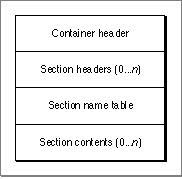

The four parts are as follows:
- The container header contains information about the container itself, such as the runtime architecture that it was created for, version information, and so on.  Each section header contains information (size, alignment, and so on) about the various sections in the PEF container. Both code and data can be stored in sections.  The section name table contains the names of each section.  The section contents area contains the contents of the sections described by the section headers.
  PEF containers typically include one or more sections of executable code, one or more sections of initialized data, and a loader section.
Each part is described in more detail in the sections that follow.
---


Main Body
 Chapter 8 - PEF Structure
---

# The Container Header
   The container header contains information about the specific PEF container. The container header data structure is of fixed size (40 bytes) and has the form shown in  Listing 8-1 .
Listing 8-1  PEF container header data structure
```c
struct PEFContainerHeader {
    OSType tag1;
    OSType tag2;
    OSType architecture;
    UInt32 formatVersion;
    UInt32 dateTimeStamp;
    UInt32 oldDefVersion;
    UInt32 oldImpVersion;
    UInt32 currentVersion;
    UInt16 sectionCount;
    UInt16 instSectionCount;
    UInt32 reservedA;
};
```
  The fields in the container header are as follows:
- The  `tag1`  field (4 bytes) designates that the container uses an Apple-defined format. This field must be set to  `Joy!`  in ASCII.  The  `tag2`  field (4 bytes) identifies the type of container (currently set to  `peff ` in ASCII).  The  `architecture`  field (4 bytes) indicates the architecture type that the container was generated for. This field holds the ASCII value  `pwpc`  for the PowerPC CFM implementation or  `m68k`  for CFM-68K.  The  `formatVersion`  field (4 bytes) indicates the version of PEF used in the container. The current version is  `1.`   The  `dateTimeStamp`  field (4 bytes) indicates when the PEF container was created. The stamp follows the Macintosh time-measurement scheme (that is, the number of seconds measured from January 1, 1904).  The next three fields,  `oldDefVersion` ,  `oldImpVersion` , and  `currentVersion`  (4 bytes each), contain version information that the Code Fragment Manager uses to check shared library compatibility. For more information about version checking, see  "Checking for Compatible Import Libraries" (page 1-15) .  The  `sectionCount`  field (2 bytes) indicates the total number of sections contained in the container.  The  `instSectionCount`  field (2 bytes) indicates the number of instantiated sections. Instantiated sections contain code or data that are required for execution.  The  `reservedA`  field (4 bytes) is currently reserved and must be set to  `0` .

---


Main Body
 Chapter 8 - PEF Structure
---

# PEF Sections
   A PEF container can contain any number of sections. A section usually contains code or data. A special case is the loader section, which is discussed separately in  "The Loader Section" (page 8-15) . For each section there is a header, which includes information such as the type of section, its presumed runtime address, its size, and so on, and a corresponding section contents area.
Sections are numbered from 0, based on the position of their header, and the sections are identified by these numbers. However, the corresponding section contents do not have to be in the same order as the section headers. The only requirement is that instantiated section headers (that is, headers for sections containing code or data) must precede noninstantiated ones in the section header array.
The section header data structure is of fixed size (28 bytes) and has the form shown in  Listing 8-2 .
Listing 8-2  Section header data structure
```c
struct PEFSectionHeader {
    SInt32 nameOffset;
    UInt32 defaultAddress;
    UInt32 totalSize;
    UInt32 unpackedSize;
    UInt32 packedSize;
    UInt32 containerOffset;
UInt8 sectionKind; 
   UInt8 shareKind;   
   UInt8 alignment;   
   UInt8 reservedA;
};
```
  The fields in the section header are as follows:
- The  `nameOffset`  field (4 bytes) holds the offset from the start of the section name table to the location of the section name. The name of the section is stored as a C-style null-terminated character string.
If the section has no name, the  `nameOffset`  field contains  `-1` .  The  `defaultAddress`  field (4 bytes) indicates the preferred address (as designated by the linker) at which to place the section's instance. If the Code Fragment Manager can place the instance in the preferred memory location, the load-time and link-time addresses are identical and no internal relocations need to be performed.  The  `totalSize`  field (4 bytes) indicates the size, in bytes, required by the section's contents at execution time. For a code section, this size is merely the size of the executable code. For a data section, this size indicates the sum of the size of the initialized data plus the size of any zero-initialized data. Zero-initialized data appears at the end of a section's contents and its length is exactly the difference of the  `totalSize`  and  `unpackedSize`  values.
For noninstantiated sections, this field is ignored.  The  `unpackedSize`  (4 bytes) is the size of the section's contents that is explicitly initialized from the container. For code sections, this field is the size of the executable code. For an unpacked data section, this field indicates only the size of the initialized data. For packed data this is the size to which the compressed contents expand. The  `unpackedSize`  value also defines the boundary between the explicitly initialized portion and the zero-initialized portion.
For noninstantiated sections, this field is ignored.  The  `packedSize`  field (4 bytes) indicates the size, in bytes, of a section's contents in the container. For code sections, this field is the size of the executable code. For an unpacked data section, this field indicates only the size of the initialized data. For a packed data section (see  Table 8-1 (page 8-8) ) this field is the size of the pattern description contained in the section.  The  `containerOffset`  field (4 bytes) contains the offset from the beginning of the container to the start of the section's contents. Packed data sections and the loader section should be 4-byte aligned. Code sections and data sections that are not packed should be at least 16-byte aligned.  The  `sectionKind`  field (1 byte) indicates the type of section as well as any special attributes.  Table 8-1 (page 8-8)  shows the currently supported section types. Note that instantiated read-only sections cannot have zero-initialized extensions.  The  `shareKind`  field (1 byte) controls how the section information is shared among processes by the Code Fragment Manager. You can specify any of the sharing options shown in  Table 8-2 (page 8-9) .  The  `alignment`  field (1 byte) indicates the desired alignment for instantiated sections in memory as a power of 2. A value of  `0`  indicates 1-byte alignment,  `1`  indicates 2-byte (halfword) alignment,  `2`  indicates 4-byte (word) alignment, and so on. Note that this field does not indicate the alignment of raw data relative to a container. The Code Fragment Manager does not support this field under System 7.
In System 7, the Code Fragment Manager gives 16-byte alignment to all writable sections. The alignment of read-only sections, which are used directly from the container, is dependent on the alignment of the section's contents within the container and the overall alignment of the container itself. When the container is not file-mapped, the overall container alignment is 16 bytes. When the container is file-mapped, the entire data fork is mapped and aligned to a 4KB boundary. The overall alignment of a file-mapped container thus depends on the container's alignment within the data fork. Note that file-mapping is currently supported only on PowerPC machines, and only when virtual memory is enabled.  The  `reservedA`  field (1 byte) is currently reserved and must be set to  `0` .
   Table 8-1  shows the various types of sections that can appear in PEF containers and the corresponding value in the  `sectionKind`  field.
| Value | Type | Instantiated? | Description |
| --- | --- | --- | --- |
| 0 | Code | Yes | Contains read-only executable code in an uncompressed binary format. A contai... |
| 1 | Unpacked data | Yes | Contains uncompressed, initialized, read/write data followed by zero-initiali... |
| 2 | Pattern- initialized data | Yes | Contains read/write data initialized by a pattern specification contained in ... |
| 3 | Constant | Yes | Contains uncompressed, initialized, read-only data.A container can have any n... |
|  | 4 | Loader | No |
| 4 | Loader | No | Contains information about imports, exports, and entry points. See"The Loader... |
| 5 | Debug | N/A | Reserved for future use. |
| 6 | Executabledata | Yes | Contains information that is both executable and modifiable. For example, thi... |
| 7 | Exception | N/A | Reserved for future use. |
| 8 | Traceback | N/A | Reserved for future use. |

Table 8-2  shows the sharing options available for PEF sections and the corresponding value in the  `shareKind`  field.
| Type | Value | Description |
| --- | --- | --- |
| Process share | 1 | Indicates that the section is shared within a process, but a fresh copy is cr... |
| Global share | 4 | Indicates that the section is shared between all processes in the system. |
| Protected share | 5 | Indicates that the section is shared between all processes, but is protected.... |

---
   SubtopicsTOC      The Section Name Table     Section Contents

---


Main Body
 Chapter 8 - PEF Structure  /  PEF Sections
---

## The Section Name Table
   The PEF container section name table contains the names of the sections stored as C-style null-terminated character strings. The strings have no specified alignment. Note that the section name table must immediately follow the section headers in the container.

---


Main Body
 Chapter 8 - PEF Structure  /  PEF Sections
---

## Section Contents
   The contents of a PEF section varies depending on the section type. For code and unpacked data sections, the section contains the executable code or initialized data as they would appear when loaded into memory. For some other sections, the raw section data must be manipulated by the Code Fragment Manager before loading. For example, a pattern-initialized data section does not contain simple data, but rather it contains a pattern specification that tells the loader how to initialize the section.
Section data within a container must be at least 16-byte aligned if the section type is instantiated and directly usable (code or data, for example, but not pattern-initialized). Noninstantiated sections should be at least 4-byte aligned. Note that gaps may appear between sections due to alignment restrictions; you cannot be sure that adding the offset of a section to its length will locate the beginning of the next section.
### Pattern-Initialized Data
   Because the data stored in a PEF container acts only as a template for the instantiated version of the data section at runtime, it is preferable to compact the stored data section. Pattern-initialized data (pidata) allows you to replace repetitious patterns of data (for example, in transition vector arrays and C++ VTables) with small instructions that generate the same result. These instructions save space (resulting in a data section about one third the size of a similar uncompressed one) and can be executed quickly at preparation time.
Note   The choice of data generation patterns reflects the code generation model used to build CFM-based runtime fragments.      To execute the pattern-initialization instructions, a data location counter must be set to the first byte of the data section in memory and an instruction location counter must be set to the first byte of the pattern-initialized data. Each opcode instruction (and its associated arguments) is executed in turn until the end of the pattern-initialized data section is reached. The data location counter is incremented each time a data byte is written.
Figure 8-2  shows the general format of a pattern-initialization instruction.
Figure 8-2  A pattern-initialization instruction
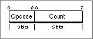

Each instruction, depending on its definition, takes one or more arguments. The first is stored in the 5 bits of the count field while any additional arguments are stored in bytes that immediately follow the instruction byte. Each instruction may also require raw data used in the initialization process; this raw data appears after the argument bytes.
The instruction byte can hold count values up to 31. If you need to specify a count value larger than 31, you should place  `0`  in the count field. This indicates that the first argument following the instruction byte is the count value.
Argument values are stored in big-endian fashion, with the most significant bits first. Each byte holds 7 bits of the argument value. The high-order bit is set for every byte except the last (that is, an unset high-order bit indicates the last byte in the argument). For example,  Figure 8-3  shows how the values 50 and 881 would be stored.
Figure 8-3  Argument storage in pattern-initialized data
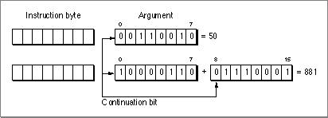

The argument value is determined by shifting the current value up 7 bits and adding in the low-order 7 bits of the next byte, doing so until an unset high-order bit is encountered.
You can encode up to a 32-bit value using this format. In the case of a 32-bit value, the fifth byte must have 0 in its high-order bit, and only the least-significant 32 bits of the 35-bit accumulation are used.
Note   The advantage of this format is that while a 32-bit value is stored in 5 bytes, smaller values can be stored in correspondingly fewer bytes.
### Pattern-Initialization Opcodes
   The sections that follow describe the currently defined pattern-initialization instructions. Opcodes 101, 110, and 111 are reserved for future use.
#### Zero (Opcode 000)

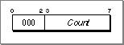

This instruction initializes Count bytes to  `0`  beginning at the current data location.
#### blockCopy (Opcode 001)

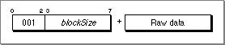

This instruction initializes the next blockSize bytes from the current data location to the values in the following raw data bytes.
#### repeatedBlock (Opcode 010)

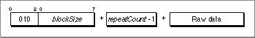

This instruction repeats the blockSize number of data bytes repeatCount times, beginning at the current data location.
IMPORTANT   The repeat count value stored in the instruction is one smaller than the actual value ( *repeatCount*  -1).
#### interleaveRepeatBlockWithBlockCopy (Opcode 011)

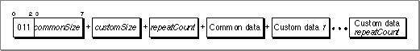

This instruction requires three parameters and commonSize + (customSize  *  repeatCount ) bytes of raw data. The first commonSize bytes of raw data make up the common (repeating) pattern and the next customSize bytes make up the first custom (nonrepeating) section. There are repeatCount number of custom sections. The instruction places the common pattern followed by the first custom section, then the common pattern, then the second custom section, and so on. After performing this procedure repeatCount times, a final common data pattern is added at the end.  Figure 8-4  shows the data section after initialization.
Figure 8-4  Data section after executing  `interleaveRepeatBlockWithBlockCopy`
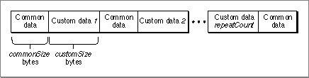

#### interleaveRepeatBlockWithZero (Opcode 100)


This instruction is similar to the  `interleaveRepeatBlockWithBlockCopy`  instruction except the common pattern is commonSize bytes of zero instead of raw data.  Figure 8-5  shows the data section after initialization.
Figure 8-5  Data section after executing  `interleaveRepeatB` `lockWithZero`
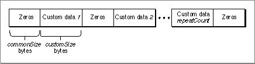

---


Main Body
 Chapter 8 - PEF Structure
---

# The Loader Section
   The loader section is a special section that contains information used by the Code Fragment Manager to prepare the fragment. It contains information about the symbols imported to, and exported from, the fragment as well as instructions that tell the Code Fragment Manager how to fix up references to symbols.
The general layout and content of the loader section appears in  Figure 8-6 .
Figure 8-6  PEF loader section
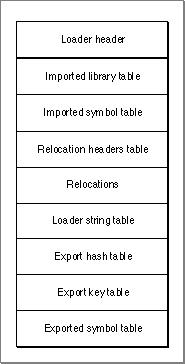

The contents of the loader section are as follows:
- The loader header contains information about the location of other components of the loader section.  The import information (library descriptions and symbol tables) describes the imports for the container.  The relocation headers table provides information about relocations to be applied to a given section.  The relocations area contains relocation instructions that describe how to fix up references to symbols within each section.  The loader string table contains the names of the container's imported and exported symbols.  The export information is contained in a hashed data structure, which has three parts:
- The export hash table, which contains hash chain information (the number of elements in the chain and the location of the first element) for each index value in the table.  The export key table, which contains the hash values of the exports.  The exported symbol table, which contains additional information about the exported symbols.
  The sections that follow describe these components in more detail.
All tables use zero-based indexes. It is recommended that offset values for elements with no entries be set to  `0` .
---
   SubtopicsTOC      The Loader Header     Imported Libraries and Symbols     Relocations     The Loader String Table     Exported Symbols

---


Main Body
 Chapter 8 - PEF Structure  /  The Loader Section
---

## The Loader Header
   The loader header data structure is of fixed size (56 bytes) and has the form shown in  Listing 8-3 .
Listing 8-3  Loader header data structure
```c
struct PEFLoaderInfoHeader {
    SInt32 mainSection;
    UInt32 mainOffset;
    SInt32 initSection;
    UInt32 initOffset;
    SInt32 termSection;
    UInt32 termOffset;
    UInt32 importedLibraryCount;
    UInt32 totalImportedSymbolCount;
    UInt32 relocSectionCount;
    UInt32 relocInstrOffset;
    UInt32 loaderStringsOffset;
    UInt32 exportHashOffset;
    UInt32 exportHashTablePower;
    UInt32 exportedSymbolCount;
};
```
  The fields in the loader header are as follows:
- The  `mainSection`  field (4 bytes) specifies the number of the section in this container that contains the main symbol. If the fragment does not have a main symbol, this field is set to  `-1` .  The  `mainOffset`  field (4 bytes) indicates the offset (in bytes) from the beginning of the section to the main symbol.  The  `initSection`  field (4 bytes) contains the number of the section containing the initialization function's transition vector. If no initialization function exists, this field is set to  `-1` .  The  `initOffset`  field (4 bytes) indicates the offset (in bytes) from the beginning of the section to the initialization function's transition vector.  The  `termSection`  field (4 bytes) contains the number of the section containing the termination routine's transition vector. If no termination routine exists, this field is set to  `-1` .  The  `termOffset`  field (4 bytes) indicates the offset (in bytes) from the beginning of the section to the termination routine's transition vector.  The  `importedLibraryCount`  field (4 bytes) indicates the number of imported libraries.  The  `totalImportedSymbolCount`  field (4 bytes) indicates the total number of imported symbols.  The  `relocSectionCount`  field (4 bytes) indicates the number of sections containing load-time relocations.  The  `relocInstrOffset`  field (4 bytes) indicates the offset (in bytes) from the beginning of the loader section to the start of the relocations area.  The  `loaderStringsOffset`  field (4 bytes) indicates the offset (in bytes) from the beginning of the loader section to the start of the loader string table.  The  `exportHashOffset`  field (4 bytes) indicates the offset (in bytes) from the beginning of the loader section to the start of the export hash table. The hash table should be 4-byte aligned with padding added if necessary.  The  `exportHashTablePower`  field (4 bytes) indicates the number of hash index values (that is, the number of entries in the hash table). The number of entries is specified as a power of two. For example, a value of  `0`  indicates one entry, while a value of  `2`  indicates four entries.
If no exports exist, the hash table still contains one entry, and the value of this field is  `0` .  The  `exportedSymbolCount`  field (4 bytes) indicates the number of symbols exported from this container.

---


Main Body
 Chapter 8 - PEF Structure  /  The Loader Section
---

## Imported Libraries and Symbols
  The loader section must describe every import library required by the fragment and the symbols imported from those libraries. The following two sections describe the format of these descriptions.
### Imported Library Descriptions
   An imported library description, which contains information about a required import library, is of fixed size (24 bytes) and has the form shown in  Listing 8-4 .
Listing 8-4  Imported library description data structure
```c
struct PEFImportedLibrary {
    UInt32 nameOffset;
    UInt32 oldImpVersion;
    UInt32 currentVersion;
    UInt32 importedSymbolCount;
    UInt32 firstImportedSymbol;
UInt8 options;        
   UInt8 reservedA;      
       UInt16 reservedB;
};
```
  The fields of the description are as follows:
- The  `nameOffset`  field (4 bytes) indicates the offset (in bytes) from the beginning of the loader string table to the start of the null-terminated library name.  The  `oldImpVersion`  and  `currentVersion`  fields (4 bytes each) provide version information for checking the compatibility of the imported library.  The  `importedSymbolCount`  field (4 bytes) indicates the number of symbols imported from this library.  The  `firstImportedSymbol`  field (4 bytes) holds the (zero-based) index of the first entry in the imported symbol table for this library.  The  `options`  byte contains bit flag information as follows:
- The high-order bit (mask 0x80) controls the order that the import libraries are initialized. If set to  `0` , the default initialization order is used, which specifies that the Code Fragment Manager should try to initialize the import library before the fragment that imports it. When set to  `1` , the import library must be initialized before the client fragment.  The next bit (mask 0x40) controls whether the import library is weak. When set to  `1`  (weak import), the Code Fragment Manager continues preparation of the client fragment (and does not generate an error) even if the import library cannot be found. If the import library is not found, all imported symbols from that library have their addresses set to  `0` . You can use this information to determine whether a weak import library is actually present.
   The reservedA and reservedB fields are currently reserved and must be set to  `0` .

### The Imported Symbol Table
   The imported symbol table is an array of imported symbol entries. Symbols imported from the same library are grouped together in the table, but they may appear in any order within that grouping. A table entry is of fixed size (4 bytes) and has the form shown in  Figure 8-7 .
Figure 8-7  An imported symbol table entry
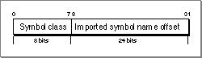

The elements of the table entry are as follows:
- The symbol class field (1 byte) designates the class of the imported symbol.  The imported symbol name offset field (3 bytes) indicates the offset (in bytes) from the beginning of the loader string table to the null-terminated name of the symbol.
   The symbol class byte of an imported symbol entry is structured as shown in  Figure 8-8 .
Figure 8-8  A symbol class field
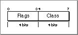

For imported symbols, the high-order flag bit (mask 0x80) indicates whether the symbol is weak. When this bit is set, the imported symbol does not have to be present at fragment preparation time in order for execution to continue. However, your code must check that the imported symbol exists before attempting to use it. The other flag bits are currently reserved.
The symbol classes are defined in  Table 8-3 . The symbol classes are used for annotation only.
| Class name | Value | Description |
| --- | --- | --- |
| kPEFCodeSymbol | 0 | A code address |
| kPEFDataSymbol | 1 | A data address |
| kPEFTVectSymbol | 2 | A standard procedure pointer |
| kPEFTOCSymbol | 3 | A direct data area (Table of Contents ) symbol |
| kPEFGlueSymbol | 4 | A linker-inserted glue symbol |

---


Main Body
 Chapter 8 - PEF Structure  /  The Loader Section
---

## Relocations
   Relocations (sometimes called fix-ups) are part of a process by which the Code Fragment Manager replaces references to code and data with actual addresses at runtime. The loader section contains information on how to perform these relocations. These relocations apply to any symbols accessed via pointers, such as imported code and data, or a fragment's own pointer-based function calls.
By the very nature of pointer-based references, you cannot know the actual address that a pointer refers to at build time. Instead, the compiler includes placeholders than can be fixed up by the Code Fragment Manager at preparation time.
For example, a reference to an imported routine points to a transition vector. Before preparation, the pointer in the calling fragment that points to the transition vector has the value  `0` . After instantiating the called fragment at preparation time, the actual address of the transition vector becomes known. The Code Fragment Manager then executes a relocation instruction that adds the address of the transition vector to the pointer that references it. The pointer then points to the transition vector in the called fragment's data section.
Relocation information is stored in PEF containers using a number of specialized instructions and variables, which act much like machine-language instructions for a pseudo-microprocessor. These elements reduce the number of bytes required to store the relocation information and reduce the time required to perform the relocations.
The pseudo-microprocessor maintains state information in pseudo-registers. For the state to be correct for each instruction, relocation instructions must be executed in order from start to finish for each section.
The relocation instructions make use of the variables shown in  Table 8-4 . The initial values are set by the Code Fragment Manager prior to executing the relocations for each section.
| Name | Description |
| --- | --- |
| relocAddress | Holds an address within the section where the relocations are to be performed... |
| importIndex | Holds a symbol index, which is used to access an imported symbol's address.(T... |
| sectionC | Holds the memory address of an instantiated section within the PEF container;... |
| sectionD | Holds the memory address of an instantiated section within the PEF container;... |

Note   The  `sectionC`  and  `sectionD`  variables actually contain the memory address of an instantiated section minus the default address for that section. The default address for a section is contained in the  `defaultAddress`  field of the section header. However, in almost all cases the default address should be  `0` , so the simplified definition suffices.      The relocation instructions themselves generally accomplish one of the following functions:
- assign a value to one of the relocation variables  add an imported symbol's address to the current location (pointed to by  `relocAddress` ), then increment  `importIndex`  and  `relocAddress`   add the  `sectionC`  value to the current location, then increment  `relocAddress`   add the  `sectionD`  value to the current location, then increment  `relocAddress`   add the  `sectionC`  value to the current location and increment  `relocAddress` , then add the  `sectionD`  value to the new current location, and increment  `relocAddress ` again

### The Relocation Headers Table
   If an instantiated section requires one or more relocations, it has an entry in the relocation headers table. A header entry data structure is of fixed size (12 bytes) and has the form shown in  Listing 8-5 .
Listing 8-5  Relocation header entry data structure
```c
struct PEFLoaderRelocationHeader {
    UInt16 sectionIndex;
    UInt16 reservedA;
    UInt32 relocCount;
    UInt32 firstRelocOffset;
};
```
  The header fields are as follows:
- The  `sectionIndex`  field (2 bytes) designates the section number to which this relocation header refers.  The  `reservedA`  field (2 bytes) is currently reserved and must be set to  `0` .  The  `relocCount`  field (4 bytes) indicates the number of 16-bit relocation blocks for this section.  The  `firstRelocOffset`  field (4 bytes) indicates the byte offset from the start of the relocations area to the first relocation instruction for this section.
  Note that the  `relocCount`  field is the number of 16-bit relocation blocks (that is, one half the total number of bytes of relocation instructions). Although most relocation instructions are 16 bits long, some are longer, so the number of complete relocation instructions may be less than the  `relocCount`  value.
### The Relocation Area
  The relocation area consists of a sequence of relocation instructions that describe how to fix up pointers to the fragment's own code and data and to imported symbols during the preparation process. These instructions are grouped by section number, and they are accessed through the relocation headers described earlier. See  "Relocation Instruction Set" (page 8-27)  for a detailed description of the relocation instructions.
### A Relocation Example
   This section gives an example of how various relocation instructions are used. In this example, a fragment calls the imported routine  `moo` . At build time, all pointers to  `moo`  in the calling fragment are set to  `0` , since the compiler or linker cannot know the actual runtime address of the routine. Similarly, in the fragment that contains  `moo` , the transition vector for  `moo`  contains only offset values for the location of its code and its data world.  Figure 8-9  shows the unprepared state for the two fragments.
Figure 8-9  Unprepared fragments
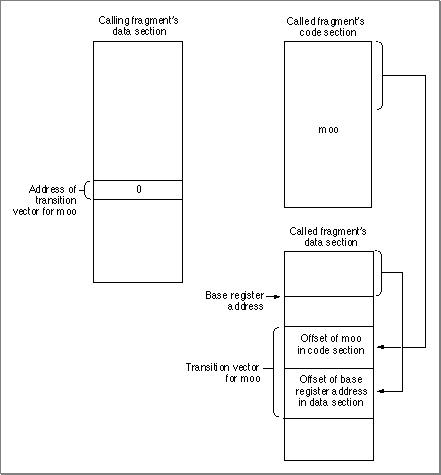

After instantiating both fragments, the Code Fragment Manager fixes up the calling fragment's pointer by executing instructions as follows (see  Figure 8-10 ):
1. Set  `relocAddress`  to point to the data pointer for  `moo` .  Set  `importIndex`  to select the imported symbol entry for  `moo` .  Execute a relocation instruction that adds the address of the imported symbol  `moo ` (that is, the address of its transition vector) to the 4 bytes at  `relocAddress` .
   Figure 8-10  Relocations for the calling fragment
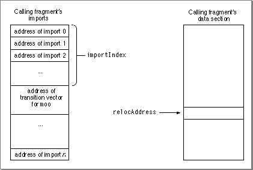

After being fixed up, the calling fragment's pointer now points to the transition vector for  `moo` .
The pointers for the called fragment are fixed up as follows (see  Figure 8-11 ):
1. Set  `relocAddress`  to point to the beginning of the transition vector for  `moo` .  Set  `sectionC`  to point to the beginning of the code section containing  `moo` .  Set  `sectionD`  to point to the beginning of the called fragment's data section.  Execute a relocation instruction that adds  `sectionC`  to the contents of the location pointed to by  `relocAddress` ; increments  `relocAddress`  (4 bytes); adds  `sectionD`  to the contents of the location pointed to by the new  `relocAddress` ; and increments  `relocAddress`  again.
   Figure 8-11  Relocations for the called fragment
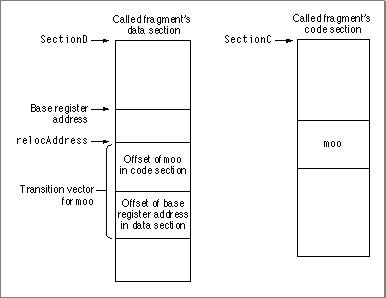

After being fixed up, the transition vector for  `moo`  now contains the actual address of  `moo`  and the base register address for its data world. The routine  `moo`  is now prepared for execution.
### Relocation Instruction Set
   Relocation instructions are stored in 2-byte relocation blocks .  Most instructions take up one block that combines an opcode and related arguments. Instructions that are larger than 2 bytes have an opcode and some of the operands in the first 2-byte block, with other operands in the following 2-byte blocks. The opcode occupies the upper (higher-order) bits of the block that contains it. Relocation instructions can be decoded from the high-order 7 bits of their first block.  Listing 8-6  shows the high-order 7 bits for the currently defined relocation opcode values. Binary values indicated by " `x` " are "don't care" operands. For example, any combination of the high-order 7 bits that starts with two zero bits ( `00` ) indicates the RelocBySectDWithSkip instruction.
All currently defined relocation instructions relocate locations as words (that is, 4-byte values).
Listing 8-6  Relocation opcode values
```c
enum {

   kPEFRelocBySectDWithSkip= 0x00,/* binary: 00xxxxx */

   kPEFRelocBySectC     = 0x20,  /* binary: 0100000 */
   kPEFRelocBySectD     = 0x21,  /* binary: 0100001 */
   kPEFRelocTVector12   = 0x22,  /* binary: 0100010 */
   kPEFRelocTVector8    = 0x23,  /* binary: 0100011 */
   kPEFRelocVTable8     = 0x24,  /* binary: 0100100 */
   kPEFRelocImportRun   = 0x25,  /* binary: 0100101 */

   kPEFRelocSmByImport  = 0x30,  /* binary: 0110000 */
   kPEFRelocSmSetSectC  = 0x31,  /* binary: 0110001 */
   kPEFRelocSmSetSectD  = 0x32,  /* binary: 0110010 */
   kPEFRelocSmBySection = 0x33,  /* binary: 0110011 */

   kPEFRelocIncrPosition= 0x40,  /* binary: 1000xxx */
   kPEFRelocSmRepeat    = 0x48,  /* binary: 1001xxx */

   kPEFRelocSetPosition = 0x50,  /* binary: 101000x */
   kPEFRelocLgByImport  = 0x52,  /* binary: 101001x */
   kPEFRelocLgRepeat    = 0x58,  /* binary: 101100x */
   kPEFRelocLgSetOrBySection= 0x5A,/* binary: 101101x */

};
```
     IMPORTANT   If you wish to create your own relocation instructions, the 3 highest order bits must be set ( `111xxxx` ) to indicate a third-party opcode. All other undocumented opcode values are reserved.      The following sections describe the individual instructions in more detail.
#### RelocBySectDWithSkip
  The  `RelocBySectDWithSkip`  instruction (opcode 00) has the structure shown in  Figure 8-12 .
Figure 8-12  Structure of the  `RelocBySectDWithSkip`  instruction
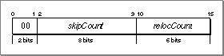

This instruction first increments  `relocAddress`  by skipCount  *  4 bytes. It then adds the value of  `sectionD`  to the next relocCount contiguous words. After the instruction is executed,  `relocAddress`  points just past the last modified word.
#### The Relocate Value Group
  Instructions in the Relocate Value group of opcodes all begin with  `010`  and have the structure shown in  Figure 8-13 .
Figure 8-13 Structure of the Relocate Value opcode group
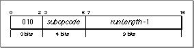

Instructions in this group add a value to the next runLength items starting at address  `relocAddress` . The subopcode indicates the type and size of the items to be added as shown in  Table 8-5 . After execution,  `relocAddress`  points to just past the last modified item.
IMPORTANT   The value stored in this instruction is one less than the actual run length (runLength-1).
| Value | Instruction name | Description |
| --- | --- | --- |
| 0000 | RelocBySectC | Add the value in the variablesectionCto the next runLength contiguous 4-byte ... |
| 0001 | RelocBySectD | Add the value in the variablesectionDto the next runLength contiguous 4-byte ... |
| 0010 | RelocTVector12 | Add values to runLength 12-byte items as follows: add the value insectionCto ... |
| 0011 | RelocTVector8 | Add values to runLength 8-byte items as follows: add the value insectionCto t... |
| 0100 | RelocVTable8 | Add values to runLength 8-byte items as follows: add the value insectionDto t... |
| 0101 | RelocImportRun | Add the addresses of a sequence of imported symbols to the next runLength con... |

#### The Relocate By Index Group
  Instructions in the Relocate By Index group all begin with  `011`  and have the structure shown in  Figure 8-14 .
Figure 8-14  Structure of the Relocate By Index opcode group
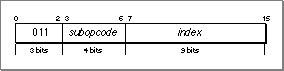

Instructions in this group fix up values according to the subopcode values shown in  Table 8-6 .
| Value | Instruction name | Description |
| --- | --- | --- |
| 0000 | RelocSmByImport | Add the address of the imported symbol whose index is held in index to the wo... |
| 0001 | RelocSmSetSectC | Set the variablesectionCto the memory address of the instantiated section spe... |
| 0010 | RelocSmSetSectD | Set the variablesectionDto the memory address of the instantiated section spe... |
| 0011 | RelocSmBySection | Add the address of the instantiated section specified by index to the word po... |

#### RelocIncrPosition
  The  `RelocIncrPosition`  instruction (opcode 1000) has the structure shown in  Figure 8-15 .
Figure 8-15  Structure of the  `RelocIncrPosition`  instruction
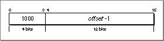

This instruction increments  `relocAddress`  by offset bytes. The value of offset is treated as an unsigned value.
IMPORTANT   The value stored in this instruction is one less than the actual offset (offset-1).
#### RelocSmRepeat
  The  `RelocSmRepeat`  instruction (opcode 1001) has the structure shown in  Figure 8-16 .
Figure 8-16  Structure of the  `RelocSmRepeat`  instruction
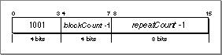

This instruction repeats the preceding blockCount relocation blocks repeatCount number of times. Note that you cannot nest this instruction within itself or within the  `RelocLgRepeat`  instruction.
IMPORTANT   The values of blockCount and repeatCount stored in this instruction are one less than the actual values.
#### RelocSetPosition
  The  `RelocSetPosition`  instruction (opcode 101000) takes two relocation blocks (4 bytes) rather than the usual one; the extra bytes allow you to specify an unsigned offset parameter of up to 26 bits.
The  `RelocSetPosition`  instruction has the structure shown in  Figure 8-17 .
Figure 8-17  Structure of the  `RelocSetPosition`  instruction
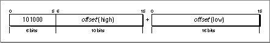

This instruction sets  `relocAddress`  to the address of the section offset offset.
#### RelocLgByImport
  The  `RelocLgByImport`  instruction (opcode 101001) takes two relocation blocks (4 bytes); the extra bytes allow you to specify an unsigned index parameter of up to 26 bits.
The  `RelocLgByImport`  instruction has the structure shown in  Figure 8-18 .
Figure 8-18  Structure of the  `RelocLgByImport`  instruction


This instruction adds the address of the imported symbol whose index is held in index to the word pointed to by  `relocAddress` . After the addition,  `relocAddress`  points to just past the modified word, and  `importIndex`  is set to index +1.
#### RelocLgRepeat
  The  `RelocLgRepeat`  instruction (opcode 101100) takes two relocation blocks and has the structure shown in  Figure 8-19 .
Figure 8-19  Structure of the  `RelocLgRepeat`  instruction
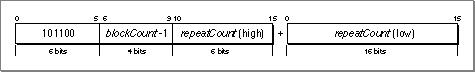

This instruction repeats the preceding blockCount relocation blocks repeatCount number of times. The  `RelocLgRepeat`  instruction is very similar to the  `relocSmRepeat`  (opcode 1001) instruction, but it allows for larger repeat counts.
You cannot nest this instruction, either within itself or within the  `relocSmRepeat`  instruction.
IMPORTANT   Note that the repeat value stored in this instruction is the actual value (repeatCount), while for the  `relocSmRepeat`  instruction the value stored is repeatCount-1. The block count value stored is blockCount-1 for both repeat instructions.
#### RelocLgSetOrBySection
  The  `RelocLgSetOrBySection`  instruction (opcode 101101) takes two relocation blocks and has the form shown in  Figure 8-20 .
Figure 8-20  Structure of the  `RelocLgSetOrBySection`  instruction
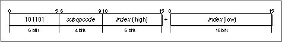

This instruction performs instructions identical to those shown in  "The Relocate By Index Group" (page 8-31) , but with a larger (up to 22-bit, unsigned) section number. The action specified depends on the value of subopcode as shown in  Table 8-7 .
| Subopcode | Action |
| --- | --- |
| 0000 | Add the address of the instantiated section specified by index to the word at... |
| 0001 | Set the variablesectionCto the memory address of the instantiated section spe... |
| 0010 | Set the variablesectionDto the memory address of the instantiated section spe... |

---


Main Body
 Chapter 8 - PEF Structure  /  The Loader Section
---

## The Loader String Table
   The loader string table contains character strings that specify the names of imported and exported symbols and the names of imported libraries. Strings for imported symbols and imported libraries must be null terminated, but strings referenced by export symbol table entries (that is, strings for exported symbols) do not have this requirement. (The Code Fragment Manager uses the upper 16 bits of the hash value to determine the length of the string). None of the strings contain a Pascal-style length byte.

---


Main Body
 Chapter 8 - PEF Structure  /  The Loader Section
---

## Exported Symbols
  All exported symbols in a PEF container are stored in a hashed form, allowing the Code Fragment Manager to search for them efficiently when preparing a fragment.  Hashing  is a method of processing and organizing symbols so they can be searched for quickly.
PEF uses a modified version of the traditional hash table. The traditional model is shown in  Figure 8-21 .
Figure 8-21  A traditional hash table
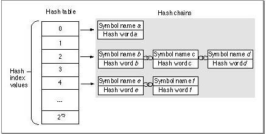

A hash word is computed for every symbol and a hash index value is computed for every hash word. The hash words are grouped together in hash chains according to their index values, and each chain corresponds to an entry in the hash table.
The PEF implementation, as shown in  Figure 8-22 , effectively flattens the traditional hash table. Functionally the hash tables in  Figure 8-21  and  Figure 8-22  are identical.
Figure 8-22  Flattened hash table implementation
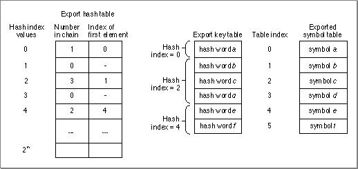

Each hash chain is stored consecutively in the export key table and the exported symbol table. For each hash index value, the hash table stores the number of entries in its chain and the starting table index value for that chain.
The general procedure for creating a hashed data structure is as follows:
1. Compute the number of hash index values. This value is based on the number of exported symbols in the container. See  "The Exported Symbol Count to Hash Table Size Function" (page 8-42)  for a suggested method of calculating this value.  Compute the hash word value and hash index value for every exported symbol. (The hash index value is dependent on both the symbol and the size of the hash table.) See  "The Name to Hash Word Function" (page 8-41)  and  "The Hash Word to Hash Index Function" (page 8-42)  for details of the required calculations.  Sort the exported symbols by hash index value. This procedure effectively indexes the exported symbols. Each symbol has a table index value that references its hash word in the export key table and an entry in the exported symbol table.  Construct the hash table using the size determined in step 1. Each hash table entry contains a chain count indicating the number of exported symbols in the chain (that is, the number that have this hash index value) and the offset in the export key and symbol tables to the first symbol in the chain.
  The Code Fragment Manager can search for exported symbols by name or by table index number. When searching for a symbol by (zero-based) table index number, the Code Fragment Manager looks up the index value in the exported symbol table to obtain a pointer to the name of the symbol. Then it uses the same index to get the hash word value of the symbol in the export key table. (The length of the name is encoded in the hash word.)
Searching for exported symbols by name is somewhat more complicated. The Code Fragment Manager first computes the hash word of the symbol it is trying to locate. Then it computes a hash index value from the hash word and the size of the hash table. Using this value as an index into the hash table, the Code Fragment Manager obtains a chain count value and a table index value for the first entry in the hash chain (as determined in step 4). Then, beginning at the table index value, it searches the export key table for a hash word to match the one it previously calculated. If the Code Fragment Manager finds a match, it uses the matching table index value to look up the name in the symbol table. If the symbol names match, the Code Fragment Manager returns information about the symbol. If the Code Fragment Manager cannot find a match after searching the number of entries equivalent to the chain count value, it marks the symbol as not found.
The sections that follow describe the elements of the hashed data structure in more detail.
### The Export Hash Table
   The number of entries in the hash table is 2 raised to the value in the  `exportHashTablePower`  field of the loader header  (page 8-18) . The number of entries is determined from the number of exported symbols. If there are no exports, the table still contains one entry. See  "Hashing Functions" (page 8-41)  for details of the hashing process and the suggested method for computing the number of hash table entries.
A hash table entry is of fixed size (4 bytes) and has the form shown in  Figure 8-23 .
Figure 8-23  A hash table entry
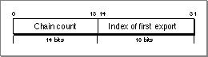

The field values are as follows:
- The first field (14 bits) contains the number of items in this chain.  The second field (18 bits) contains the table index value of the first symbol in the chain (see  Figure 8-22 (page 8-37) ).

### The Export Key Table
   The export key table contains a key (a hash word) for every exported symbol. The structure of a hash word is fixed (4 bytes) and has the form shown in  Figure 8-24 .
Figure 8-24  A hash word
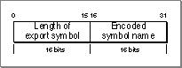

- The first field contains the length of the export symbol name in bytes.  The second field contains the name of the symbol encoded using a hash key.
  For more information about calculating the hash word, see  "The Name to Hash Word Function" (page 8-41) .
### The Exported Symbol Table
   The exported symbol table contains an entry for every symbol exported by the fragment. All exports with a given hash index value are grouped together in the symbol table (see  Figure 8-22 (page 8-37) ).
An exported symbol table entry data structure is of fixed size (10 bytes) and has the form shown in  Listing 8-7 .
Listing 8-7  Exported symbol table entry data structure
```c
struct PEFExportedSymbol {
    UInt32 classAndName;
    UInt32 symbolValue;
    SInt16 sectionIndex;
};
```
     Note   Each entry is 10 bytes long. No padding bytes are used between successive entries.      The fields in the entry are as follows:
- The  `classAndName`  field (4 bytes) contains two entries:
- The first byte designates the symbol class of the exported symbol. See  Table 8-3 (page 8-21)  for a listing of classes. Flag bits for exported symbols are reserved for future use.  The following 3 bytes designate the offset from the beginning of the loader string table to the name of the symbol. The name of the symbol is not null terminated, but you can determine the length of the string from the upper 2 bytes of the symbol's hash word (found in the export key table).
   The  `symbolValue`  field (4 bytes) typically indicates the offset from the beginning of the symbol's section to the exported symbol.  The  `sectionIndex`  field (2 bytes) indicates the number of the section that contains this symbol. Note that this is a signed field.
  The  `symbolValue`  field has special meaning when the section number is negative. If the section number is  `-2` , the  `symbolValue`  field contains an absolute address. If the section number is  `-3` , the  `symbolValue`  field contains an imported symbol index, indicating that the imported symbol is being reexp orted.
### Hashing Functions
   This section describes hashing algorithms used to create the hashed data structure for exported symbols.
#### The Name to Hash Word Function
   The hash word function computes a 32-bit hash word for a symbol name. The upper 16 bits contains the length of the name, and the symbol name is encoded using a hash key in the lower 16 bits. You are required to use this algorithm to calculate the hash word.  Listing 8-8  shows a C implementation of the hash word function.
Listing 8-8  Hash word function
```c
/* Computes a hash word for a given string. nameText points to the */ 
/* first character of the string (not the Pascal length byte). The */
/* string may be null terminated. */

enum {
   kPEFHashLengthShift= 16,
   kPEFHashValueMask = 0x0000FFFF
};

UInt32 PEFComputeHashWord (BytePtr nameText, UInt32 nameLength)
{
   BytePtrcharPtr = nameText;
   SInt32hashValue= 0;
   UInt32length   = 0;
       UInt32 limit;
    UInt32 result;
UInt8 currChar;

   #define PseudoRotate(x)  ( ( (x) << 1 ) - ( (x) >> 16 )) 

   for (limit = nameLength; limit > 0; limit -= 1) 
   {
      currChar = *charPtr++;
      if (currChar == NULL) break;
      length += 1;
      hashValue = PseudoRotate (hashValue) ^ currChar;
   }

   result = (length << kPEFHashLengthShift) | 
   ((UInt16) ((hashValue ^ (hashValue >> 16)) & kPEFHashValueMask));

   return result;

} /* PEFComputeHashWord () */
```

#### The Hash Word to Hash Index Function
   The hash index (or hash slot number) function converts the 32-bit hash word value into a small index number.You are required to use this algorithm for calculating the index number.  Listing 8-9  shows the hash word to hash index function.
Listing 8-9  Hash word to hash index function
```c
#define PEFHashTableIndex(fullHashWord,hashTablePower) \
   ( ( (fullHashWord) ^ ((fullHashWord) >> (hashTablePower)) ) & \
   ((1 << (hashTablePower)) - 1) )
```

#### The Exported Symbol Count to Hash Table Size Function
   Listing 8-10  shows a suggested method of calculating the hash table size. (This algorithm provides a good tradeoff between minimizing search time and minimizing table size, but you may substitute a similar algorithm.) The hash table size function computes the size of the hash table based on the number of exported symbols in the PEF container. The number of hash table entries is always a power of 2. The function in  Listing 8-10  returns the value of the exponent. The value kExponentLimit can be arbitrary, but it must not exceed 30. The constant  `kAverageChainLimit`  is normally set to  `10` , but you can adjust this to make a trade off between the size of the chain and search time.
Listing 8-10  Exported symbol count to hash table size function
```c
UInt8 PEFComputeHashTableExponent (SInt32 exportCount)
{
       SInt32 exponent;
const SInt32kExponentLimit = 16;
   const SInt32kAverageChainLimit= 10;

   for (exponent = 0; exponent < kExponentLimit; exponent += 1) {
      if ((exportCount / (1 << exponent)) < kAverageChainLimit)
         break;
   }

   return exponent;

}  /* PEFComputeHashTableExponent () */
```

---


Main Body
 Chapter 8 - PEF Structure
---

# PEF Size Limits
   The PEF structure has the following size limits:
- The total size of the container cannot be larger than 4 GB.  The maximum offset allowed into the section name table is 2 GB.  The total number of sections cannot exceed 65,535.  The total number of instantiated sections (that is, those containing code or data) cannot exceed 32,767.  The maximum size of the loader string table is 16 MB.  The total number of imported symbols is limited to 2 *26* . However, the number of reexported imports is limited to 2 *24* .  The number of exported symbols is limited to 2 *18* .  A single hash chain cannot contain more than 16,384 entries.
  In general, 32-bit integers ( `UInt32` ) are used to store size and count values in PEF containers, resulting in a maximum allowable integer of 2 *32* . In many cases, this is a theoretical rather than actual limit, since other PEF limitations may restrict the largest allowable value.
Note that the Code Fragment Manager itself imposes limits that are not related to the PEF specification. For example, there is a length limit of 255 characters for imported and exported symbol names and a 63 character limit for imported library names. For specifics, check the current Code Fragment Manager documentation.
---