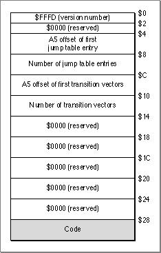
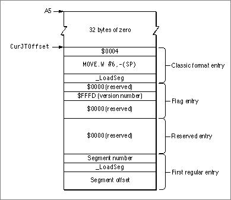
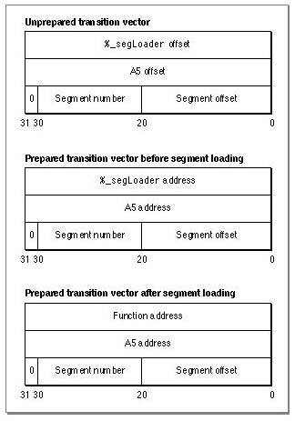
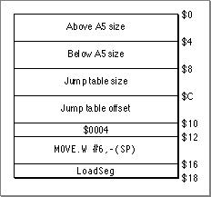
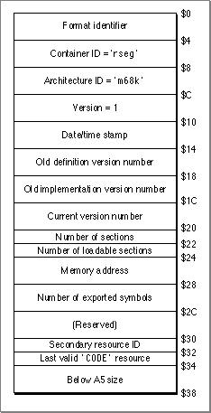
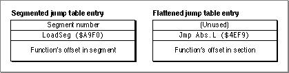
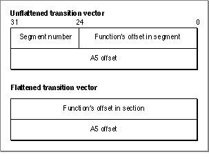
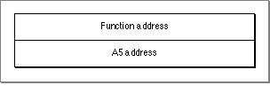

# CFM-68K Application and Shared Library Structure
 This chapter describes the file structure of CFM-68K runtime applications and shared libraries. You need to read this section only if you need specific details about segment structure and the storage of items such as transition vectors and jump table entries in CFM-68K runtime programs.   Note Some sections specifically describe MPW implementations for the CFM-68K runtime environment. Other implementations are possible, however.    Chapter Contents   CFM-68K Application Structure   The Segment Header  The Jump Table  Transition Vectors and the Transition Vector Table  The 'CODE' 0 Resource  The 'CODE' 6 Resource  The 'rseg' 0 Resource  The 'rseg' 1 Resource   CFM-68K Shared Library Structure   Jump Table Conversion  Transition Vector Conversion  Static Constructors and Destructors              
# CFM-68K Application Structure
   Although CFM-68K runtime shared libraries are virtually identical to their PowerPC counterparts, CFM-68K runtime applications are hybrids that retain the segmented form of classic 68K applications.
CFM-68K runtime applications use some classic 68K structures ( `'CODE'`  resources, for example), but many of these structures have been modified for the CFM-based architecture. CFM-68K applications have different segment headers and jump tables, as well as a new table for transition vectors. The  `%A5Init`  segment does not exist in CFM-68K applications, and the  `'CODE'0`  resource does not hold the jump table. The following sections describe the CFM-68K application structure in detail.
Note   If you are not familiar with the structure of classic 68K applications, you may want to refer to  Chapter 10, "Classic 68K Runtime Architecture,"  as you read this section.
---
   SubtopicsTOC      The Segment Header     The Jump Table     Transition Vectors and the Transition Vector Table     The 'CODE' 0 Resource     The 'CODE' 6 Resource     The 'rseg' 0 Resource     The 'rseg' 1 Resource

---

Main Body
 Chapter 9 - CFM-68K Application and Shared Library Structure  /  CFM-68K Application Structure
---

## The Segment Header
   Each CFM-68K runtime segment contains a header that gives information about the segment.  Figure 9-1  shows the structure of a CFM-68K runtime segment header.
Note   The CFM-68K runtime segment header is the same size as a classic 68K far model (32-bit everything) header (see  Figure 10-11 (page 10-24) ), but it contains different information.  *u*Figure 9-1  Structure of a CFM-68K runtime segment header

The version number $FFFD indicates that the segment header was built for the CFM-68K runtime architecture. This value must match the version number in the jump table flag entry (see  Figure 9-2 (page 9-5) ).
Note   In MPW you must build your application with the same size constraints as a classic 68K near model program unless you specify the  `-bigseg`  compiler option.

---

Main Body
 Chapter 9 - CFM-68K Application and Shared Library Structure  /  CFM-68K Application Structure
---

## The Jump Table
   Figure 9-2  shows the structure of a CFM-68K runtime jump table. This jump table is similar to the classic 68K far model jump table as shown in  Figure 10-10 (page 10-23) .
Figure 9-2  CFM-68K runtime jump table structure

---

Main Body
 Chapter 9 - CFM-68K Application and Shared Library Structure  /  CFM-68K Application Structure
---

## Transition Vectors and the Transition Vector Table
   The transition vector table resides in the direct data world (the A5 world in classic 68K) above the jump table. It contains a transition vector for every exported routine and every routine whose address is accessed in any way. The transition vectors contain the entry point address for the desired routine and the value to be placed in the A5 base register when the routine executes.  Figure 9-3  shows the structure of an application transition vector.
Figure 9-3  An application transition vector

The Code Fragment Manager sets the  `%_segLoader`  address and A5 address portions of the transition vector at preparation time. (See  "The 'rseg' 1 Resource" (page 9-10)  for more information about the  `%_segLoader`  routine.) The application transition vector is larger than the corresponding shared library transition vector (12 bytes versus 8 bytes) because it needs additional segment information to properly address routines in a segmented application.
The segment offset field in a transition vector contains a word (2 byte) offset. This differs from a jump table entry's segment offset field, which contains a byte offset.

---

Main Body
 Chapter 9 - CFM-68K Application and Shared Library Structure  /  CFM-68K Application Structure
---

## The 'CODE' 0 Resource
   A CFM-68K runtime application's  `'CODE'0`  resource contains a small "start-up" jump table that loads and executes the code that launches the application. In MPW, this code is stored in the  `'CODE'6`  resource.  Figure 9-4  shows the structure of a CFM-68K runtime  `'CODE'0`  resource.
Note   In classic 68K applications, the  `'CODE'0`  resource contains the application's jump table.       Figure 9-4  The  `'CODE'0`  resource

---

Main Body
 Chapter 9 - CFM-68K Application and Shared Library Structure  /  CFM-68K Application Structure
---

## The 'CODE' 6 Resource
   In MPW, code stored in the  `'CODE'6`  resource handles the launching of CFM-68K runtime applications for the Process Manager in System 7.1.
Note   The Process Manager in System 7.5 or later can launch CFM-68K runtime applications directly without having to execute routines in the  `'CODE'6`  resource.      The  `CFM Launch`  code segment in the  `'CODE'6`  resource takes the following steps when launching a CFM-68K runtime application.
1. Checks to see if the computer is a PowerPC-based machine. If so, the  `CFM Launch`  segment displays the message, "Sorry, this application doesn't run on PowerPC platforms. You may only run it on 68K platforms." If you want to create a custom version of this message, you must install a  `'STR '`  resource with ID -20227 in your CFM-68K runtime application.  Checks to see that the CFM-68K Runtime Enabler is installed on the computer. If the CFM-68K Runtime Enabler is missing, the  `CFM Launch`  segment displays the message, "This application requires installation of the CFM-68K Runtime Enabler." If you want to create a custom version of this message, you must install a  `'STR '`  resource with ID -20029 in your CFM-68K runtime application.  Reads the  `'cfrg'0`  resource and calls the Code Fragment Manager to select the proper fragment from the  `'cfrg'0`  entries.  Tells the Code Fragment Manager to prepare the application fragment, along with any necessary import libraries.  Adds code to the  `ExitToShell`  routine to perform the necessary CFM clean-up operations when an application quits or aborts.  Calls the application's main entry point.

---

Main Body
 Chapter 9 - CFM-68K Application and Shared Library Structure  /  CFM-68K Application Structure
---

## The 'rseg' 0 Resource
   The  `'rseg'0`  resource is the resource loaded and retained by the Code Fragment Manager and is the fragment referenced from the  `'cfrg'0 ` resource. Since the Code Fragment Manager does not release an "active" fragment, the  `'rseg'0`  resource does not contain the executable fragment, but only a small data structure. This structure specifies the location of the actual executable fragment as well as some additional information about the fragment. The actual executable fragment is stored in the  `'rseg'1`  resource, which can be released after the application launch procedures are completed. The  `'rseg'0`  resource contains a copy of the PEF container header from the  `'rseg'1`  resource along with other information, as shown in  Figure 9-5 . For more information about PEF headers, see  "The Container Header," beginning on page 8-4 .
Figure 9-5  The  `'rseg'0`  resource

---

Main Body
 Chapter 9 - CFM-68K Application and Shared Library Structure  /  CFM-68K Application Structure
---

## The 'rseg' 1 Resource
  The   `'rseg'1`  resource holds a PEF container consisting of the following sections:
- A data section containing the application's jump table, transition vector table, and global data, all in a compressed format. This section replaces the  `%A5Init`  segment used for classic 68K runtime applications.  A loader section that specifies the import libraries needed by the application. This section also includes a list of symbols imported from each library and a list of symbols (if any) exported from the application.  A code section containing the  `%_segLoader`  routine. This code patches the  `_LoadSeg`  and  `_UnloadSeg`  A-line instructions, so they can function properly in the CFM-68K runtime environment.
  See  Chapter 8, "PEF Structure,"  for more information about PEF containers.
The Code Fragment Manager uses the  `'rseg'`  resources to create a direct data area, perform A5 relocations, and bind shared libraries to the application. While preparing the launch of a CFM-68K application, the Code Fragment Manager stores the  `'rseg'1`  resource in the application heap (much the way the  `%A5Init`  segment is stored for classic 68K applications). After preparations are complete, the Code Fragment Manager releases the  `'rseg'1`  resource.

---

Main Body
 Chapter 9 - CFM-68K Application and Shared Library Structure
---

# CFM-68K Shared Library Structure
   In some development environments, creating a CFM-68K shared library involves first creating a segmented version of the library and then flattening it to produce a contiguous program that is stored in the file's data fork. In MPW, the mechanism for flattening segmented shared libraries is the MakeFlat tool. This section describes what conversions are necessary to go from a segmented state to a flattened state and how MakeFlat implements these conversions.
You need to read this section in either of these two cases:
- You want to understand how the MPW MakeFlat tool flattens CFM-68K shared libraries.  You are writing a library flattening tool and want to understand what conversions are necessary.
  An unflattened shared library has a structure very similar to that of a CFM-68K runtime application. The main differences are as follows:
- The transition vectors are 8 bytes long instead of 12.  The PEF container's data section is not compressed.  The ` 'cfrg'0`  resource indicates that the fragment is a library, not an application.
  The structure changes radically, however, when you flatten the segmented library using the MakeFlat tool.  MakeFlat makes the following changes to a segmented shared library:
- Converts the shared library's  `'CODE'`  resources (except for  `'CODE'0`  and  `'CODE'6` ) into code sections in the output PEF container.  Modifies the PEF relocations.  Converts jump table entries and transition vectors to their flattened state.  Compresses the PEF container's data section.  Creates a new  `'cfrg'0`  resource specifying the new location of the PEF container.  Adds a debug section to the output PEF container so you can use the 68K Macintosh Debugger to debug shared libraries.  Adds code to properly call static constructor or destructor routines if they exist in the shared library.
  After making these changes, MakeFlat writes the PEF container to the data fork of the output file.
The following sections describe some of the conversions in greater detail.
---
   SubtopicsTOC      Jump Table Conversion     Transition Vector Conversion     Static Constructors and Destructors

---

Main Body
 Chapter 9 - CFM-68K Application and Shared Library Structure  /  CFM-68K Shared Library Structure
---

## Jump Table Conversion
   When MakeFlat flattens jump table entries, it changes the addressing method from one that is segment oriented to one that is code section oriented. This involves removing the segment number (since it serves no purpose in a flat file), changing the  `LoadSeg`  instruction to a  `Jmp Abs.L ` instruction, and copying the routine's offset into the new entry. Then, MakeFlat generates a relocation instruction for each jump table entry that adds the code section's address to the routine's offset.  Figure 9-6  compares the two jump table versions.
Figure 9-6  Segmented versus flattened jump table entries

---

Main Body
 Chapter 9 - CFM-68K Application and Shared Library Structure  /  CFM-68K Shared Library Structure
---

## Transition Vector Conversion
   As with the jump table entries, MakeFlat converts the transition vector addressing scheme from one that is segment oriented to one that is code section oriented. MakeFlat generates a relocation instruction for each transition vector that adds the section's address and A5 address to the offset in each transition vector.  Figure 9-7  shows a transition vector before and after conversion (flattening).
Figure 9-7  A transition vector before and after flattening

Note that the function offset in the unflattened transition vector is a word offset, and the A5 offset is a byte offset. In a flattened transition vector, MakeFlat has converted the function's word offset into a byte offset.
At runtime, the transition vector offset values are replaced with absolute addresses, as shown in  Figure 9-8 .
Figure 9-8  A transition vector at runtime

---

Main Body
 Chapter 9 - CFM-68K Application and Shared Library Structure  /  CFM-68K Shared Library Structure
---

## Static Constructors and Destructors
   In MPW, if the input shared library contains static constructors or destructors, the MakeFlat tool performs special processing to ensure these routines are called at the proper time.
MakeFlat adds a block of data to the top of the A5 world and adds a new code section. The data block consists of two new transition vectors, offsets to the library's original initialization and termination routines, and the contents of the code segment  `%_Static_Constructor_Destructor_Pointers` . The new code section,  `%_CPlus_Static_Init_Term` , contains the two routines that call the static constructors and destructors. These two routines are then marked as being the library's initialization and termination routines.
Note   Because MakeFlat takes care of static object construction and destruction, you do not need to call the MPW routines  `__init_lib`  and  `__term_lib`  when creating your own initialization and termination routines for shared libraries. However, when creating routines for CFM-68K runtime applications, you must call the corresponding  `__init_app`  and  `__term_app`  routines.

---