# Classic 68K Runtime Architecture The classic 68K runtime architecture is the original Macintosh runtime architecture, designed for computers running a Motorola 68000-series microprocessor. Applications are stored as segments that can be loaded into the application heap as necessary. The application space contains the application heap, the application stack, and the A5 world. 
 This chapter gives an overview of the classic 68K runtime architecture, with information about the following topics:  the A5 world
program segmentation
the jump table
addressing limitations of the original classic 68K architecture and MPW solutions for bypassing these limitations 
 The first three sections, which discuss the A5 world, program segmentation, and the jump table, assume the near model classic 68K architecture. Programs built using the near model rely on 16-bit addressing for code and data. The sections that follow introduce the far model, which relies on 32-bit addressing for code and data. Note that you have the option of incorporating only some of the far model characteristics when building your application. 
 For additional information you should consult the various volumes of the Inside Macintosh series.   Note Classic 68K runtime code cannot use shared libraries. However, classic 68K runtime code can run transparently under emulation on PowerPC-based computers.    Chapter Contents   The A5 World  Program Segmentation  The Jump Table  Bypassing MC68000 Addressing Limitations   Increasing Global Data Size  Increasing Segment Size  Increasing the Size of the Jump Table  32-Bit Everything   How 32-Bit Everything Is Implemented   Expanding Global Data and the Jump Table  Intrasegment References  The Far Model Jump Table   The Far Model Segment Header Structure  Relocation Information Format              
# The A5 World
   Every classic 68K application contains an A5 world ,  an area of memory that stores the following items:
- the jump table, which allows the application to make calls between segments  the application's global variables  the application's  QuickDraw global variables, which contain information about the drawing environment  the application parameters, which are reserved for use by the Mac OS
  The data is referenced as offsets from the value of the A5 register, hence the name A5 world. The application's global variables and QuickDraw global variables are referenced with negative offsets from A5, while application parameters and jump table entries are referenced with positive offsets.
Figure 10-1  shows a classic 68K A5 world.
Figure 10-1  Classic 68K A5 world
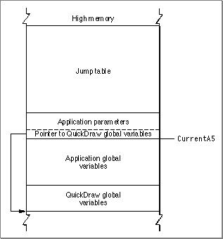

The system global variable  `CurrentA5`  holds the value of the A5 register.
---


Main Body
 Chapter 10 - Classic 68K Runtime Architecture
---

# Program Segmentation
   The classic 68K runtime architecture reflects the need for maximum memory efficiency in the original Macintosh computer which had 128 KB of RAM and an MC68000 CPU. To run large applications in this limited memory environment, Macintosh applications were broken up into segments ( `'CODE'`  resources) that could be loaded into the application heap as necessary.
When you compile and link a program, the linker places your program's routines into code segments and constructs  `'CODE'`  resources for each program segment. The Process Manager loads some code segments into memory when you launch an application. Later, if the code calls a routine stored in an unloaded segment, the Segment Manager loads that new segment into memory. These operations occur automatically by using information stored in the application's jump table and in the individual code segments themselves.
Note that although the Segment Manager loads segments automatically, it does not unload segments. The Segment Manager locks the segment when it is first loaded into memory and any time thereafter when routines in that segment are executing. This locking prevents the segment from being moved during heap compaction and from being purged during heap purging.
Your development environment lets you specify compiler directives to indicate which routines should be grouped together in the same segment. For example, if you have code that is not executed very often (for example, code for printing a document), you can store that in a separate segment, so it does not occupy memory when it is not needed. Here are some general guidelines for grouping routines into segments:
- Group related routines in the same segment.  Put your main event loop into the main segment (that is, the segment that contains the main entry point).  Put any routines that handle low-memory conditions into a locked segment (usually the main segment). For example, if your application provides a grow-zone function, you should put that function in a locked segment.  Put any routines that execute at interrupt time, including VBL tasks and Time Manager tasks, into a locked segment.  Any initialization routines that are executed only once at application startup time should be put in a separate segment. This grouping allows you to unload the segment after executing the routines. However, routines that allocate non relocatable objects (for example,  `MoreMasters`  or  `InitWindows` ) in your application heap should be called in the main segment, before loading any code segments that will later be unloaded. If you put such allocation routines in a segment that is later unloaded and purged, you increase heap fragmentation.
  A typical strategy is to unload all segments except segment 1 (the main segment) and any other essential code segments each time through your application's main loop.
To unload a segment you must call the  `UnloadSeg`  routine from your application. The ` UnloadSeg`  routine does not actually remove a segment from memory, but merely unlocks it, indicating to the Segment Manager that it may be relocated or purged if necessary. To unload a particular segment, you pass the address of any externally referenced routine contained in that segment. For example, if you wanted to unload the segment that contains the routine  `happyMoo` , you can execute the following:
`UnloadSeg(&happyMoo);`
WARNING   Before you unload a segment, make sure that your application no longer needs it. Never unload a segment that contains a completion routine or other interrupt task (such as a Time Manager or VBL task) that might be executed after the segment is unloaded. Also, you must never unload a segment that contains routines in the current call chain.
---


Main Body
 Chapter 10 - Classic 68K Runtime Architecture
---

# The Jump Table
   The loading and unloading of segments are controlled by the linker and the Segment Manager through the use of the jump table ( `'CODE'0` ), a data structure created by the linker. The jump table is always located at a fixed offset above A5 as shown previously in  Figure 10-1 .
The jump table is used to track the state (loaded or unloaded) and the location of  `'CODE'`  resources. The jump table keeps track of the location of each  `'CODE'`  resource and the offset of each routine inside each segment.
- If one routine needs to call another routine in a different segment  (intersegment reference),  it must go through the jump table to determine the address where the other routine starts. If the segment containing the externally referenced routine is unloaded, it must be loaded before jumping to the routine address.  If a routine calls another routine in its own segment  (intrasegment reference),  it does not need the jump table. Although  `'CODE'`  resources move in the heap, their contents are constant, so the routines always keep a constant distance apart and can be accessed using a self-relative (that is, a  PC-relative)  branch.
   Figure 10-2  shows a call that goes through the jump table and a call that uses self-relative branching.
Figure 10-2  Using the jump table and using self-relative branching
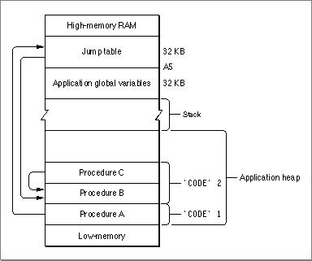

When procedure A calls procedure B, procedure A must go through the jump table because the procedures are in different segments. But procedure C can call procedure B without going through the jump table because the procedures are in the same segment.
If you trace through code and see an instruction such as
```
JSR   60(A5)
```
  you are looking at a call to a routine in another code segment--that is, a call that must go through the jump table. Remember that A5 is used to reference the application's global variables and the jump table. Negative offsets from A5 reference global variables, while positive offsets that are greater than 32 refer to jump-table entries.
The jump table is created by the linker when you build your application, and it is stored in the  `'CODE'0`  resource (sometimes called segment 0). The structure of the  `'CODE'0`  resource is shown in  Figure 10-3 .
Figure 10-3  The  `'CODE'0`  resource
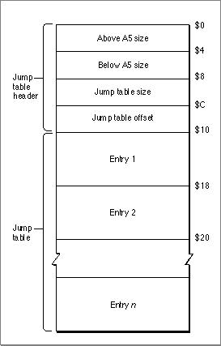

The elements of the  `'CODE'0`  resource are as follows:
- Above A5 size. The size (in bytes) from the location pointed to by A5 to the upper end of the application space.  Below A5 size. The size (in bytes) of the application's global variables plus the QuickDraw global variables.  Jump table size. The size of the jump table. The jump table contains one 8-byte entry for each externally referenced routine.  Jump table offset. The offset (in bytes) of the jump table from the location pointed to by A5. This offset is stored in the global variable  `CurJTOffset` .  Jump table. A contiguous list of jump table entries.
     Note   For all applications, the offset to the jump table from the location pointed to by A5 is 32. The number of bytes above A5 is 32 plus the length of the jump table.      When the application is launched, the Segment Manager uses this information to place the jump table in the A5 world.
The linker creates a jump table entry for every routine that is called by a routine from a different segment. All entries for a particular segment are stored contiguously in the jump table. The structure of the entry varies depending on whether the referenced routine is in a loaded or unloaded segment. If the segment has not been loaded into memory, the jump table entry has the structure shown in  Figure 10-4 .
Figure 10-4  An unloaded jump table entry
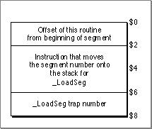

Note   The jump table structure for unloaded segments is different if you are building with the  `-model far`  option. See  "The Far Model Jump Table" (page 10-20)  for more details.      A call that goes through the jump table has the form
`JSR ` offset ` (A5)`
where offset is the offset of the jump table entry for the routine from A5 plus 2 bytes. This results in the execution of the  `MOVE.W #` n `, -SP`  instruction, which places the number of the segment containing the routine on the stack. (The jump table refers to segments by the segment numbers assigned by the linker.)
The next instruction invokes the  `_LoadSeg`  trap, which loads the specified segment into memory. Then the Segment Manager can transform all the jump table entries for the segment into their loaded states as follows:
1. The Segment Manager loads the segment, locks it, double-dereferences it, and adds the offset, which is stored in the first word of the unloaded entry. This results in the actual address of the routine.  The Segment Manager then builds the loaded entry format: it stores the segment number in the entry's first 2 bytes, and it stores a  `JMP`  instruction to the address it has calculated in the entry's last 6 bytes.
   Figure 10-5  shows the structure of a loaded jump table entry.
Figure 10-5  A loaded jump table entry
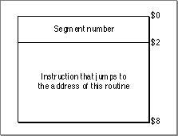

After transforming the jump table entries, the Segment Manager then calls the actual routine by executing the instruction in the last 6 bytes of the (now loaded) jump table entry. Any subsequent calls to the routine also execute this instruction.
Note that the last 6 bytes of the jump table entry are executed whether the segment is loaded or not. The effect of the instruction depends on the state of the entry at the time.
The jump table entries remain in their loaded state unless you call the  `_UnloadSeg`  routine, which restores them to their unloaded state.
Note that to set all the jump table entries for a segment to their loaded or unloaded state, the Segment Manager needs to know where in the jump table all the entries are located. It gets this information from the segment header. The segment header, which is 4 bytes long for the near model environment, contains the offset of the first routine's entry from the start of the jump table (2 bytes) and the number of entries for the segment (2 bytes).  Figure 10-6  shows the segment header.
Figure 10-6  Near model segment header
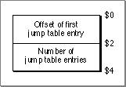

Note   The segment header is different for the far model environment. See  "The Far Model Segment Header Structure" (page 10-23) , for more information.
---


Main Body
 Chapter 10 - Classic 68K Runtime Architecture
---

# Bypassing MC68000 Addressing Limitations
  68K compilers typically generate PC-relative instructions for intrasegment references. This restricts the size of segments to 32 KB because the PC-relative instructions on the MC68000 processor use a 16-bit offset. Similarly, references to addresses expressed as offsets from the address stored in A5 are also limited to 16-bit offsets on the MC68000 processor.
Since references to the jump table are expressed as positive offsets from A5, this effectively limits the size of the jump table to 32 KB.  References to global variables are expressed as negative offsets from A5, so the size of the global data area is limited to 32 KB as well.
In the past, the Resource Manager used to limit resources to 32 KB, so 16-bit offsets were guaranteed to be sufficient.
Table 10-1  summarizes existing MPW solutions to these limitations. The sections that follow provide detail on how to implement these solutions. The section  "32-Bit Everything" (page 10-17)  describes a mechanism that allows you to remove all three limits. Which solution you choose depends on the specific needs of your program.
Note   Other development environments may use different methods to work around the 16-bit addressing limitations.      In general, it is recommended that if you need to remove only one of the limits, you use the solution given for that limit. If you need to remove two or more limits, the 32-bit everything solution is probably your best choice.
---
   SubtopicsTOC      Increasing Global Data Size     Increasing Segment Size     Increasing the Size of the Jump Table     32-Bit Everything

---


Main Body
 Chapter 10 - Classic 68K Runtime Architecture  /  Bypassing MC68000 Addressing Limitations
---

## Increasing Global Data Size
  To permit your application to use more than 32 KB of global data, you have the following options:
- Use the  `-model farData ` option when you compile C files that reference far data. See  "Expanding Global Data and the Jump Table" (page 10-19)  for additional information.  Implement 32-bit references in assembly language when necessary.
  When linking files compiled with the  `-model farData`  option, ILink sorts data modules into near and far groups by default, placing all 16-bit referenced global data as close to A5 as possible and all 32-bit referenced data farther away. Thus, any data with a 16-bit reference is forced to within 32 KB of A5 if possible.
If you are using assembly language, you must explicitly code 32-bit references when you want to avoid fixing a data module to within 32 KB of A5. For the MC68000, you could write something like this:
```
IMPORT   LONGDATA:DATA
            MOVE.L   indirect(PC),D0   ; [4/7/9 clocks]offset -> scratch 
                                       ; register
            MOVE.x   (A5,D0.L),dest    ; [ea: 3/6/7 clocks]access var
                                       ; (PEA,etc.)
            ...
indirect:   DC.L         LONG DATA;
;  32-bit offset of data
```
  In code that is intended to run only on a 68020 microprocessor, you can do this:
```
MACHINE     MC68020
            IMPORT      LONGDATA:DATA
            MOVE.x      ((LONGDATA).L,A5),dest; move to destination
                                             ; (or PEA)
                                             ; [ea: 11/15/25 clocks]
```
  The 68020 code, while smaller, runs more slowly than the 68000 code shown above if you ignore the possible impact of the temporary register required (11 versus 7 clock cycles best case, 15 versus 13 clocks cache case, and 25 versus 16 clocks worst case). Also note that the operand addressing mode shown in the last instruction uses normal 68000 syntax; it does not, in this instance, represent far model syntax.

---


Main Body
 Chapter 10 - Classic 68K Runtime Architecture  /  Bypassing MC68000 Addressing Limitations
---

## Increasing Segment Size
  There are two methods for increasing segment size:
- You can use the  `-bigseg`  compiler option. This causes function calls within the same segment to be encoded with the  `BSR.L`  instruction (available on 68020 or higher CPUs), which is a PC-relative instruction with a 32-bit offset. This solution is right for single-code segments like command extensions (type  `'XCMD'` ) written in C. It does not work on 68000 machines.  You can use the  `-br 68k`  or  `-br 020`  option of the ILink command. ILink then inserts small assembly-language modules called  branch islands  that transmit calls between two distant modules. The original call is modified to be a  `JSR`  instruction to the branch island, and the latter contains instructions to branch to the desired target.
     Note   If the program you are writing is intended to run on a 68020 or higher CPU, you can use the  `-br 020`  option. This reduces code size and improves execution speed.      Creating branch islands solves intrasegment reference problems, but is not a complete solution in the case where a routine located beyond the 32 KB limit is externally referenced.  Figure 10-7  shows two segments, one of which is larger than 32 KB.
Figure 10-7  Branch islands and intersegment references
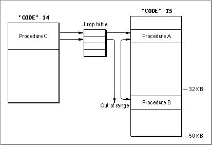

As you can see, the only reference that cannot be resolved is that to procedure B if it is made through the jump table. The ILink tool automatically tries to place externally referenced routines in the first 32 KB of a segment, but if this is not possible, it generates a linker error. In such cases, you should resegment your code or build your program with the  `-model far`  (32-bit everything) option.

---


Main Body
 Chapter 10 - Classic 68K Runtime Architecture  /  Bypassing MC68000 Addressing Limitations
---

## Increasing the Size of the Jump Table
  To increase the size of the jump table, use the  `-wrap`  option of the ILink command. This increases the memory allocated for the jump table at the expense of memory reserved for global data. In effect, this puts some of the jump table at negative offsets from A5.
This method is particularly useful for MacApp programs because they make little demand on global data space. However, at best, this method can only double the jump table size.
If you choose this option, intersegment calls, which are always routed through the jump table, might look like global references, as in this example:
```
JSR -48(A5)
```
  The instruction used,  `JSR`  or  `BSR` , makes it plain that it is not a global variable that is being referenced.

---


Main Body
 Chapter 10 - Classic 68K Runtime Architecture  /  Bypassing MC68000 Addressing Limitations
---

## 32-Bit Everything
  The 32-bit everything method allows you to remove limitations on segment size, global data size, and jump-table size by using compiler and linker  `-model far`  options instead of the default value, which is  `-model near` . For each compilation unit, the compiler allows you to choose
- full 32-bit offsets for global data by specifying the  `-model farData`  option  full 32-bit offsets for code references by specifying the  `-model farCode`  option  full 32-bit offsets for data and code by specifying the  `-model far`  option
  You can link any combination of near and far model compiled modules, but if any of the modules are compiled with the  `-model far` ,  `-model farData` , or  `-model farCode`  options, you must specify the  `-model far`  linker option.
WARNING   Because the 32-bit everything solution is implemented by modifications to the  `LoadSeg` ,  `UnloadSeg` ,  `Launch` ,  `Chain` , and  `ExitToShell`  traps, it will not work if your application patches these traps without calling the original traps when your patch completes. If you need to use  `_LoadSeg`  or  `_UnloadSeg`  in the 32-bit everything environment, you must use the routines in the  `RTLib.o`  library. For details, see  Appendix B .      In assembly language, the use of a 32-bit reference for the target address of an instruction must be explicitly demanded by use of the absolute long address syntax (expr). `L` , where expr is a relocatable expression. Two other requirements must be met:
- The relevant operand symbol must be imported. This means that the defining occurrence of the symbol must be in a different module than the module or modules containing its use as a 32-bit reference.  The option  `-model far`  must be used for the assembly. Since the absolute long address syntax specifies absolute operands by definition, the use of this form with a relocatable symbol is an error unless you specify the  `-model far`  option.
  Global data references, references to code in the same segment, and references to code in a different segment all cause the assembler to produce similar records that tell the linker that a 32-bit patch is needed. The linker determines whether the references are to code or data. If the reference is to code, the linker can also determine whether the reference is internal or external.
The example shown in  Listing 10-1  illustrates using 32-bit references for the target address of an instruction.
Listing 10-1  Using 32-bit references for the target address of an instruction
```
MAIN
            IMPORT STUFF               ; Symbols from other
            IMPORT THERE               ; modules must be
            IMPORT ELSEWHERE           ; imported.
            JSR (THERE).L              ; Symbols are written using
            JSR (ELSEWHERE).L          ; (xxx).L syntax.
            ADD.W (STUFF).L,DO
            ENDMAIN

            PROC                       ; Note that THERE is in the MAIN
            EXPORT            THERE    ; segment
THERE       NOP                        
            ENDPROC
            SEG               'SG1 '   ; Note that ELSEWHERE
            PROC                       ; is in a different segment
            EXPORT            ELSEWHERE
ELSEWHERE   NOP      
            ENDPROC
            PROC
            DATA
            EXPORT            STUFF    
STUFF       DS                1
            ENDPROC
            END
```

---


Main Body
 Chapter 10 - Classic 68K Runtime Architecture
---

# How 32-Bit Everything Is Implemented
  The implementation of the 32-bit everything solution affects the way global data, intrasegment references, and intersegment references are generated by the compiler and relocated by the linker. This section describes the changes that result from using this option. If you are using a low-level debugger or if your application depends on walking through jump-table entries, you need to be familiar with the details of this implementation.
---
   SubtopicsTOC      Expanding Global Data and the Jump Table     Intrasegment References     The Far Model Jump Table     The Far Model Segment Header Structure     Relocation Information Format

---


Main Body
 Chapter 10 - Classic 68K Runtime Architecture  /  How 32-Bit Everything Is Implemented
---

## Expanding Global Data and the Jump Table
  Because jump-table entries and global data are both referenced relative to A5, far references to global data and to jump table entries are handled in a similar way.
If you compile and link units with any option that specifies the far model for data, any instruction that references global data is generated with a 32-bit absolute address. This address is the byte offset of the data item relative to the address stored in A5. The address of any instruction that references global data is stored in compressed form in an area called  A5 relocation information.  The modified _ `LoadSeg`  trap, using this information and the address stored in A5 at load time, relocates each instruction during loading by subtracting the 32-bit address field of the instruction from the value of A5.
If you compile and link units with any option that specifies the far model for code, any  `JSR`  instruction that references a jump-table entry is generated with a 32-bit absolute address. The address of any instruction that makes such a reference is recorded in compressed form in the A5 relocation information area. The modified _ `LoadSeg`  trap adds the value of A5 to the address fields of the  `JSR`  instruction at load time.
Note that because intersegment references linked under this model appear in the disassembled code as  `JSR`  instructions to an absolute address, it is no longer obvious that you are going through the jump table. If the value of the address is greater than that in A5, it is possible you are going through the jump table.
For additional information about A5 relocation information, see the section  "The Far Model Segment Header Structure" (page 10-23) .

---


Main Body
 Chapter 10 - Classic 68K Runtime Architecture  /  How 32-Bit Everything Is Implemented
---

## Intrasegment References
  If you compile and link units with any option that specifies the far model for code, any instruction that makes an intrasegment reference is generated with a 32-bit absolute address. This address is the byte offset from the beginning of the segment to the referenced entry point. The address of any instruction making such a reference is stored in compressed form in an area called segment relocation information.  The modified _ `LoadSeg`  trap, using this information and the load address of the segment, relocates each such instruction by adding the load address of the segment to the instruction's 32-bit address field.

---


Main Body
 Chapter 10 - Classic 68K Runtime Architecture  /  How 32-Bit Everything Is Implemented
---

## The Far Model Jump Table
  Compilation and linking with the option  `-model far`  results in a change in the format of the jump table and a change in the format of unloaded entries.
- Because a segment can be larger than 32 KB, 4 bytes are required to describe the offset of a routine from the beginning of its segment. As the model near unloaded entry for a routine allowed only 2 bytes to specify the offset of the routine, this requires a change in the unloaded format of jump table entries.   Because segments compiled with the option  `-model near`  can be linked with segments compiled with the option  `-model far` , jump-table entries for the same segment are not necessarily contiguous.
   Figure 10-8  shows the unloaded jump table entry for a routine in a segment that is linked using the far model. As you can see, the modified entry omits the instruction that puts the segment number on the stack. The 2 bytes saved are then used to store the larger 4-byte offset that locates the routine within the segment. The Segment Manager gets the segment number from the entry itself and loads that segment.
Figure 10-8  `` Far model unloaded jump table entry
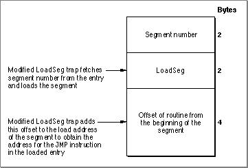

In the standard near model jump table, entries for routines in the same segment are stored contiguously. In a jump table created for a program linked under the far model, entries for routines in the same segment might not be contiguous. Consider the case shown in  Figure 10-9 . When the linker builds segment 1 and segment 2, it places code compiled with  `-model near`  within the first 32 KB and code with  `-model far`  beyond the 32 KB limit.
When the jump table is built, the linker places near-referenced entries within the first 32 KB; far-referenced entries are placed after all near references. Thus near and far references for the same segment can be stored in different areas of the jump table. In  Figure 10-9 , the entry for  `Module`   `E`  is not contiguous with near entries for the other modules contained in segment 2.
Figure 10-9  Separation of near and far references in the far model jump table
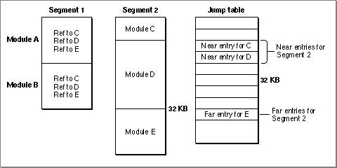

The format of the jump table built for programs linked under the far model is different from that for programs built under the near model.  Figure 10-10  shows the format of the far model jump table.
Figure 10-10  The far model jump table structure
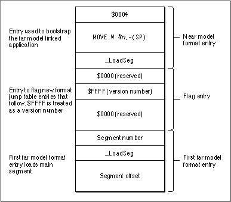

The first entry in the jump table is a near model format entry used to load a segment that patches the  `_LoadSeg`  trap, segment  *n* . The next entry is an entry used to flag the far model format jump table. The third entry is a far model format entry. Remember that what's different about it affects only the information stored for its unloaded state. This third entry is used to load segment 1, which is the segment containing the program's main entry point.

---


Main Body
 Chapter 10 - Classic 68K Runtime Architecture  /  How 32-Bit Everything Is Implemented
---

## The Far Model Segment Header Structure
   Near model segments have a 4-byte header that provides the information required by the Segment Manager to transform jump table entries from their unloaded state to their loaded state. Segments linked with the  `-model far`  option have a larger header and contain relocation information. The format of the far model segment header is shown in  Figure 10-11 . Following the header are the code, the A5 relocation information, and the segment relocation information.
Figure 10-11  The far model segment header
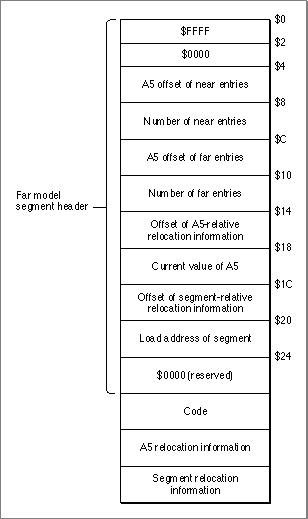

The meaning of each field in  Figure 10-11  is as follows.
| Address | Entry |
| --- | --- |
| $0 | This field determines whether the segment has been built according to the far... |
| $2 | Reserved. |
| $4 | The byte offset from A5 of the first near model jump table entry. |
| $8 | The number of near entries. |
| $C | The byte offset from A5 of the first far model jump table entry. |
| $10 | The number of far model entries. |
| $14 | The offset (from the beginning of the segment) of the relocation information ... |
| $18 | The current A5 value, which is added to the offset specified in the A5-relati... |
| $1C | The offset, from the beginning of the segment, of the relocation information ... |
| $20 | The segment load address, which is added to the offset specified in the A5-re... |
| $24 | Reserved. |

---


Main Body
 Chapter 10 - Classic 68K Runtime Architecture  /  How 32-Bit Everything Is Implemented
---

## Relocation Information Format
  Relocation information consists of a consecutive list of offsets between longwords that need to be relocated at load time, beginni ng with the offset of the first such longword from the start of the segment.
Some data compression is used in recording this information. Because instructions start at even addresses, it suffices to record the offset values divided by two. In  Table 10-2 , the various encodings are shown as bit strings. The part of the value represented by "bbb..." gives, when doubled, the desired offset value.
| Relocation item | Interpretation |
| --- | --- |
| 00000000 00000000 | End of relocation information |
| 0bbbbbbb | Offsets between $02 and $FE |
| 1bbbbbbb bbbbbbbb | Offsets between $0100 and $FFFE |
| 00000000 1bbbbbbb |  |
| bbbbbbbb bbbbbbbb |  |
| bbbbbbbb | Offsets between $00010000 and $FFFFFFFE |

---