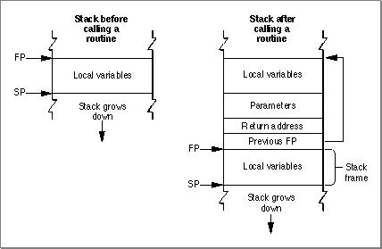
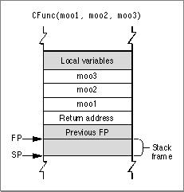

# Classic 68K Runtime Conventions This chapter covers data storage and parameter-passing conventions for the classic 68K runtime environment. Classic 68K conventions can vary depending on the programming language and the compiler you use; this chapter assumes you are using the SC/SCpp compiler and C or Pascal calling conventions.   Chapter Contents   Data Types  Classic 68K Stack Structure and Calling Conventions   Pascal Calling Conventions  SC Compiler C Calling Conventions   Register Preservation               
# Data Types
   Table 11-1  lists the various binary data types and their sizes in the classic 68K runtime environment.
All numeric and pointer data types are stored in big-endian format (that is, high bytes first, then low bytes). Signed integers use two's-complement representation.
IMPORTANT   The layout of the  `extended`  data type is either that of the SANE 80-bit data type or that of the 96-bit MC68881 data type, depending on the software development environment used.      The size of data structures and unions must be a multiple of two (2-byte alignment), and an extra byte may be added at the end to meet this requirement. Items inside a data structure (except for types  `UInt8`  and  `SInt8` ) are placed on a 2-byte boundary with an extra padding byte inserted if necessary. Type  `UInt8`  and type  `SInt8`  items (single variables or arrays) are merely placed in the next available byte.
---


Main Body
 Chapter 11 - Classic 68K Runtime Conventions
---

# Classic 68K Stack Structure and Calling Conventions
   T he classic 68K runtime architecture uses a stack-based parameter-passing system, as shown in  Figure 11-1 .
Figure 11-1  A 68K stack frame before and after calling a routine


The stack grows from high-memory addresses towards low-memory addresses. The end that grows or shrinks is usually referred to the "top" of the stack, despite the fact that it is at the lower end of memory occupied by the stack.
The boundaries of the stack are defined by two pointers:
- The stack pointer (SP), which points to the top of the stack and defines its current downward limit. Operations that push data onto the stack or pop data off of it do so by adjusting the value of the stack pointer. The classic 68K runtime architecture uses the  A7 register as the stack pointer.  The frame pointer (FP), which points to the base in memory of the current  stack frame, the area of the stack used by a routine for its parameters, return address, local variables, and temporary storage. By keeping track of the frame pointer value, the operating system can find the beginning of the stack frame when it has to pop data off the stack. The classic 68K runtime architecture uses the A6 register as the frame pointer.
   Para meters passed by a routine are always placed on the stack above the frame pointer, while local variables are always placed below the frame pointer. Data passed onto the stack is always aligned to 2 bytes. If you pass a single-byte parameter (such as a single character), a padding byte is added by decrementing the stack pointer by 2 bytes instead of 1 (the padding byte is the most significant byte).
The classic 68K runtime environment supports many non-standard calling conventions. For example, C calling conventions can vary depending on the type of call (some system calls have their own conventions) and the development environment. However, in C you can specify Pascal conventions for a routine by using the   `pascal`  keyword. Pascal calling conventions are standardized and supported in all 68K development environments.
For example, the routine declared in C as
```c
int mooFunc(UInt8, double);
```
  uses C calling conventions, while
```c
pascal int mooFunc(UInt8, double);
```
  uses Pascal calling conventions.
Note   These parameter passing conventions are part of Apple's standard for procedural interfaces. Object-oriented languages may use different rules for their own method calls. For example, the conventions for C++ virtual function calls may be different from those for C functions.
---
   SubtopicsTOC      Pascal Calling Conventions     SC Compiler C Calling Conventions     Register Preservation

---


Main Body
 Chapter 11 - Classic 68K Runtime Conventions  /  Classic 68K Stack Structure and Calling Conventions
---

## Pascal Calling Conventions
   When following P ascal calling conventions, the caller passes space for the return value before pushing any parameters. The caller then passes parameters from left to right. For example, given the code
```
cow = PasFunc(moo1, moo2, moo3);
```
  the calling routine first pushes the value of  `moo1`  onto the stack, followed by  `moo2`  and then  `moo3`  as shown in  Figure 11-2 .
Figure 11-2  Passing parameters onto the stack in Pascal


Pascal allows only a fixed number of parameters to be passed to the called routine. However, this means the size of the stack frame can be determined at compile time, so the called routine assumes responsibility for deallocating (popping) parameters before returning.
Function values are returned on the stack, as follows:
- If the value is 4 bytes or smaller in size, the item on the stack is the return value.  If the return value is larger than 4 bytes, the item on the stack is a pointer to the return value.
  The calling routine must allocate space on the stack for the return value before pushing any parameters, and the same routine is responsible for popping the result after the call .

---


Main Body
 Chapter 11 - Classic 68K Runtime Conventions  /  Classic 68K Stack Structure and Calling Conventions
---

## SC Compiler C Calling Conventions
   As  mentioned earlier, the classic 68K runtime environment supports several different C calling conventions. This section describes the C calling conventions used by the SC compiler in the MPW development environment.
C allows either a fixed or variable number of parameters to be passed to the called routine. In an ANSI-style C syntax definition, a routine with a variable number of arguments typically appears with ellipsis points (...) at the end of its input parameter list.
A variable-argument function may have several required (that is, fixed) parameters preceding the variable parameter portion. For example, the function definition
```
mooColor(number,[color1. . .])
```
  gives no restriction on the number of color arguments, but you must always precede them with a number argument. Therefore, number is a fixed parameter.
Parameters passed by routines are pushed onto the stack from right to left. For example, given the code
```
cow = CFunc(moo1, moo2, moo3);
```
  the calling routine first pushes the value of  `moo3`  onto the stack, followed by  `moo2`  and then  `moo1` , as shown in  Figure 11-3 .
Figure 11-3  Passing parameters onto the stack in C


The return address of the routine is the last item pushed onto the stack.
The calling function is responsible for parameter deallocation (that is, popping parameters off the stack) after the called routine has returned. If the called  routine is a function, the function value is normally returned in register D0 (or, for floating-point values, in register F0). In the case of data structures or values larger than 4 bytes, however, the caller must allocate space for the return value and pass a pointer to that storage space as the first (that is, the leftmost) parameter.

---


Main Body
 Chapter 11 - Classic 68K Runtime Conventions  /  Classic 68K Stack Structure and Calling Conventions
---

## Register Preservation
   Table 11-2  lists registers used in the classic 68K runtime environment and their volatility in routine calls. Registers that retain their value after a routine call are called nonvolatile. Note that these register conventions are for C and Pascal-style calls. Certain system calls may use different conventions, so you should check their definitions in the appropriate Inside Macintosh book before using them. All registers are 4 bytes long.
| Type | Register | Preserved by afunction call? | Notes |
| --- | --- | --- | --- |
| Data register | D0 through D2 | No |  |
|  | D3 through D7 | Yes |  |
| Address register | A0 | No |  |
|  | A1 | No |  |
|  | A2 through A4 | Yes |  |
|  | A5 | See note | Used to access global data objects and the jump table. |
|  | A6 | Yes | Used as the frame pointer, which points to the base of the stack frame. |
|  |  | A7 | See note |
|  | A7 | See note | A7 is the stack pointer used to push and pop parameters and other temporary d... |
| Floating- point register | F0 through F3 | No | When present. |
|  | F4 through F7 | Yes | When present. |
| Condition Register | CR | No | Bits are set by compare instructions and used for conditional branching. |

Appendixes

---