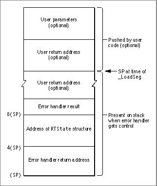

# The RTLib.o and NuRTLib.o Libraries 
 This appendix describes the interface to the MPW RTLib libraries RTLib.o and NuRTLib.o, which allow access to the Segment Manager routines in the classic 68K far model (32-bit everything) and CFM-68K runtime environments respectively. These routines are useful if an application needs to have knowledge of its execution environment or if it needs to have knowledge of another application's environment. Specifically, if your application needs to patch the _LoadSeg trap or the _UnloadSeg trap in the far model or CFM-68K runtime environments, you need to use the RTLib libraries. 
 The interface for the RTLib routines is identical for both far model and CFM-68K runtime environments. The only difference is that you must link to different libraries when you build your application.   Note Traditional classic 68K near model applications can patch the _LoadSeg and _UnloadSeg traps normally without having to go through the RTLib routines.  IMPORTANT The RTLib libraries can be used only for calls from a segmented application. CFM-68K runtime shared libraries cannot use the NuRTLib.o library, and any A5 or fA5 referenced calls made to a nonsegmented A5 world returns an error.    Appendix Contents   Runtime Interface  Runtime Operations   Segment Manager Hooks   User Handlers  Error Handling With kRTSetSegLoadErr   kRTGetVersion and kRTGetVersionA5  kRTGetJTAddress and kRTGetJTAddressA5  kRTPreLaunch and kRTPostLaunch  kRTLoadSegbyNum and kRTLoadSegbyNumA5   A Preload Example             
# Appendix B -The RTLib.o and NuRTLib.o Libraries
  This appendix describes the interface to the MPW RTLib libraries  `RTLib.o`  and  `NuRTLib.o` , which allow access to the Segment Manager routines in the classic 68K far model (32-bit everything) and CFM-68K runtime environments respectively. These routines are useful if an application needs to have knowledge of its execution environment or if it needs to have knowledge of another application's environment. Specifically, if your application needs to patch the  `_LoadSeg`  trap or the  `_UnloadSeg`  trap in the far model or CFM-68K runtime environments, you need to use the RTLib libraries.
The interface for the RTLib routines is identical for both far model and CFM-68K runtime environments. The only difference is that you must link to different libraries when you build your application.
Note   Traditional classic 68K near model applications can patch the  `_LoadSeg`  and  `_UnloadSeg`  traps normally without having to go through the RTLib routines.     IMPORTANT   The RTLib libraries can be used only for calls from a segmented application. CFM-68K runtime shared libraries cannot use the  `NuRTLib.o`  library, and any A5 or fA5 referenced calls made to a nonsegmented A5 world returns an error.
---
   AppendixContentsTOC      Runtime Interface     Runtime Operations       Segment Manager Hooks       User Handlers     Error Handling With kRTSetSegLoadErr       kRTGetVersion and kRTGetVersionA5     kRTGetJTAddress and kRTGetJTAddressA5     kRTPreLaunch and kRTPostLaunch     kRTLoadSegbyNum and kRTLoadSegbyNumA5       A Preload Example

---


Main Body
 Appendix B - The RTLib.o and NuRTLib.o Libraries
---

# Runtime Interface
   The RTLib runtime interface consists of a single procedure call (as defined in  `RTLib.h` ):
```
pascal OSErr Runtime (RTPB* runtimeParams);
```
  The  `RTPB`  data type is a structure in which you specify one of four posssible parameter blocks:
```c
struct RTPB {
   short fOperation;
   void* fA5;
   union {
      RTGetVersionParam fVersionParam;
      RTGetJTAddrParam fJTAddrParam;
      RTSetSegLoadParam fSegLoadParam;
      RTLoadSegbyNumParam fLoadbyNumParam;
      } fRTParams;
   };
typedef struct RTPB RTPB;
```
  The fields of the  `RTPB`  structure are as follows:
- The  `fOperation`  field indicates the type of operation to be performed, and it can be set to any value shown in  Table B-1 (page B-3) . See  "Runtime Operations" (page B-4)  for more detailed information.  Any operation whose name ends in A5 requires a value for the  `fA5`  field, which indicates the address of an A5 world. The similarly named operation without the A5 suffix uses the current value of A5 for this parameter.  The  `fRTParams`  field is a parameter block consisting of one of four structures that hold the parameters for the appropriate operation. See the descriptions for each operation in  "Runtime Operations" (page B-4)  for more details about these structures.
| Value | Description |
| --- | --- |
| kRTSetPreLoad | kRTSetPreLoadA5 |
| kRTSetSegLoadErr | kRTSetSegLoadErrA5 |
| kRTSetPostLoad | kRTSetPostLoadA5 |
| kRTSetPreUnload | kRTSetPreUnloadA5 |
| kRTGetVersion | kRTGetVersionA5 |
| kRTGetJTAddress | kRTGetJTAddressA5 |
| kRTPreLaunch |  |
| KRTPostLaunch |  |
| KRTLoadSegbyNum | KRTLoadSegbyNumA5 |
  The  `Runtime`  routine can return an error value as shown in  Table B-2 .
| Error | Description |
| --- | --- |
| eRTNoErr | No error (success) |
| eRTInvalidOP | Invalid operation |
| eRTBadVersion | Invalid version |
| eRTInvalidJTPtr | Invalid jump table pointer |
| eRT_not_segmented | A5 world not segmented (for example, the A5 world of a CFM-68K shared library) |

---


Main Body
 Appendix B - The RTLib.o and NuRTLib.o Libraries
---

# Runtime Operations
   This section describes the operations in  Table B-1  in more detail. Note that operations are grouped according to which structure they use in the  `fRTParams`  field of the  `RTPB`  structure.
---
   SubtopicsTOC      Segment Manager Hooks     kRTGetVersion and kRTGetVersionA5     kRTGetJTAddress and kRTGetJTAddressA5     kRTPreLaunch and kRTPostLaunch     kRTLoadSegbyNum and kRTLoadSegbyNumA5

---


Main Body
 Appendix B - The RTLib.o and NuRTLib.o Libraries  /  Runtime Operations
---

## Segment Manager Hooks
  Several  `Runtime`  operations allow the application to take control and execute a user-defined handler routine during the segment loading or unloading process. These operations are
- `kRTSetPreLoad`  and  `kRTSetPreLoadA5` , which pass control to the handler before loading a segment  `kRTSetSegLoadErr`  and  `kRTSetSegLoadErrA5` , which pass control to the handler if the segment load fails  `kRTSetPostLoad`  and  `kRTSetPostLoadA5` , which pass control to the handler after loading a segment  `kRTSetPreUnload`  and  `kRTSetPreUnloadA5` , which pass control to the handler before calling  `_UnloadSeg`
  In each of these cases, control is passed by replacing the null user vector (set up by the patched Segment Manager) with a user handler.
The  `fRTParams`  structure used with these operations is as follows:
```c
struct RTSetSegLoadParam {
   SegLoadHdlrPtr fUserHdlr;
   SegLoadHdlrPtr fOldUserHdlr;
   };
typedef struct RTSetSegLoadParam RTSetSegLoadParam;
```
  The pointer  `fUserHdlr`  points to the user handler to be called at the time indicated by the operation. A pointer to the original (bypassed) handler is returned in  `fOldUserHdlr` .
### User Handlers
   A user handler is defined as follows:
```c
typedef pascal short (*SegLoadHdlrPtr)(RTState* state)
```
  The handler may return a result code of type  `short` . This code is ignored by the Segment Manager except in the case of the error handler. See  "Error Handling With kRTSetSegLoadErr" (page B-7)  for more details.
WARNING   User handlers must be defined within the segment to be loaded into memory when the handler is invoked (usually the main segment). Also, the user handler must not call any routines in unloaded segments as this may result in a system crash.      Information about the Segment Manager operation is passed to the user handler  through the  `RTState`  structure. This structure has the following form:
```c
struct RTState {
   unsigned short   fVersion;/* runtime version */
   void*     fSP;       /* SP: address of user return address */
   void*     fJTAddr;   /* PC: address of jump table entry */
                        /*    or  (see fCallType) */
                        /*    address of a transition vector*/
   long      fRegisters[15];/* registers D0-D7 and A0-A6 */
   short     fSegNo;    /* segment number */
   ResType   fSegType;  /* segment type (normally 'CODE') */
   long      fSegSize;  /* segment size */
   Boolean   fSegInCore;/* true if segment is in memory */
   Boolean   fCallType; /* 0 = _LoadSeg, */
                        /* 1 = fJTAddr, address of TVector */
   OSErr     fOSErr;    /* error number */
   long      fReserved2;/* (reserved for future use) */
   };
typedef struct RTState RTState;
```
  The fields in the structure are as follows:
- `fVersion`  is the version number from the A5 or fA5 runtime world.  `fSP`  has the value of the stack pointer when either  `_LoadSeg`  or  `_UnloadSeg`  was executed.
- In the case of  `_LoadSeg` , if the jump table entry was reached using a  `JSR`  instruction,  `fSP`  is a pointer to the user return address. You can modify the stack pointer value within an error handler to change the return address if you want to continue execution after trapping an error. See  "Error Handling With kRTSetSegLoadErr" (page B-7)  for more information. However, this is not recommended since there may not be a user return address on the stack.  In the case of  `_UnloadSeg` ,  `fSP`  points to the return adress from the  `_UnloadSeg`  call.
   `fJTAddr`  points to either a jump table entry or a transition vector depending on the runtime environment and the value of  `fCallType` :
- In a  `_LoadSeg`  call ( `fCallType`  is  `0` ),  `fJTAddr`  points to the jump table entry called by the user code prior to the  `_LoadSeg`  call. You can modify the value of  `fJTAddr`  within an error handler if you want to retry the segment load procedure.  In an  `_UnloadSeg`  call,  `fJTAddr`  points to the function address passed to  `_UnloadSeg` .  In the CFM-68K runtime environment, the  `fJTAddr`  field is always the address of a transition vector. You cannot modify this field when  `fCallType`  is  `1` .
Note that you should not make any assumptions about the layout of the jump table entry since it varies between the far model and CFM-68K runtme environments and may change in the future.
   `fRegisters`  is an array of long integers that contains the register values at the time  `_LoadSeg`  was called. The registers are saved in the order D0 through D7, then A0 through A6.  `fSegType`  and  `fSegNo`  contain the segment's resource type and ID.  `fSegType`  is usually  `'CODE'`  but this may change in the future.  `fSegSize`  contains the size of the segment, in bytes.  `fSegInCore`  indicates whether the segment is in memory. If  `fSegInCore`  is  `true` , the segment is already in the heap but has not been locked. (If the segment is resident, no memory needs to be allocated for it.)  The  `fCallType`  field is used by other fields whose meanings are dependent on how the segment load was invoked. If  `fCallType`  is  `1` , the segment load was invoked through a function call by a pointer (or by a virtual method dispatch in C++).  `fOSErr`  contains an error number. This field is valid only when this structure is passed to an error handler.
  All attempts to modify the  `RTState`  structure are ignored except for alterations of  `fJTAddr`  by the user error handle r.
### Error Handling With kRTSetSegLoadErr
   When  `kRTSetSegLoadErr`  invokes the user error handler (that is, when a segment loading error occurs), the stack has the form shown in  Figure B-1 .
Figure B-1  The stack when a user error handler is called


The error handler should use the information at the following locations:
- The word at  `8(SP)`  is reserved for the error handler's action code (as described later in this section).  The value at  `4(SP)`  points to the  `RTState`  structure, which contains information about the error.  The value at  `(SP)`  is the return address from the error handler. This value may or may not be used depending on how the routine handles the error.
  Items on the stack labeled as optional may not actually appear. For example, a simple  `JMP`  instruction would not push user parameters or a return address onto the stack.
The error handler should examine the  `RTState`  structure and then take appropriate action (for example, release some memory). After doing so, the handler can do one of the following:
- Return an action code on the stack for the Segment Manager and then return. Current action codes are shown in  Table B-3 . Attempts to pass any other value to the Segment Manager results in the system error  `daLoadErr` .  use a  `LONGJMP`  (or the equivalent) instruction to pass control to another error handler set up in a parent stack frame. This second handler could save the current document, alert the end user, and quit the application.
| Value | Action |
| --- | --- |
| kRTRetry | Retry. This action restores the stack to its state before the call to_LoadSeg... |
| kRTContinue | Continue. This action restores the stack to its state before the_LoadSegcall ... |

---


Main Body
 Appendix B - The RTLib.o and NuRTLib.o Libraries  /  Runtime Operations
---

## kRTGetVersion and kRTGetVersionA5
   The operation  `kRTGetVersion`  returns the value of the current A5 world and  `kRTGetVersionA5`  returns the value of the specified A5 world.
The  `fRTParams`  structure  (page B-2)  used with these operations is as follows:
```c
struct RTGetVersionParam {
   unsigned short fVersion;
   };
typedef struct RTGetVersionParam RTGetVersionParam;
```
  The  `kRTGetVersion`  operation assumes the current A5 world, while  `RTGetVersionA5`  lets you specify one in the  `fA5`  field of the  `RTPB`  structure  (page B-2) .
The  `fVersion`  field holds the returned version number as shown in  Table B-4 .
| Versionnumber | Description |
| --- | --- |
| $0000 | Classic 68K near model A5 world |
| $FFFD | CFM-68K runtime A5 world |
| $FFFF | Classic 68K far model (32-bit everything) A5 world |

---


Main Body
 Appendix B - The RTLib.o and NuRTLib.o Libraries  /  Runtime Operations
---

## kRTGetJTAddress and kRTGetJTAddressA5
   The operation  `kRTGetJTAddress`  returns the address of the code that the specified function address points to in the current A5, and  `kRTGetJTAddressA5`  does the same for a specified A5 world.
The  `fRTParams`  structure  (page B-2)  used with these operations is as follows:
```c
struct RTGetJTAddrParam {
   void*fJTAddr;
   void*fCodeAddr;
   };
typedef struct RTGetJTAddrParam RTGetJTAddrParam;
```

- In the classic 68K runtime environment,  `fJTAddr`  is a function address. In the CFM-68K runtime environment,  `fJTAddr`  is the address of a transition vector.  `fCodeAddr`  contains the returned code address. If the segment is not loaded,  `fCodeAddr`  is set to  `0` .
  The  `kRTGetJTAddress`  operation assumes the current A5 world, while  `RTGetJTAddressA5`  lets you specify one in the  `fA5`  field of the  `RTPB`  structure  (page B-2) .

---


Main Body
 Appendix B - The RTLib.o and NuRTLib.o Libraries  /  Runtime Operations
---

## kRTPreLaunch and kRTPostLaunch
   In the classic 68K near model environment, you cannot call  `_Launch`  or  `_Chain`  directly, but must instead use the Process Manager call  `LaunchApplication`  (See Inside Macintosh: Processes for more details). If you need to call  `_Launch`  or  `_Chain`  under the far model environment, you must wrap a call to  `_Launch`  with calls to  `Runtime`  using the  `kPreLaunch`  and  `KPostLaunch`  operations as follows:
```
IMPORT(Runtime): CODE

MOVE.W#kRTPreLaunch,-(SP) ; push fOperation
SUBQ.W#2,-(SP)       ; room for result
PEA2(SP)             ; push ptr to RTPB
JSRRuntime           ; prepare for launch

_Launch              ; attempt a launch

MOVE.W#kRTPostLaunch,-(SP); push fOperation
SUBQ.W#2,-(SP)       ; room for result
PEA2(SP)             ; push ptr to RTPB
JSRRuntime           ; post-launch housekeeping
```
  The only field used in the  `RTPB`  structure  (page B-2)  is  `fOperation` . Neither  `kPreLaunch`  or  `kPostLaunch`  require an  `fRTParams`  parameter block.
If you need to call  `_Chain` , you must wrap the routine with  `kPreLaunch`  and  `kPostLaunch`  in the same manner as with the  `_Launch`  routine.
IMPORTANT   You must never call the  `_Chain`  trap since it is not implemented by the System 7 Process Manager.      The CFM-68K runtime environment does not support calling  `_Launch`  or  `_Chain`  directly from a CFM-68K application. You can call  `kPreLaunch`  and  `kPostLaunch`  in the CFM-68K runtime environment, but the routines do nothing.

---


Main Body
 Appendix B - The RTLib.o and NuRTLib.o Libraries  /  Runtime Operations
---

## kRTLoadSegbyNum and kRTLoadSegbyNumA5
  This operation (available only for CFM-68K) allows you to explicitly load a segment by segment number.  `kRTLoadSegbyNum`  assumes the current A5 world, while  `kRTLoadSegbyNumA5`  lets you specify one in the  `fA5`  field of the  `RTPB`  structure  (page B-2) .
No user vectors are called while attempting to load the segment. If for any reason the segment cannot be loaded, the operation returns  `OSErr` .
The  `fRTParams`  structure  (page B-2)  used with these operations is as follows:
```c
struct RTLoadSegbyNumParam{
   short fSegNumber;
   };
typedef struct RTLoadSegbyNumParam RTLoadSegbyNumParam;
```
  The  `fSegNumber`  field holds the specified segment number. If there is insufficient memory to load the segment, the  `GetResource`  call returns a Memory Manager error. If  `fSegNumber`  is not a valid segment number,  `GetResource`  also returns an error.

---


Main Body
 Appendix B - The RTLib.o and NuRTLib.o Libraries
---

# A Preload Example
   Listing B-1  shows a C program that installs a preload handler and uses it to print information about the segment.
To compile and link this example for the classic 68K far model environment, use the following MPW commands:
```
SC -model far example.c -o example.c.o -i {CIncludes}
ILink -model far -w -t MPST -c 'MPS ' -o example �
   example.c.o �
   {Libraries}RTLib.o �
   {Libraries}Interface.o �
   {Libraries}IntEnv.o �
   {Libraries}MacRuntime.o �
   {CLibraries}StdCLib.o �
```
  For the CFM-68K runtime environment, use the following commands:
```
SC -model cfmseg example.c -o example.c.o -i {CIncludes}
Ilink -model cfmseg -xm e -w -t MPST -c 'MPS ' -o example �
   example.c.o �
   {CFM68KLibraries}NuRTLib.o �
   {CFM68KLibraries}NuMacRuntime.o �
   {SharedLibraries}InterfaceLib �
   {SharedLibraries}StdCLib
```
   Listing B-1  A preload handler example
```c
#include <stdio.h>
#include <types.h>
#include <RTLib.h>
#pragma segment One
one ()
{
   /* do something */
}
#pragma segment Main
pascal short preload_handler(RTState* state)
{
   
   /* print segment information */
   
   printf("segno= %d\n",state->fSegNo);
   printf("segtype= %.4s\n",&(state->fSegType));
   printf("segsize= %d\n",state->fSegSize);
   if (state->fSegInCore) printf("incore = yes\n");
   else printf("incore = no\n");
   return(0);
}
main ()
{
   RTPBparam_block, *p;
       OSErr error;
/* load printf segment so that the preload handler does not */
   /* invoke another call to _LoadSeg */
   
   printf("load printf segment\n");
   /* load the handler */
   
   p = &param_block;
   p->fOperation = kRTSetPreLoad;
   p->fRTParam.fSegLoadParam.fUserHdlr = (void*)&    preload_handle r;
error = Runtime(p);
   
   /* load the segment */
   
   one();
}
```

---